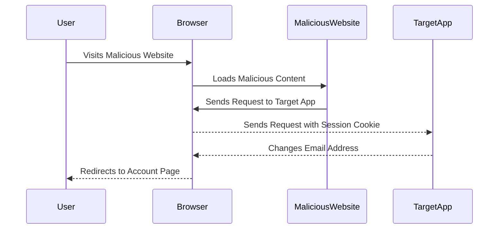
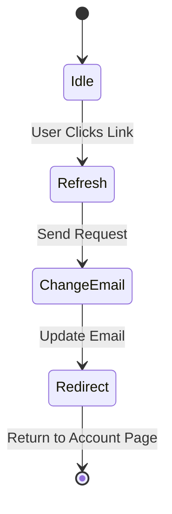

## SameSite Lax Bypass via Cookie Refresh

In this section, we will explore a specific technique for bypassing the `SameSite=Lax` protection mechanism used to mitigate CSRF attacks. We will walk through the steps to exploit this vulnerability and discuss how to defend against it.

### Background Theory

The `SameSite` attribute is designed to prevent CSRF attacks by controlling whether a cookie is sent with cross-site requests. There are three possible values for the `SameSite` attribute:

1. **Strict**: The cookie is only sent with requests originating from the same site.
2. **Lax**: The cookie is sent with top-level navigations and with POST requests, but not with subresource requests.
3. **None**: The cookie is sent with all requests, regardless of the origin.

While `SameSite=Lax` provides better protection than `SameSite=None`, it can still be bypassed in certain scenarios, such as when a user is tricked into refreshing a page.

### Exploitation Steps

Let's break down the steps involved in exploiting a CSRF vulnerability using the `SameSite=Lax` bypass technique.

#### Step 1: Craft the Malicious Link

First, we need to craft a malicious link that will trick the user into refreshing a page on the target web application. This can be done using an HTML `` tag or a hidden form.

```html

```

This link will cause the user's browser to send a request to the `/change-email` endpoint on the target application, potentially changing the user's email address.

#### Step 2: Trigger the Request

When the user visits the malicious website containing the crafted link, their browser will automatically send a request to the target application. Since the `SameSite=Lax` attribute is set on the session cookie, the cookie will be sent with the request, allowing the attacker to perform the unauthorized action.

#### Step 3: Observe the Result

If the exploitation is successful, the user's email address will be changed to `test4@test.ca`. The user may not notice this change unless they check their account settings.

### Complete Example

Let's walk through a complete example of the exploitation process, including the full HTTP request and response.

#### Full HTTP Request

```http
GET /change-email?newEmail=test4@test.ca HTTP/1.1
Host: target-app.com
Cookie: session=abc123
```

#### Full HTTP Response

```http
HTTP/1.1 302 Found
Location: https://target-app.com/account
Set-Cookie: session=def456; Path=/; Secure; HttpOnly; SameSite=Lax
Content-Type: text/html
Content-Length: 0
```

In this example, the user's browser sends a GET request to the `/change-email` endpoint with the new email address as a query parameter. The server responds with a 302 redirect to the user's account page, updating the session cookie.

### Real-World Example: CVE-2021-21972

CVE-2021-21972 is a real-world example of a CSRF vulnerability that affected the WordPress REST API. An attacker could craft a malicious link that, when clicked by an authenticated user, would delete posts or comments on the user's behalf. This vulnerability highlights the importance of implementing proper CSRF protections in web applications.

### How to Prevent / Defend

To prevent CSRF attacks and defend against the `SameSite=Lax` bypass technique, web developers can take the following steps:

#### Secure Coding Practices

1. **Use CSRF Tokens**: Generate a unique token for each user session and include it in forms and AJAX requests. Verify the token on the server-side to ensure that the request originated from the intended user.

    ```html
    <form method="POST" action="/change-email">
        <input type="hidden" name="csrf_token" value="abc123">
        <input type="email" name="newEmail" value="test4@test.ca">
        <button type="submit">Change Email</button>
    </form>
    ```

2. **Validate User Input**: Ensure that user input is validated and sanitized to prevent injection attacks.

#### Configuration Hardening

1. **Set the `SameSite` Attribute**: Set the `SameSite` attribute on cookies to `Strict` or `Lax` to prevent them from being sent with cross-site requests.

    ```http
    Set-Cookie: session=abc123; Path=/; Secure; HttpOnly; SameSite=Lax
    ```

2. **Use the `X-Requested-With` Header**: Verify that requests originate from the same origin by checking the `X-Requested-With` header.

    ```http
    X-Requested-With: XMLHttpRequest
    ```

#### Detection and Mitigation

1. **Monitor User Activity**: Implement logging and monitoring to detect unusual activity, such as multiple failed login attempts or unexpected changes to user data.
2. **Educate Users**: Educate users about the risks of clicking on suspicious links and encourage them to report any unusual activity.

### Mermaid Diagrams

#### Attack Chain Diagram



#### State Machine Diagram



### Practice Labs

For hands-on practice with CSRF vulnerabilities and mitigation techniques, consider the following real-world labs:

- **PortSwigger Web Security Academy**: Offers comprehensive labs on various web security topics, including CSRF.
- **OWASP Juice Shop**: A deliberately insecure web application for practicing web security skills.
- **DVWA (Damn Vulnerable Web Application)**: A PHP/MySQL web application that contains numerous security vulnerabilities.

By thoroughly understanding the concepts, mechanisms, and practical applications of CSRF attacks and defenses, you can better protect web applications from these types of vulnerabilities.

---
<!-- nav -->
[[06-SameSite Attribute and CSRF Mitigation|SameSite Attribute and CSRF Mitigation]] | [[Web Security (PortSwigger)/04-Cross-Site Request Forgery (CSRF)/13-Lab 12 SameSite Lax bypass via cookie refresh/00-Overview|Overview]] | [[Web Security (PortSwigger)/04-Cross-Site Request Forgery (CSRF)/13-Lab 12 SameSite Lax bypass via cookie refresh/08-Practice Questions & Answers|Practice Questions & Answers]]
