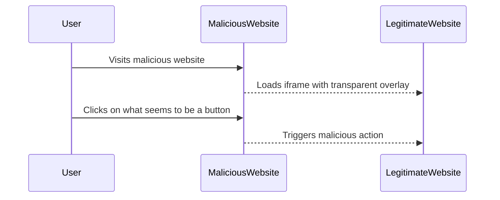

## Clickjacking: A Comprehensive Guide

### Introduction to Clickjacking

Clickjacking, also known as UI redress attack or user interface (UI) redressing, is a malicious technique used by attackers to trick users into clicking on something different from what they perceive they are clicking on. This can lead to unauthorized actions being performed on behalf of the victim, such as changing account settings, making purchases, or even downloading malware. The attacker achieves this by layering transparent, clickable elements over the legitimate ones, thereby hijacking the user's clicks.

### Understanding the Mechanics of Clickjacking

To understand clickjacking, let's break down the process:

1. **Transparent Overlay**: The attacker creates a transparent or nearly invisible overlay on top of a legitimate webpage.
2. **User Interaction**: When the user interacts with what they believe to be the legitimate webpage, they are actually clicking on the hidden overlay.
3. **Malicious Action**: The hidden overlay triggers a malicious action, such as submitting a form or executing a script.

#### Real-World Example: CVE-2010-0188

One of the most notable real-world examples of clickjacking is CVE-2010-0188, which affected Facebook. In this case, attackers created a malicious website that contained a transparent iframe pointing to a Facebook page. When users visited the malicious site and clicked on what appeared to be a button, they were actually clicking on the iframe, which caused their Facebook account to like a specific page or post.



### Defense in Depth Against Clickjacking

Defense in depth is a security strategy that involves implementing multiple layers of protection to ensure that if one layer fails, others continue to provide security. In the context of clickjacking, this means using multiple defenses to protect against potential attacks.

#### First Defense: X-Frame-Options Header

The `X-Frame-Options` HTTP response header is a simple yet effective way to mitigate clickjacking attacks. This header instructs the browser about whether or not a page can be framed within another page. There are three possible values for this header:

1. **DENY**: Prevents any domain from framing the content of the page.
2. **SAMEORIGIN**: Only allows the current site to frame the content of the page.
3. **ALLOW-FROM uri**: Allows the specified URI to frame the content of the page.

##### Setting the X-Frame-Options Header

Let's look at how to set the `X-Frame-Options` header in different web servers and frameworks.

###### Apache Configuration

In Apache, you can set the `X-Frame-Options` header using the `.htaccess` file or the main configuration file (`httpd.conf`).

```apache
<IfModule mod_headers.c>
    Header always set X-Frame-Options "DENY"
</IfModule>
```

###### Nginx Configuration

In Nginx, you can set the `X-Frame-Options` header in the server block of your configuration file.

```nginx
server {
    listen 80;
    server_name example.com;

    location / {
        add_header X-Frame-Options "DENY";
    }
}
```

###### Flask Application

In a Flask application, you can set the `X-Frame-Options` header using the `after_request` decorator.

```python
from flask import Flask, make_response

app = Flask(__name__)

@app.after_request
def add_header(response):
    response.headers['X-Frame-Options'] = 'DENY'
    return response

@app.route('/')
def index():
    return "Hello, World!"

if __name__ == '__main__':
    app.run()
```

##### Limitations of X-Frame-Options

While the `X-Frame-Options` header is effective, it has some limitations:

1. **Browser Support**: Not all browsers support the `X-Frame-Options` header. Older versions of Internet Explorer and some mobile browsers may not recognize this header.
2. **Compatibility Issues**: Some websites may rely on framing content for legitimate purposes, such as embedding content in iframes. Using `X-Frame-Options` could break these functionalities.

### Second Defense: Content Security Policy (CSP)

Content Security Policy (CSP) is a more advanced and flexible approach to mitigating clickjacking attacks. CSP allows you to define a set of trusted sources from which your web application can load resources. By specifying a strict CSP, you can prevent your content from being embedded in iframes from untrusted sources.

#### Setting the Content-Security-Policy Header

Let's look at how to set the `Content-Security-Policy` header in different web servers and frameworks.

###### Apache Configuration

In Apache, you can set the `Content-Security-Policy` header using the `.htaccess` file or the main configuration file (`httpd.conf`).

```apache
<IfModule mod_headers.c>
    Header always set Content-Security-Policy "frame-ancestors 'none'"
</IfModule>
```

###### Nginx Configuration

In Nginx, you can set the `Content-Security-Policy` header in the server block of your configuration file.

```nginx
server {
    listen 80;
    server_name example.com;

    location / {
        add_header Content-Security-Policy "frame-ancestors 'none'";
    }
}
```

###### Flask Application

In a Flask application, you can set the `Content-Security-Policy` header using the `after_request` decorator.

```python
from flask import Flask, make_response

app = Flask(__name__)

@app.after_request
def add_header(response):
    response.headers['Content-Security-Policy'] = "frame-ancestors 'none'"
    return response

@app.route('/')
def index():
    return "Hello, World!"

if __name__ == '__main__':
    app.run()
```

##### Limitations of CSP

While CSP is a powerful tool, it also has some limitations:

1. **Complexity**: Setting up a strict CSP can be complex and requires careful consideration of all the resources your application loads.
2. **Browser Support**: While modern browsers support CSP, older browsers may not recognize this header.

### Third Defense: Framebusting JavaScript

Framebusting JavaScript is a client-side solution that attempts to detect if a page is being loaded inside an iframe and then breaks out of the frame. However, this method is not foolproof and can be bypassed by sophisticated attackers.

#### Implementing Framebusting JavaScript

Here is an example of how to implement framebusting JavaScript:

```html
<script type="text/javascript">
    if (self === top) {
        // The page is not inside an iframe
    } else {
        // The page is inside an iframe
        top.location = self.location;
    }
</script>
```

##### Limitations of Framebusting JavaScript

Framebusting JavaScript has several limitations:

1. **Bypassable**: Sophisticated attackers can bypass framebusting by disabling JavaScript or using techniques to prevent the script from executing.
2. **Compatibility Issues**: Framebusting can cause compatibility issues with legitimate uses of iframes, such as embedding content from other sites.

### How to Prevent / Defend Against Clickjacking

#### Detection

To detect clickjacking vulnerabilities, you can use automated tools and manual testing methods.

1. **Automated Tools**:
    - **Burp Suite**: Burp Suite includes a feature to test for clickjacking vulnerabilities.
    - **OWASP ZAP**: OWASP ZAP provides a plugin to test for clickjacking.
2. **Manual Testing**:
    - Create a test environment with a known vulnerable page.
    - Attempt to frame the page using an iframe and observe the behavior.

#### Prevention

To prevent clickjacking, implement the following defenses:

1. **Use X-Frame-Options Header**: Set the `X-Frame-Options` header to `DENY` or `SAMEORIGIN`.
2. **Implement Content Security Policy (CSP)**: Set the `Content-Security-Policy` header to `frame-ancestors 'none'`.
3. **Avoid Framebusting JavaScript**: While framebusting JavaScript can be useful, it should not be relied upon as the primary defense.

#### Secure Coding Fixes

Here is an example of how to implement the `X-Frame-Options` header and `Content-Security-Policy` in a Flask application:

```python
from flask import Flask, make_response

app = Flask(__name__)

@app.after_request
def add_headers(response):
    response.headers['X-Frame-Options'] = 'DENY'
    response.headers['Content-Security-Policy']_frame-ancestors 'none'
    return response

@app.route('/')
def index():
    return "Hello, World!"

if __name__ == '__main__':
    app.run()
```

#### Configuration Hardening

Ensure that your web server configurations are hardened to prevent clickjacking:

- **Apache**: Ensure that the `.htaccess` file or `httpd.conf` file includes the necessary headers.
- **Nginx**: Ensure that the server block in the configuration file includes the necessary headers.

### Conclusion

Clickjacking is a serious security threat that can lead to unauthorized actions being performed on behalf of the victim. By implementing multiple layers of defense, including the `X-Frame-Options` header, Content Security Policy (CSP), and avoiding framebusting JavaScript, you can significantly reduce the risk of clickjacking attacks.

### Practice Labs

For hands-on practice with clickjacking, consider the following labs:

- **PortSwigger Web Security Academy**: Offers a comprehensive course on web security, including clickjacking.
- **OWASP Juice Shop**: A deliberately insecure web application for practicing web security skills.
- **DVWA (Damn Vulnerable Web Application)**: A PHP/MySQL web application that contains a large number of security vulnerabilities.

By combining theoretical knowledge with practical experience, you can become proficient in defending against clickjacking attacks.

---
<!-- nav -->
[[Web Security (PortSwigger)/05-Clickjacking/01-Clickjacking Complete Guide/00-Overview|Overview]] | [[Web Security (PortSwigger)/05-Clickjacking/01-Clickjacking Complete Guide/02-Introduction to Clickjacking|Introduction to Clickjacking]]
