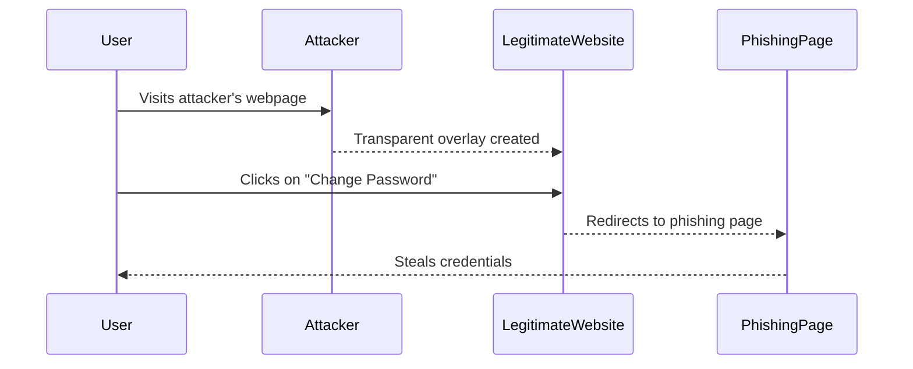
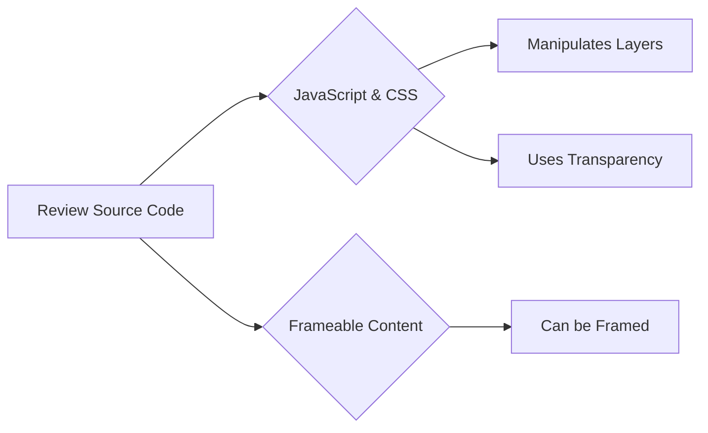
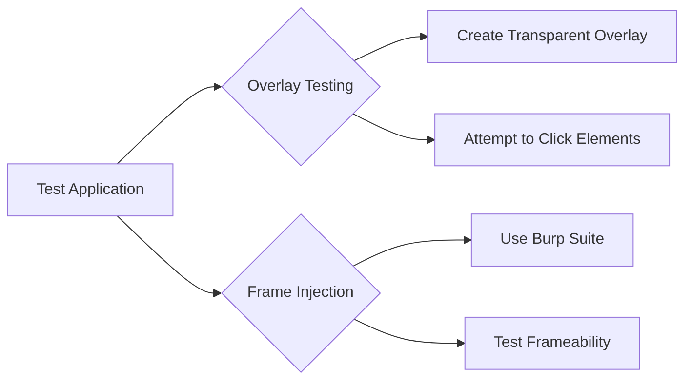
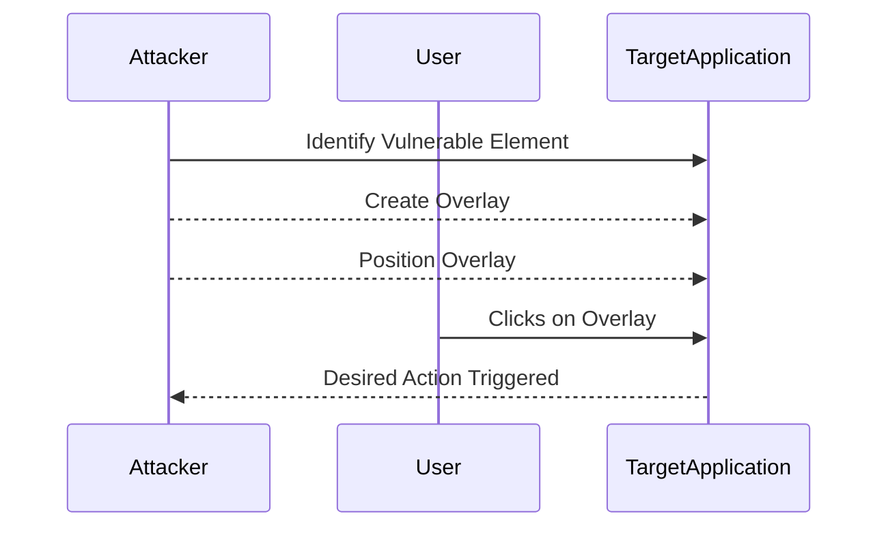
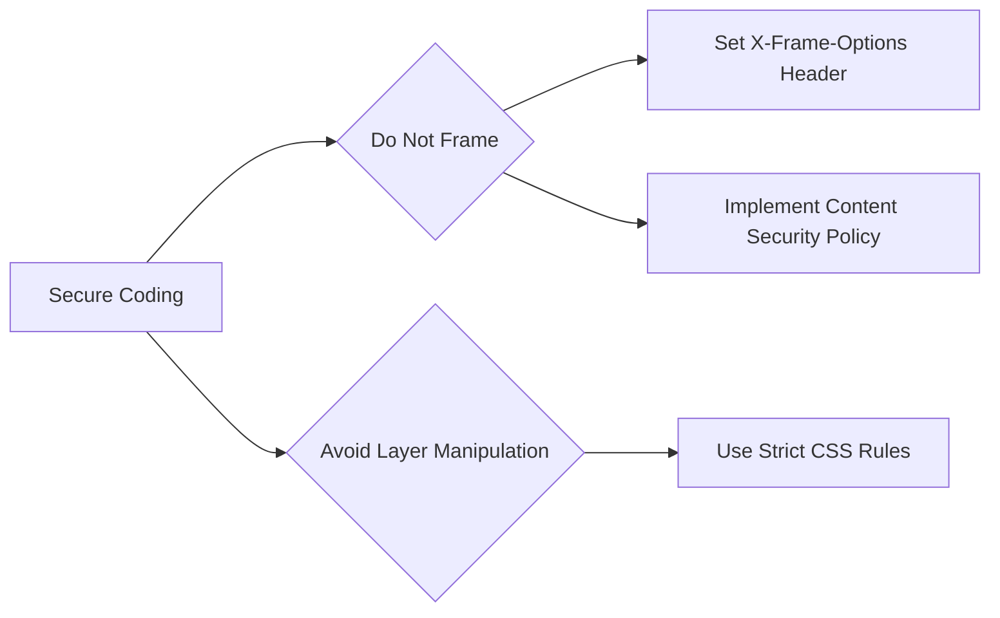

## What is Clickjacking?

Clickjacking, also known as UI Redress Attack, is a malicious technique used by attackers to trick users into clicking on a button or link that is invisible or disguised as something else. The attacker overlays a transparent or opaque layer over the legitimate webpage, making the user believe they are interacting with a trusted site when they are actually performing actions controlled by the attacker.

### Why Does Clickjacking Matter?

Clickjacking is significant because it exploits the trust users have in their web browsers and the websites they visit. By manipulating the visual interface, attackers can perform unauthorized actions such as changing account settings, downloading malware, or even stealing sensitive information. This type of attack can be particularly dangerous because it often does not require the user to download any malicious files; instead, it relies on the user's interaction with seemingly benign elements on a webpage.

### How Does Clickjacking Work Under the Hood?

To understand clickjacking, it's essential to grasp the basics of how web pages are rendered and interacted with. A typical web page consists of HTML, CSS, and JavaScript. These technologies work together to create the visual interface and handle user interactions. Clickjacking exploits the way layers are managed in web design.

#### Layers and Transparency

Web pages can contain multiple layers, each with its own set of properties, including transparency. By using CSS, an attacker can create a transparent or semi-transparent overlay that covers specific parts of the page. When a user clicks on what they think is a legitimate element, they are actually clicking on the overlay, which triggers the attacker's desired action.

#### Example of a Clickjacking Attack

Consider a scenario where an attacker wants to trick a user into clicking a button that changes their email password. The attacker creates a webpage with a transparent overlay positioned over the "Change Password" button on a legitimate website. When the user clicks on what they believe is the "Change Password" button, they are actually clicking on the overlay, which redirects them to a phishing page designed to steal their credentials.



### Real-World Examples of Clickjacking Attacks

Clickjacking has been used in various real-world attacks. One notable example is the Facebook Likejacking incident in 2010. Attackers exploited a vulnerability in Facebook's Like button to trick users into liking malicious content without their knowledge. Another example is the Adobe Reader clickjacking vulnerability (CVE-2013-0640), which allowed attackers to trick users into installing malicious software.

### Common Mistakes and Pitfalls

One common mistake is assuming that modern browsers are immune to clickjacking attacks. While many browsers have implemented security features to mitigate clickjacking, it is still possible for attackers to find ways around these protections. Another pitfall is neglecting to test applications for clickjacking vulnerabilities during development and maintenance phases.

### How to Find Clickjacking Vulnerabilities

Finding clickjacking vulnerabilities requires a combination of white-box and black-box testing approaches.

#### White-Box Testing

White-box testing involves having access to the source code of the application. This allows testers to review the code for potential vulnerabilities. Key areas to focus on include:

- **JavaScript and CSS**: Look for code that manipulates layers or uses transparency.
- **Frameable Content**: Check if the application's content can be framed by external sites.



#### Black-Box Testing

Black-box testing involves testing the application without access to the source code. This approach focuses on identifying vulnerabilities through interaction with the application.

- **Overlay Testing**: Create a transparent overlay and attempt to click on elements within the application.
- **Frame Injection**: Use tools like Burp Suite to inject frames and test if the application's content can be framed.



### How to Exploit Clickjacking Vulnerabilities

Exploiting a clickjacking vulnerability typically involves creating a malicious webpage that overlays the target application. The attacker then tricks the user into clicking on the overlay, which triggers the desired action.

#### Step-by-Step Exploitation

1. **Identify Vulnerable Element**: Determine which element on the target application can be manipulated.
2. **Create Overlay**: Use CSS to create a transparent or semi-transparent overlay.
3. **Position Overlay**: Position the overlay over the vulnerable element.
4. **Trick User**: Trick the user into clicking on the overlay, which triggers the desired action.



### How to Prevent / Defend Against Clickjacking

Preventing clickjacking involves implementing several security measures to protect against such attacks.

#### Secure Coding Practices

Secure coding practices are crucial in preventing clickjacking. Developers should ensure that their applications are not frameable and that layers are not manipulated in a way that could be exploited.



#### Set X-Frame-Options Header

The `X-Frame-Options` header is a simple yet effective way to prevent clickjacking. This header instructs the browser whether to allow a page to be framed or not.

```http
HTTP/1.1 200 OK
Content-Type: text/html
X-Frame-Options: DENY
```

- **DENY**: The page cannot be framed at all.
- **SAMEORIGIN**: The page can only be framed within the same origin.
- **ALLOW-FROM uri**: The page can be framed only by the specified URI.

#### Implement Content Security Policy (CSP)

Content Security Policy (CSP) is a more advanced method to prevent clickjacking. CSP allows developers to specify which sources of content are allowed to be loaded in a web page.

```http
HTTP/1.1 200 OK
Content-Type: text/html
Content-Security-Policy: frame-ancestors 'none'
```

- **frame-ancestors 'none'**: The page cannot be framed at all.
- **frame-ancestors 'self'**: The page can only be framed within the same origin.
- **frame-ancestors uri**: The page can be framed only by the specified URI.

#### Secure-Coding Fixes

Here is an example of how to implement the `X-Frame-Options` header in a web application:

**Vulnerable Code:**

```html
<!DOCTYPE html>
<html>
<head>
    <title>Vulnerable Page</title>
</head>
<body>
    <h1>Welcome to the Vulnerable Page</h1>
</body>
</html>
```

**Fixed Code:**

```html
<!DOCTYPE html>
<html>
<head>
    <title>Secure Page</title>
    <meta http-equiv="X-Frame-Options" content="DENY">
</head>
<body>
    <h1>Welcome to the Secure Page</h1>
</body>
</html>
```

#### Configuration Hardening

Configuration hardening involves ensuring that the server and application configurations are set up securely. This includes setting appropriate headers and policies.

**Nginx Configuration:**

```nginx
server {
    listen 80;
    server_name example.com;

    location / {
        add_header X-Frame-Options "DENY";
        add_header Content-Security-Policy "frame-ancestors 'none'";
        # Other configurations
    }
}
```

**Apache Configuration:**

```apache
<IfModule mod_headers.c>
    Header always set X-Frame-Options "DENY"
    Header always set Content-Security-Policy "frame--ancestors 'none'"
</IfModule>
```

### Detection and Monitoring

Detecting and monitoring for clickjacking vulnerabilities involves regular security assessments and continuous monitoring.

#### Security Assessments

Regular security assessments, including penetration testing and code reviews, can help identify potential clickjacking vulnerabilities.

#### Continuous Monitoring

Continuous monitoring involves using tools and services to detect and respond to security incidents in real-time.

### Hands-On Labs

For hands-on practice with clickjacking, consider the following well-known labs:

- **PortSwigger Web Security Academy**: Offers a comprehensive module on clickjacking, including detailed explanations and practical exercises.
- **OWASP Juice Shop**: Provides a vulnerable web application that includes clickjacking vulnerabilities for educational purposes.
- **DVWA (Damn Vulnerable Web Application)**: Contains a variety of web application vulnerabilities, including clickjacking, for hands-on learning.

By thoroughly understanding the concepts, techniques, and defenses related to clickjacking, you can better protect web applications from this type of attack.

---
<!-- nav -->
[[Web Security (PortSwigger)/05-Clickjacking/01-Clickjacking Complete Guide/02-Introduction to Clickjacking|Introduction to Clickjacking]] | [[Web Security (PortSwigger)/05-Clickjacking/01-Clickjacking Complete Guide/00-Overview|Overview]] | [[04-Black Box Testing Perspective|Black Box Testing Perspective]]
