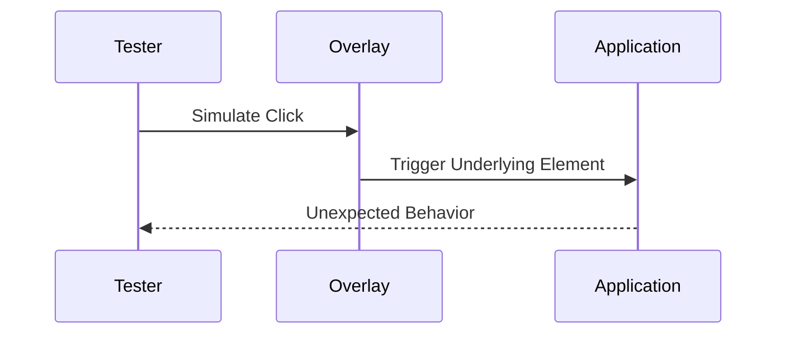

## Finding Clickjacking Vulnerabilities

To effectively identify clickjacking vulnerabilities, it is essential to understand the different perspectives from which testing can be approached. These perspectives are categorized into black box testing, white box testing, and gray box testing.

### Black Box Testing

Black box testing, also known as closed-box testing, is a method of software testing that examines the functionality of an application without peering into its internal structures or workings. In the context of web application pen testing, black box testing involves assessing the application with minimal knowledge about its internal workings. Typically, the tester is provided with only the URL of the application and the scope of the engagement.

#### Steps in Black Box Testing

1. **Identify Potential Targets**: Begin by identifying areas within the application that could be susceptible to clickjacking attacks. This includes buttons, links, and other interactive elements.
   
2. **Create a Test Environment**: Set up a test environment that mimics the target application. This environment should include a transparent or opaque overlay that can be used to simulate a clickjacking attack.

3. **Simulate User Interaction**: Use automated tools or manual methods to simulate user interaction with the application. This involves clicking on the overlay to see if the underlying elements are triggered.

4. **Analyze Results**: Analyze the results to determine if the application is vulnerable to clickjacking. Look for unexpected behavior or actions that occur when the overlay is clicked.

#### Example of Black Box Testing

Consider a scenario where a tester is given the URL of a social media platform and asked to test it for clickjacking vulnerabilities. The tester sets up a test environment with a transparent overlay and simulates user clicks on the overlay. If the underlying buttons or links are triggered, the application is likely vulnerable to clickjacking.



### White Box Testing

White box testing, also known as open-box testing, is a method of software testing that examines the internal structures or workings of an application. In the context of web application pen testing, white box testing involves assessing the application with complete knowledge of its internal workings. This includes access to the source code of the application.

#### Steps in White Box Testing

1. **Review Source Code**: Examine the source code of the application to identify potential vulnerabilities. Look for areas where user input is not properly validated or where interactive elements are not properly protected.

2. **Identify Potential Targets**: Identify areas within the application that could be susceptible to clickjacking attacks. This includes buttons, links, and other interactive elements.

3. **Create a Test Environment**: Set up a test environment that mimics the target application. This environment should include a transparent or opaque overlay that can be used to simulate a clickjacking attack.

4. **Simulate User Interaction**: Use automated tools or manual methods to simulate user interaction with the application. This involves clicking on the overlay to see if the underlying elements are triggered.

5. **Analyze Results**: Analyze the results to determine if the application is vulnerable to clickjacking. Look for unexpected behavior or actions that occur when the overlay is clicked.

#### Example of White Box Testing

Consider a scenario where a tester is given complete access to the source code of a financial services application and asked to test it for clickjacking vulnerabilities. The tester reviews the source code to identify potential vulnerabilities and sets up a test environment with a transparent overlay. The tester then simulates user clicks on the overlay to see if the underlying buttons or links are triggered. If unexpected behavior occurs, the application is likely vulnerable to clickjacking.

```mer


### Gray Box Testing

Gray box testing is a hybrid approach that combines elements of both black box and white box testing. In this method, the tester has partial knowledge of the internal workings of the application, but not complete access to the source code. This approach is often used when the tester has limited access to the application's internal structures but still needs to perform thorough testing.

#### Steps in Gray Box Testing

1. **Review Available Information**: Examine the available information about the application, including documentation, design specifications, and any accessible source code.

2. **Identify Potential Targets**: Identify areas within the application that could be susceptible to clickjacking attacks. This includes buttons, links, and other interactive elements.

3. **Create a Test Environment**: Set up a test environment that mimics the target application. This environment should include a transparent or opaque overlay that can be used to simulate a clickjacking attack.

4. **Simulate User Interaction**: Use automated tools or manual methods to simulate user interaction with the application. This involves clicking on the overlay to see if the underlying elements are triggered.

5. **Analyze Results**: Analyze the results to determine if the application is vulnerable to clickjacking. Look for unexpected behavior or actions that occur when the overlay is clicked.

#### Example of Gray Box Testing

Consider a scenario where a tester is given partial access to the source code of an e-commerce platform and asked to test it for clickjacking vulnerabilities. The tester reviews the available information and identifies potential targets. The tester then sets up a test environment with a transparent overlay and simulates user clicks on the overlay. If unexpected behavior occurs, the application is likely vulnerable to clickjacking.


---
<!-- nav -->
[[09-Detection and Prevention|Detection and Prevention]] | [[Web Security (PortSwigger)/05-Clickjacking/01-Clickjacking Complete Guide/00-Overview|Overview]] | [[11-Frame-Busting Scripts|Frame-Busting Scripts]]
