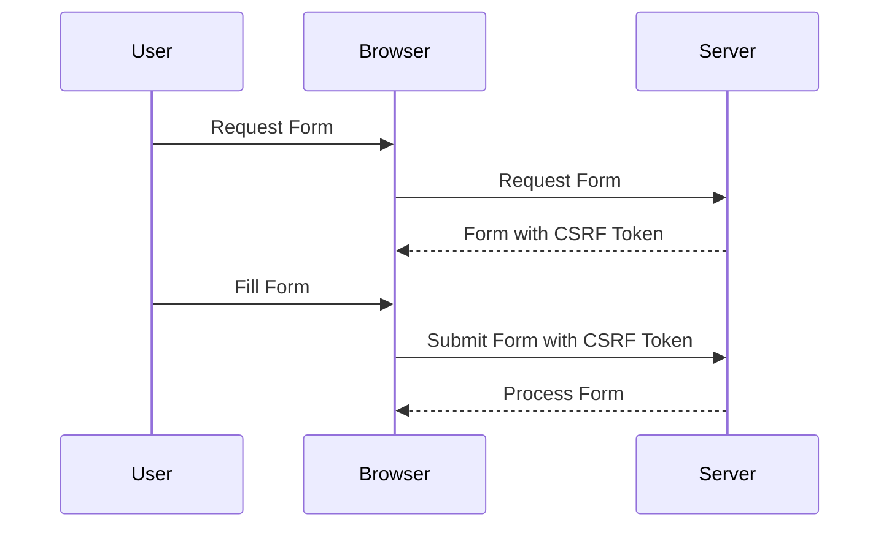
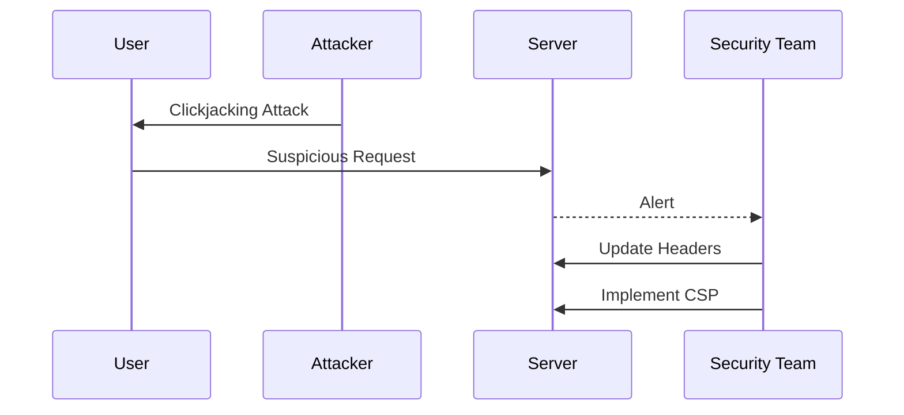

## Prevention Techniques for Clickjacking

Preventing clickjacking attacks requires a combination of technical measures and best practices. The following sections outline the key strategies for defending against clickjacking vulnerabilities.

### X-Frame-Options Header

The `X-Frame-Options` header is a simple yet effective way to prevent clickjacking attacks. This header instructs the browser whether to allow a page to be rendered within a frame or iframe. By setting the appropriate value, the browser can prevent the page from being embedded in a frame, thus mitigating the risk of clickjacking.

#### Values of X-Frame-Options

- **DENY**: The page cannot be displayed in a frame on any origin.
- **SAMEORIGIN**: The page can only be displayed in a frame on the same origin as the page itself.
- **ALLOW-FROM uri**: The page can only be displayed in a frame on the specified origin.

#### Example of X-Frame-Options Header

Consider a web application that sets the `X-Frame-Options` header to `SAMEORIGIN`. This ensures that the page can only be displayed in a frame on the same origin, preventing it from being embedded in a frame on a different origin.

```http
HTTP/1.1 200 OK
Content-Type: text/html
X-Frame-Options: SAMEORIGIN

<!DOCTYPE html>
<html>
<head>
    <title>Secure Page</title>
</head>
<body>
    <h1>Welcome to the Secure Page</h1>
</body>
</html>
```

### Content Security Policy (CSP)

Content Security Policy (CSP) is a more advanced mechanism for preventing clickjacking attacks. CSP allows the server to specify which sources of content are allowed to be loaded in the browser. By setting appropriate directives, the server can restrict the loading of frames and iframes, thereby mitigating the risk of clickjacking.

#### Directives of CSP

- **frame-ancestors**: Specifies valid parents that may embed a page using `<frame>`, `<iframe>`, `<object>`, or `<embed>` tags.

#### Example of CSP Header

Consider a web application that sets the `Content-Security-Policy` header to `frame-ancestors 'self'`. This ensures that the page can only be embedded in a frame on the same origin, preventing it from being embedded in a frame on a different origin.

```http
HTTP/1.1 200 OK
Content-Type: text/html
Content-Security-Policy: frame-ancestors 'self'

<!DOCTYPE html>
<html>
<head>
    <title>Secure Page</title>
</head>
<body>
    <h1>Welcome to the Secure Page</h1>
</body>
</html>
```

### Secure Coding Practices

In addition to technical measures, secure coding practices are essential for preventing clickjacking attacks. The following are some best practices for secure coding:

- **Validate User Input**: Ensure that user input is properly validated to prevent malicious content from being injected into the application.
- **Use Anti-CSRF Tokens**: Implement anti-CSRF tokens to prevent cross-site request forgery attacks, which can be used in conjunction with clickjacking attacks.
- **Sanitize Output**: Sanitize output to prevent malicious content from being rendered in the browser.

#### Example of Secure Coding Practices

Consider a web application that implements anti-CSRF tokens to prevent clickjacking attacks. The application generates a unique token for each user session and includes it in the form submission. The server verifies the token before processing the form submission, ensuring that the request is legitimate.



### Detection and Mitigation

Detecting and mitigating clickjacking attacks requires a combination of monitoring and logging mechanisms. The following are some strategies for detecting and mitigating clickjacking attacks:

- **Monitor Logs**: Monitor server logs for suspicious activity, such as unexpected requests or unauthorized actions.
- **Implement Intrusion Detection Systems (IDS)**: Implement IDS to detect and alert on potential clickjacking attacks.
- **Regular Audits**: Conduct regular security audits to identify and mitigate clickjacking vulnerabilities.

#### Example of Detection and Mitigation

Consider a web application that monitors server logs for suspicious activity. The application detects an unusual number of requests to a specific endpoint and alerts the security team. The security team investigates the incident and identifies a clickjacking attack. They then implement the necessary measures to mitigate the attack, such as updating the `X-Frame-Options` header and implementing CSP.



---
<!-- nav -->
[[13-Mechanics of Clickjacking|Mechanics of Clickjacking]] | [[Web Security (PortSwigger)/05-Clickjacking/01-Clickjacking Complete Guide/00-Overview|Overview]] | [[15-Prevention and Defense Against Clickjacking|Prevention and Defense Against Clickjacking]]
