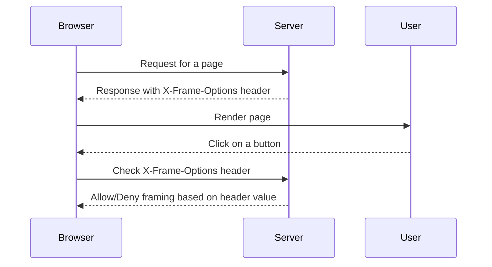

## X-Frame-Options Header

The `X-Frame-Options` header is a security feature that allows websites to control whether their content can be embedded within an iframe. This header helps prevent clickjacking attacks by specifying whether a page can be framed or not.

### What is the X-Frame-Options Header?

The `X-Frame-Options` header is a response header that indicates whether or not a browser should be allowed to render a page in a frame or an iframe element. This header can take one of three values:

1. **DENY**: This value prevents any domain from framing the content.
2. **SAMEORIGIN**: This value allows only the current site to frame content.
3. **ALLOW-FROM uri**: This value allows framing from a specific domain.

### How Does the X-Frame-Options Header Work?

When a browser encounters a page with the `X-Frame-Options` header, it checks the value of the header and decides whether to allow the page to be framed or not. If the value is `DENY`, the browser will not allow the page to be framed at all. If the value is `SAMEORIGIN`, the browser will only allow the page to be framed by the same origin. If the value is `ALLOW-FROM uri`, the browser will only allow the page to be framed by the specified domain.

### Setting the X-Frame-Options Header

To set the `X-Frame-Options` header, you need to configure your web server or application to include the header in the HTTP response. Here are some examples of how to set the header in different environments:

#### Apache Configuration

```apache
<IfModule mod_headers.c>
    Header always append X-Frame-Options "SAMEORIGIN"
</IfModule>
```

#### Nginx Configuration

```nginx
add_header X-Frame-Options "SAMEORIGIN";
```

#### ASP.NET Configuration

```csharp
Response.AppendHeader("X-Frame-Options", "SAMEORIGIN");
```

#### Node.js Configuration

```javascript
res.setHeader('X-Frame-Options', 'SAMEORIGIN');
```

### Full HTTP Response Example

Here is an example of a full HTTP response with the `X-Frame-Options` header:

```http
HTTP/1.1 200 OK
Date: Mon, 23 May 2023 12:00:00 GMT
Server: Apache/2.4.41 (Ubuntu)
Content-Type: text/html; charset=UTF-8
Content-Length: 1234
X-Frame-Options: SAMEORIGIN

<!DOCTYPE html>
<html>
<head>
    <title>Example Page</title>
</head>
<body>
    <h1>Welcome to the Example Page</h1>
</body>
</html>
```

### Per-Page Policy Specification

The `X-Frame-Options` header has a per-page policy specification, which means that it needs to be specified for every single page. However, most developers usually implement a filter that automatically adds the header to every page. Depending on the implementation, you may have to check every single page of the application that has an actionable item to confirm that it contains the response header.

### Mermaid Diagram: X-Frame-Options Flow



### Common Pitfalls

While the `X-Frame-Options` header is effective, there are some common pitfalls to be aware of:

1. **Not Setting the Header**: If the header is not set, the page can be framed, making it vulnerable to clickjacking attacks.
2. **Incorrect Header Value**: If the header value is incorrect (e.g., `SAMEORIGIN` instead of `DENY`), the page may still be vulnerable to clickjacking attacks.
3. **Missing Header in Some Pages**: If the header is not set for every page, some pages may still be vulnerable to clickjacking attacks.

### How to Prevent / Defend Against Clickjacking

To prevent clickjacking attacks, you should implement the following measures:

1. **Set the X-Frame-Options Header**: Ensure that the `X-Frame-Options` header is set for every page in your application.
2. **Use Content Security Policy (CSP)**: Implement a Content Security Policy (CSP) to further restrict the ability to frame your content.
3. **Regularly Audit Your Application**: Regularly audit your application to ensure that the `X-Frame-Options` header is set correctly for every page.
4. **Educate Users**: Educate users about the risks of clickjacking and how to avoid falling victim to such attacks.

### Secure Coding Fixes

Here is an example of how to set the `X-Frame-Options` header in a secure manner:

#### Vulnerable Code

```python
from flask import Flask, Response

app = Flask(__name__)

@app.route('/')
def index():
    return Response('<h1>Welcome to the Example Page</h1>', mimetype='text/html')
```

#### Secure Code

```python
from flask import Flask, Response

app = Flask(__name__)

@app.route('/')
def index():
    response = Response('<h1>Welcome to the Example Page</h1>', mimetype='text/html')
    response.headers['X-Frame-Options'] = 'SAMEORIGIN'
    return response
```

### Detection and Mitigation

To detect and mitigate clickjacking attacks, you should:

1. **Monitor Logs**: Monitor your logs for any suspicious activity that may indicate a clickjacking attack.
2. **Implement Security Headers**: Implement security headers such as `X-Frame-Options` and `Content-Security-Policy`.
3. **Regularly Update Software**: Keep your software up to date with the latest security patches.
4. **Use Security Tools**: Use security tools such as static analysis tools and penetration testing tools to identify and fix vulnerabilities.

### Hands-On Labs

To practice and gain hands-on experience with clickjacking and its prevention, you can use the following labs:

- **PortSwigger Web Security Academy**: Offers a comprehensive course on web security, including clickjacking.
- **OWASP Juice Shop**: A deliberately insecure web application for security training.
- **DVWA (Damn Vulnerable Web Application)**: A PHP/MySQL web application that is riddled with vulnerabilities for educational purposes.
- **WebGoat**: An interactive, gamified web security training application.

By following these guidelines and practicing with the recommended labs, you can gain a deep understanding of clickjacking and how to effectively prevent it.

---

This expanded chapter provides a comprehensive overview of clickjacking, including detailed explanations, real-world examples, code snippets, and practical advice on how to prevent and defend against such attacks.

---
<!-- nav -->
[[17-White Box Testing Perspective|White Box Testing Perspective]] | [[Web Security (PortSwigger)/05-Clickjacking/01-Clickjacking Complete Guide/00-Overview|Overview]] | [[Web Security (PortSwigger)/05-Clickjacking/01-Clickjacking Complete Guide/19-Conclusion|Conclusion]]
