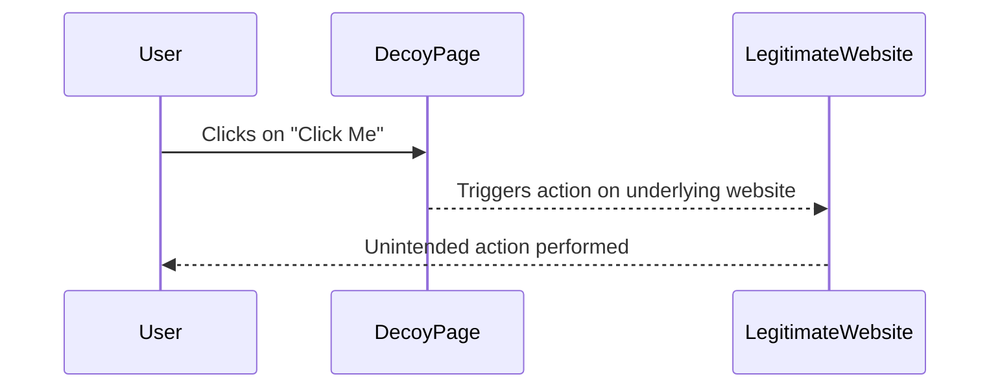

## Clickjacking Overview

Clickjacking, also known as UI redressing, is a malicious technique used by attackers to trick users into performing unintended actions on a web page. This attack exploits the way browsers handle frames and overlays to manipulate user interactions. In essence, an attacker creates a seemingly benign webpage that contains hidden elements or frames, which overlay the legitimate website's interactive elements. When a user interacts with the decoy page, they inadvertently perform actions on the underlying legitimate site.

### How Clickjacking Works

The core mechanism of clickjacking involves the following steps:

1. **Decoy Website Creation**: The attacker creates a webpage that appears harmless but contains hidden frames or layers.
2. **Overlaying Frames**: The attacker uses HTML `<iframe>` tags to embed the legitimate website within the decoy page.
3. **Positioning Overlays**: The attacker positions the embedded legitimate website such that its interactive elements (like buttons) are covered by transparent or nearly invisible elements on the decoy page.
4. **User Interaction**: When a user clicks on the decoy page, they are actually clicking on the underlying legitimate website's interactive elements, leading to unintended actions.

### Example Scenario

Consider a scenario where a user is logged into their bank account. An attacker creates a decoy page that contains an iframe embedding the bank's login page. The attacker then positions a transparent layer over the "Transfer Funds" button on the bank's page. When the user clicks on the decoy page, they inadvertently click on the "Transfer Funds" button, transferring money to the attacker's account.

### Real-World Examples

#### Recent Breaches and CVEs

- **CVE-2019-11358**: This vulnerability affected several popular websites, including Facebook and Twitter. Attackers exploited a clickjacking flaw to steal user data and perform unauthorized actions.
- **CVE-2020-14774**: A clickjacking vulnerability was discovered in the Microsoft SharePoint platform, allowing attackers to execute arbitrary commands on behalf of authenticated users.

### Code Example

Here is a simple example of a clickjacking exploit using HTML and CSS:

```html
<!DOCTYPE html>
<html>
<head>
    <style>
        /* Hide the iframe */
        .hidden {
            position: absolute;
            left: 0;
            top: 0;
            width: 100%;
            height: 100%;
            opacity: 0.00001; /* Make it almost invisible */
        }
    </style>
</head>
<body>
    <!-- Decoy button -->
    <button style="position: relative; z-index: 1;">Click Me</button>

    <!-- Hidden iframe containing the legitimate website -->
    <iframe class="hidden" src="https://legitimate-website.com"></iframe>
</body>
</html>
```

In this example, the `iframe` containing the legitimate website is positioned absolutely and made almost invisible using `opacity`. When a user clicks on the "Click Me" button, they are actually clicking on the underlying interactive elements of the legitimate website.

### Mermaid Diagram

A mermaid diagram can help visualize the clickjacking attack flow:



### Pitfalls and Common Mistakes

- **Incorrect Positioning**: If the attacker does not correctly position the overlay, the user might notice the discrepancy and avoid the trap.
- **Opacity Settings**: Setting the opacity too high can make the overlay visible, alerting the user to the deception.
- **User Awareness**: Educating users about the risks of clicking on suspicious links can mitigate the effectiveness of clickjacking attacks.

### How to Prevent / Defend

#### Detection

- **Browser Extensions**: Tools like NoScript and uMatrix can help detect and block clickjacking attempts by preventing the execution of scripts in iframes.
- **Network Monitoring**: Monitoring network traffic for unusual patterns can help identify potential clickjacking activities.

#### Prevention

- **X-Frame-Options Header**: Set the `X-Frame-Options` header to `DENY` or `SAMEORIGIN` to prevent the page from being loaded in an iframe.
- **Content Security Policy (CSP)**: Implement a Content Security Policy that restricts the sources from which iframes can be loaded.

#### Secure Coding Fixes

**Vulnerable Code**

```html
<!-- Vulnerable code without X-Frame-Options header -->
<!DOCTYPE html>
<html>
<head>
    <title>Legitimate Website</title>
</head>
<body>
    <button id="update-email">Update Email</button>
</body>
</html>
```

**Fixed Code**

```html
<!-- Fixed code with X-Frame-Options header -->
<!DOCTYPE html>
<html>
<head>
    <title>Legitimate Website</title>
    <meta http-equiv="X-Frame-Options" content="SAMEORIGIN">
</head>
<body>
    <button id="update-email">Update Email</button>
</body>
</html>
```

### Configuration Hardening

#### Nginx Configuration

To prevent clickjacking in an Nginx server, add the following configuration:

```nginx
server {
    listen 80;
    server_name example.com;

    location / {
        add_header X-Frame-Options SAMEORIGIN;
    }
}
```

#### Apache Configuration

For Apache servers, add the following to your `.htaccess` file:

```apache
<IfModule mod_headers.c>
    Header always append X-Frame-Options SAMEORIGIN
</IfModule>
```

### Practice Labs

To practice and understand clickjacking in a controlled environment, consider the following labs:

- **PortSwigger Web Security Academy**: Offers a comprehensive module on clickjacking, including practical exercises and challenges.
- **OWASP Juice Shop**: Contains various security vulnerabilities, including clickjacking, which can be explored and exploited.
- **DVWA (Damn Vulnerable Web Application)**: Provides a vulnerable web application that includes clickjacking scenarios for educational purposes.

By thoroughly understanding the mechanics of clickjacking, recognizing its real-world implications, and implementing robust preventive measures, web developers and security professionals can significantly reduce the risk of such attacks.

---
<!-- nav -->
[[Web Security (PortSwigger)/05-Clickjacking/04-Lab 3 Clickjacking with a frame buster script/00-Overview|Overview]] | [[Web Security (PortSwigger)/05-Clickjacking/04-Lab 3 Clickjacking with a frame buster script/02-Introduction to Clickjacking|Introduction to Clickjacking]]
