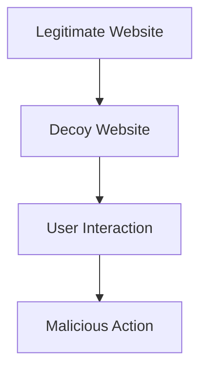

## Understanding Clickjacking

Clickjacking, also known as UI Redress Attack, is a malicious technique used by attackers to trick users into clicking on a hidden button or link. This can lead to unintended actions being performed on a user's behalf, such as making purchases, changing account settings, or even executing arbitrary JavaScript code. The attack typically involves overlaying a transparent or opaque layer over a legitimate webpage, making it appear as though the user is interacting with the original site.

### How Clickjacking Works

To understand clickjacking, let's break down the process step-by-step:

1. **Overlay Creation**: The attacker creates an iframe or a series of layers that contain the malicious content. These layers are often made invisible or semi-transparent using CSS properties like `opacity` and `z-index`.

2. **Positioning**: The attacker positions these layers precisely over the interactive elements of the legitimate website. This requires careful alignment to ensure that the user's clicks are directed to the malicious content rather than the intended elements.

3. **User Interaction**: When the user interacts with what they believe to be the legitimate website, their clicks are actually triggering actions on the malicious content. This can result in the execution of arbitrary JavaScript code or the submission of forms.

### Example Scenario

Consider a scenario where a user visits a legitimate website that contains a form to update their email address. An attacker could create a clickjacking exploit that overlays a hidden iframe containing a form to change the user's password. When the user clicks on the "Update Email" button, they inadvertently submit the password change form instead.

### Recent Real-World Examples

One notable example of clickjacking occurred in 2010 when Facebook was targeted by a clickjacking attack. The attacker created a malicious page that overlaid a hidden iframe containing a Like button. When users clicked on what they thought was a normal link, they were unknowingly liking the attacker's content, which spread rapidly through the social network.

### Code Example

Let's walk through a basic example of a clickjacking exploit. We will create an HTML page that contains both a legitimate website and a decoy website.

```html
<!DOCTYPE html>
<html lang="en">
<head>
    <meta charset="UTF-8">
    <title>Clickjacking Example</title>
    <style>
        .legitimate {
            position: absolute;
            top: 0;
            left: 0;
            width: 100%;
            height: 100%;
            z-index: 2;
            opacity: 0.5; /* Temporarily set to 0.5 for visibility */
        }
        .decoy {
            position: absolute;
            top: 700px;
            left: 50px;
            z-index: 1;
            background-color: red;
            color: white;
            padding: 10px;
        }
    </style>
</head>
<body>
    <iframe class="legitimate" src="https://example.com"></iframe>
    <div class="decoy">Click Me</div>
</body>
</html>
```

In this example, the `.legitimate` class represents the legitimate website, and the `.decoy` class represents the decoy website. The `z-index` property ensures that the decoy website is positioned above the legitimate website.

### Mermaid Diagram

A mermaid diagram can help visualize the structure of the clickjacking exploit:



### Pitfalls and Common Mistakes

1. **Incorrect Positioning**: If the decoy website is not correctly aligned with the legitimate website, the clickjacking attack will fail. Precise positioning is crucial.
   
2. **Opacity Issues**: Setting the opacity too low can make the decoy website visible, alerting the user to the attack. However, setting it too high can make the legitimate website difficult to see.

3. **Z-Index Confusion**: Incorrectly setting the `z-index` can cause the decoy website to be positioned below the legitimate website, rendering the attack ineffective.

### How to Prevent / Defend Against Clickjacking

#### Detection

1. **Content Security Policy (CSP)**: Implementing a Content Security Policy can help mitigate clickjacking attacks by restricting the sources from which content can be loaded. For example, you can use the `frame-ancestors` directive to specify which domains are allowed to frame your content.

    ```http
    Content-Security-Policy: frame-ancestors 'self';
    ```

2. **X-Frame-Options Header**: This header can be used to specify whether or not a browser should be allowed to render a page in a frame, iframe, or object. Setting it to `SAMEORIGIN` or `DENY` can prevent framing from external sites.

    ```http
    X-Frame-Options: SAMEORIGIN
    ```

#### Prevention

1. **Secure Coding Practices**: Ensure that all interactive elements on your website are properly validated and sanitized. Avoid using inline event handlers and instead use event listeners.

2. **Use of Frame-Busting Scripts**: Although not foolproof, frame-busting scripts can help prevent framing attacks. These scripts check if the current page is being framed and, if so, redirect the user to the top-level domain.

    ```javascript
    if (top !== self) {
        top.location = self.location;
    }
    ```

#### Secure Code Fix

Here is an example of how to implement a secure Content Security Policy and X-Frame-Options header:

```http
HTTP/1.1 200 OK
Content-Type: text/html
Content-Security-Policy: frame-ancestors 'self'
X-Frame-Options: SAMEORIGIN

<!DOCTYPE html>
<html lang="en">
<head>
    <meta charset="UTF-8">
    <title>Secure Website</title>
</head>
<body>
    <h1>Welcome to the Secure Website</h1>
</body>
</html>
```

### Conclusion

Clickjacking is a sophisticated attack that can have serious consequences for both users and websites. By understanding the mechanics of the attack and implementing robust security measures, you can protect against these types of exploits. Always stay vigilant and keep your security practices up-to-date to defend against emerging threats.

### Practice Labs

For hands-on experience with clickjacking and related vulnerabilities, consider the following labs:

- **PortSwigger Web Security Academy**: Offers detailed labs on various web security topics, including clickjacking.
- **OWASP Juice Shop**: A deliberately insecure web application for practicing web security skills.
- **DVWA (Damn Vulnerable Web Application)**: A PHP/MySQL web application that is riddled with vulnerabilities for educational purposes.

These resources provide practical scenarios to test and improve your understanding of web security concepts.

---
<!-- nav -->
[[Web Security (PortSwigger)/05-Clickjacking/05-Lab 4 Exploiting clickjacking vulnerability to trigger DOM based XSS/02-Introduction to Clickjacking|Introduction to Clickjacking]] | [[Web Security (PortSwigger)/05-Clickjacking/05-Lab 4 Exploiting clickjacking vulnerability to trigger DOM based XSS/00-Overview|Overview]] | [[Web Security (PortSwigger)/05-Clickjacking/05-Lab 4 Exploiting clickjacking vulnerability to trigger DOM based XSS/04-Practice Questions & Answers|Practice Questions & Answers]]
