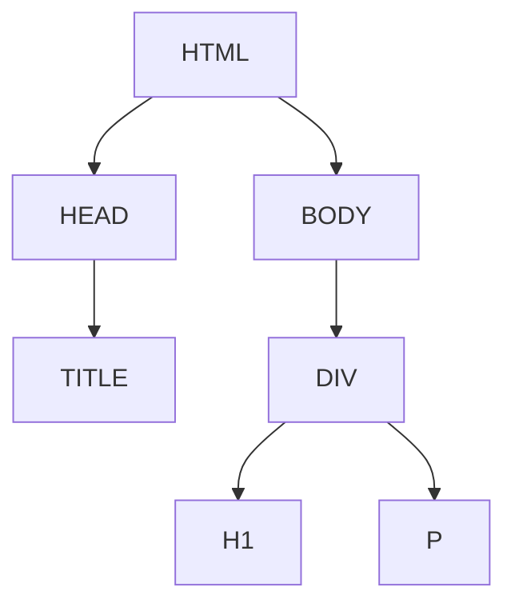

## DOM-Based Vulnerabilities and DOM-XSS Using Web Messages

### Introduction to DOM-Based Vulnerabilities

DOM-based vulnerabilities occur when a web application dynamically modifies the Document Object Model (DOM) based on untrusted input. This can lead to various types of attacks, including Cross-Site Scripting (XSS), where an attacker injects malicious scripts into a webpage viewed by other users. Unlike traditional XSS attacks, which rely on server-side modifications, DOM-based XSS attacks manipulate the client-side DOM directly.

### Understanding the DOM

The Document Object Model (DOM) is a programming interface for web documents. It represents the page so that programs can change the document structure, style, and content. The DOM represents the document as a tree structure, where each node is an object representing parts of the HTML.

#### Example of DOM Structure

Consider the following HTML snippet:

```html
<!DOCTYPE html>
<html>
<head>
    <title>Example Page</title>
</head>
<body>
    <div id="content">
        <h1>Welcome to My Website</h1>
        <p id="message">Hello, World!</p>
    </div>
</body>
</html>
```

This HTML can be represented as a DOM tree:



### DOM-Based XSS Attack Overview

In a DOM-based XSS attack, the attacker injects malicious JavaScript into the DOM. This can be achieved through various methods, such as manipulating URL parameters, hash values, or other untrusted inputs.

#### Example of DOM-Based XSS

Consider a web application that uses the `window.location.hash` value to display content dynamically:

```javascript
var hash = window.location.hash;
document.getElementById('content').innerHTML = decodeURIComponent(hash);
```

If an attacker can control the `hash` value, they can inject malicious scripts. For instance, if the URL is `http://example.com/#<script>alert('XSS')</script>`, the script will execute when the page loads.

### Lab Setup: DOM-XSS Using Web Messages

To demonstrate a DOM-based XSS attack using web messages, we will set up an iframe and use the `postMessage` API to inject a malicious script.

#### Step-by-Step Exploit Construction

1. **Create an Iframe**: We will create an iframe that points to the target application.
2. **Inject Malicious Script**: Use the `postMessage` API to send a malicious script to the target application.

Here is the complete setup:

```html
<!DOCTYPE html>
<html>
<head>
    <title>DOM-XSS Lab</title>
</head>
<body>
    <iframe id="targetFrame" src="http://example.com"></iframe>
    <script>
        var iframe = document.getElementById('targetFrame');
        var targetOrigin = "http://example.com";

        // Wait until the iframe is loaded
        iframe.onload = function() {
            // Inject the malicious script
            iframe.contentWindow.postMessage('','*');
        };
    </script>
</body>
</html>
```

#### Explanation of the Code

- **Iframe Creation**: The `<iframe>` tag creates an inline frame that embeds another document within the current document.
- **Post Message**: The `postMessage` method sends a message to the target window (`iframe.contentWindow`). The first parameter is the message to be sent, and the second parameter is the target origin.
- **Malicious Payload**: The payload is an image tag with an `onerror` event handler. When the image fails to load (since the source is nonexistent), the `onerror` event triggers the alert box.

### Real-World Examples and Recent Breaches

#### Example: CVE-2021-44228 (Log4j)

While not directly related to DOM-based XSS, the Log4j vulnerability demonstrates the importance of input validation and sanitization. In this case, attackers could inject malicious payloads into log messages, leading to remote code execution.

#### Example: CVE-2022-22965 (Spring Framework)

Another example is the Spring Framework vulnerability, where attackers could inject malicious payloads into HTTP headers, leading to arbitrary code execution. This highlights the need for thorough input validation and sanitization across all input sources.

### How to Prevent / Defend Against DOM-Based XSS

#### Detection

- **Static Analysis Tools**: Use tools like ESLint, SonarQube, or commercial static analysis solutions to identify potential DOM-based XSS vulnerabilities.
- **Dynamic Analysis Tools**: Use tools like Burp Suite, ZAP, or commercial dynamic analysis solutions to test for runtime vulnerabilities.

#### Prevention

- **Input Validation**: Ensure that all untrusted inputs are validated and sanitized before being used in the DOM.
- **Content Security Policy (CSP)**: Implement a strict CSP to limit the sources of executable scripts.
- **Sanitize Inputs**: Use libraries like DOMPurify to sanitize user inputs before inserting them into the DOM.

#### Secure Coding Fixes

**Vulnerable Code**:

```javascript
var hash = window.location.hash;
document.getElementById('content').innerHTML = decodeURIComponent(hash);
```

**Secure Code**:

```javascript
var hash = window.location.hash;
var sanitizedHash = DOMPurify.sanitize(decodeURIComponent(hash));
document.getElementById('content').innerHTML = sanitizedHash;
```

### Complete Example with Full HTTP Request and Response

#### HTTP Request

```http
POST /iframe-target HTTP/1.1
Host: example.com
Content-Type: application/json
Content-Length: 100

{
    "message": ""
}
```

#### HTTP Response

```http
HTTP/1.1 200 OK
Date: Mon, 20 Nov 2023 12:00:00 GMT
Content-Type: text/html; charset=UTF-8
Content-Length: 100

<!DOCTYPE html>
<html>
<head>
    <title>Iframe Target</title>
</head>
<body>
    <div id="content"></div>
</body>
</html>
```

### Pitfalls and Common Mistakes

- **Assuming Input is Trusted**: Always assume that any input from the user or external sources is untrusted and potentially malicious.
- **Ignoring Content Security Policy (CSP)**: Not implementing a strict CSP can leave your application vulnerable to various attacks.
- **Overlooking Sanitization Libraries**: Relying solely on manual sanitization can lead to oversight and vulnerabilities.

### Hands-On Labs

For practical experience with DOM-based XSS and web messages, consider the following labs:

- **PortSwigger Web Security Academy**: Offers detailed labs on various web security topics, including DOM-based XSS.
- **OWASP Juice Shop**: A deliberately insecure web application for security training purposes.
- **DVWA (Damn Vulnerable Web Application)**: Another popular web application for learning about web vulnerabilities.

These labs provide real-world scenarios and hands-on experience to solidify your understanding of DOM-based vulnerabilities and how to defend against them.

By thoroughly understanding the concepts, mechanisms, and preventive measures, you can effectively mitigate the risks associated with DOM-based XSS attacks.

---
<!-- nav -->
[[Web Security (PortSwigger)/06-DOM-based Vulnerabilities/01-Lab 1 DOM XSS using web messages/01-Introduction to DOM-Based Vulnerabilities|Introduction to DOM-Based Vulnerabilities]] | [[Web Security (PortSwigger)/06-DOM-based Vulnerabilities/01-Lab 1 DOM XSS using web messages/00-Overview|Overview]] | [[Web Security (PortSwigger)/06-DOM-based Vulnerabilities/01-Lab 1 DOM XSS using web messages/03-Practice Questions & Answers|Practice Questions & Answers]]
