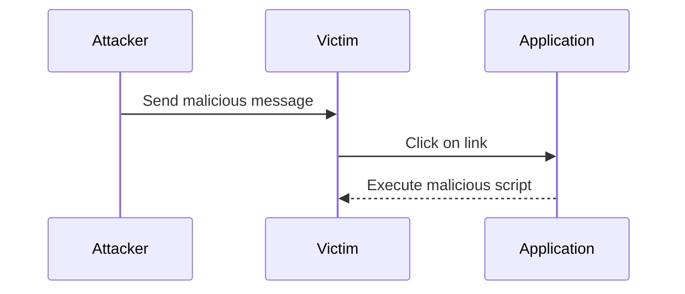
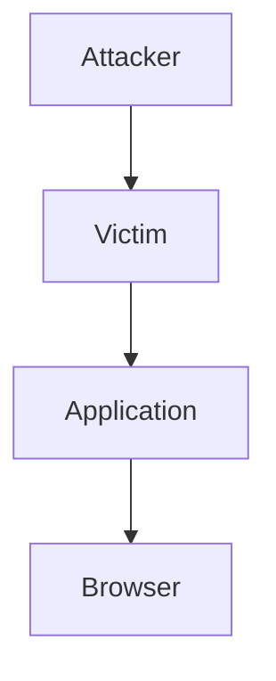

## Understanding DOM-Based Vulnerabilities

### What Are DOM-Based Vulnerabilities?

DOM-based vulnerabilities occur when a web application uses untrusted data to update the Document Object Model (DOM) without proper validation or sanitization. This can lead to various types of attacks, including Cross-Site Scripting (XSS). In the context of the provided lecture, we are focusing on DOM-based XSS vulnerabilities, specifically those involving web messages and JavaScript URLs.

### Why Are They Important?

DOM-based vulnerabilities are critical because they allow attackers to inject malicious scripts into a webpage, which can then execute within the victim's browser. This can result in unauthorized access to sensitive data, session hijacking, and other malicious activities. Understanding these vulnerabilities is essential for both developers and security professionals to ensure the integrity and security of web applications.

### How Do They Work?

To understand how DOM-based vulnerabilities work, let's break down the components involved:

1. **Document Object Model (DOM)**: The DOM is a programming interface for HTML and XML documents. It represents the document as a tree structure, allowing programs and scripts to dynamically access and update the content, structure, and style of a document.

2. **Untrusted Data**: Untrusted data refers to any input that comes from an external source, such as user input, query parameters, or messages from other domains.

3. **Event Listeners**: Event listeners are functions that get executed when a specific event occurs. In the context of the lecture, the `addEventListener` function is used to listen for messages sent to the application.

### Example Code Analysis

Let's analyze the provided code snippet to understand the vulnerability:

```javascript
// Add event listener for message events
window.addEventListener('message', function(event) {
    var url = event.data;
    if (url.indexOf('http:') !== -1 || url.indexOf('https:') !== -1) {
        location.href = url;
    }
});
```

In this code, the application listens for `message` events and updates the `location.href` based on the received data. The key issue here is that the `url` variable is directly assigned from the `event.data`, which is untrusted input. This lack of validation or sanitization makes the application vulnerable to DOM-based XSS.

### Real-World Examples

#### Recent CVEs and Breaches

One notable example of a DOM-based XSS vulnerability is CVE-2021-30143, which affected the popular web conferencing platform Zoom. The vulnerability allowed attackers to inject malicious scripts into the meeting URL, leading to potential session hijacking and data theft.

Another example is CVE-2020-14182, which affected the WordPress plugin "WPML Multilingual CMS". The plugin was vulnerable to DOM-based XSS due to improper handling of user input in the URL.

### Detailed Attack Scenario

Let's walk through a detailed attack scenario to understand how an attacker might exploit this vulnerability:

1. **Attacker Sends Malicious Message**:
   The attacker sends a malicious message to the application using the `postMessage` API. The message contains a JavaScript URL that will execute in the victim's browser.

2. **Victim Clicks on Link**:
   When the victim clicks on the link, the malicious script is executed in their browser, potentially stealing cookies, session tokens, or other sensitive information.

Here is a step-by-step breakdown of the attack:

1. **Attacker's Code**:
   ```javascript
   // Attacker's code to send a malicious message
   var iframe = document.createElement('iframe');
   iframe.src = 'https://vulnerable-application.com';
   document.body.appendChild(iframe);

   // Send a malicious message to the application
   iframe.contentWindow.postMessage('javascript:alert("XSS")', '*');
   ```

2. **Application's Response**:
   ```javascript
   // Application's code to handle the message
   window.addEventListener('message', function(event) {
       var url = event.data;
       if (url.indexOf('http:') !== -1 || url.indexOf('https:') !== -1) {
           location.href = url;
       }
   });
   ```

3. **Result**:
   When the victim clicks on the link, the `javascript:` URL is executed, triggering the alert box.

### How to Prevent / Defend

#### Detection

To detect DOM-based XSS vulnerabilities, you can use automated tools such as static analysis tools (e.g., SonarQube, ESLint) and dynamic analysis tools (e.g., Burp Suite, OWASP ZAP). These tools can help identify untrusted data sources and potential sinks where the data is used to update the DOM.

#### Prevention

To prevent DOM-based XSS vulnerabilities, follow these best practices:

1. **Input Validation**: Validate all untrusted inputs to ensure they meet expected formats and constraints.

2. **Output Encoding**: Encode untrusted data before inserting it into the DOM. Use libraries such as DOMPurify to sanitize user input.

3. **Content Security Policy (CSP)**: Implement a strict CSP to restrict the sources of executable scripts and prevent inline scripts from executing.

4. **Secure Coding Practices**: Follow secure coding guidelines and use frameworks that provide built-in protections against XSS.

#### Secure Code Fix

Here is an example of how to securely handle the message event:

```javascript
// Secure code to handle the message event
window.addEventListener('message', function(event) {
    var url = event.data;
    if (url.indexOf('http:') !== -1 || url.indexOf('https:') !== -1) {
        // Sanitize the URL before assigning it to location.href
        var sanitizedUrl = DOMPurify.sanitize(url);
        location.href = sanitizedUrl;
    }
});
```

### Complete Example

Let's put everything together with a complete example:

#### Vulnerable Code

```javascript
// Vulnerable code
window.addEventListener('message', function(event) {
    var url = event.data;
    if (url.indexOf('http:') !== -1 || url.indexOf('https:') !== -1) {
        location.href = url;
    }
});
```

#### Secure Code

```javascript
// Secure code
window.addEventListener('message', function(event) {
    var url = event.data;
    if (url.indexOf('http:') !== -1 || url.indexOf('https:') !== -1) {
        // Sanitize the URL before assigning it to location.href
        var sanitizedUrl = DOMPurify.sanitize(url);
        location.href = sanitizedUrl;
    }
});
```

### Mermaid Diagrams

#### Attack Chain Diagram



#### Network Topology Diagram



### Hands-On Labs

For hands-on practice with DOM-based XSS vulnerabilities, consider the following labs:

- **PortSwigger Web Security Academy**: Offers interactive labs on various web security topics, including DOM-based XSS.
- **OWASP Juice Shop**: A deliberately insecure web application for practicing web security skills.
- **DVWA (Damn Vulnerable Web Application)**: A PHP/MySQL web application that is riddled with vulnerabilities for educational purposes.

By thoroughly understanding and implementing the best practices outlined above, you can significantly reduce the risk of DOM-based XSS vulnerabilities in your web applications.

---
<!-- nav -->
[[02-Lab 2 DOM XSS Using Web Messages and JavaScript URL|Lab 2 DOM XSS Using Web Messages and JavaScript URL]] | [[Web Security (PortSwigger)/06-DOM-based Vulnerabilities/02-Lab 2 DOM XSS using web messages and a JavaScript URL/00-Overview|Overview]] | [[Web Security (PortSwigger)/06-DOM-based Vulnerabilities/02-Lab 2 DOM XSS using web messages and a JavaScript URL/04-Practice Questions & Answers|Practice Questions & Answers]]
