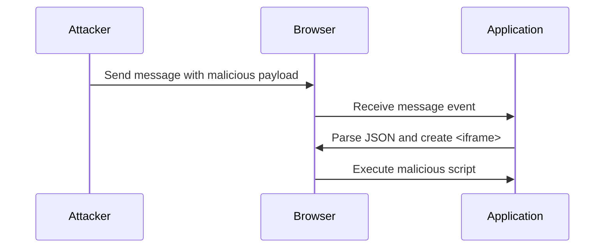

## DOM-Based Vulnerabilities and DOM XSS Using Web Messages and JSON.parse

### Introduction to DOM-Based Vulnerabilities

DOM-based vulnerabilities occur when a web application processes user input and dynamically modifies the Document Object Model (DOM) without proper validation or sanitization. This can lead to various types of attacks, including Cross-Site Scripting (XSS), which allows an attacker to inject malicious scripts into a web page viewed by other users.

### Understanding the Application Code

Let's start by examining the provided code snippet:

```javascript
// Example of the application code
window.addEventListener('message', function(event) {
    var data = JSON.parse(event.data);
    var iframe = document.createElement('iframe');
    iframe.src = data.url;
    document.body.appendChild(iframe);
});
```

In this code, the `addEventListener` method is used to listen for `message` events. When a `message` event is received, the `data` property of the event object is parsed as JSON and used to create an `<iframe>` element. The `src` attribute of the `<iframe>` is set to the value of `data.url`, and the `<iframe>` is appended to the document body.

### Analysis of the Vulnerability

#### What is DOM-Based XSS?

DOM-Based XSS occurs when an attacker can manipulate the DOM content through user input. In this case, the `data.url` value is directly used to set the `src` attribute of the `<iframe>`. If an attacker can control the `data.url` value, they can inject malicious content into the web page.

#### Why is This Vulnerable?

The vulnerability arises because the `data.url` value is not validated or sanitized before being used to set the `src` attribute. An attacker can send a crafted `message` event with a malicious URL, leading to the execution of arbitrary scripts within the context of the web page.

### Real-World Examples

#### Recent CVEs and Breaches

One notable example of a DOM-based XSS vulnerability is CVE-2021-3116, which affected several web applications. In this case, attackers were able to inject malicious scripts into the DOM by manipulating user input. Another example is the breach of a popular social media platform, where attackers exploited a DOM-based XSS vulnerability to steal user credentials.

### Detailed Attack Scenario

Let's break down the attack scenario step-by-step:

1. **Attacker Sends a Malicious Message**:
   The attacker sends a `message` event with a crafted payload. For example:

   ```javascript
   // Attacker's code to send a malicious message
   window.postMessage(JSON.stringify({ url: 'javascript:alert("XSS")' }), '*');
   ```

2. **Application Receives the Message**:
   The application receives the `message` event and parses the `data` property as JSON.

3. **Malicious Content is Injected**:
   The `data.url` value is used to set the `src` attribute of the `<iframe>`, resulting in the execution of the malicious script.

### Mermaid Diagram of the Attack Chain



### How to Prevent / Defend Against DOM-Based XSS

#### Detection

To detect DOM-based XSS vulnerabilities, you can use automated tools such as static analysis tools (e.g., SonarQube, ESLint) and dynamic analysis tools (e.g., Burp Suite, OWASP ZAP). These tools can help identify potential vulnerabilities in your code.

#### Prevention

To prevent DOM-based XSS, follow these best practices:

1. **Input Validation and Sanitization**:
   Validate and sanitize all user inputs before using them to modify the DOM. For example, you can use libraries like DOMPurify to sanitize HTML content.

2. **Content Security Policy (CSP)**:
   Implement a strict Content Security Policy (CSP) to restrict the sources of executable scripts. This can help mitigate the impact of XSS attacks.

3. **Secure Coding Practices**:
   Follow secure coding practices to avoid common pitfalls. For example, avoid using `eval()` and ensure that user inputs are properly escaped.

#### Secure Code Fix

Here is an example of how to securely handle the `message` event:

```javascript
// Secure code example
window.addEventListener('message', function(event) {
    try {
        var data = JSON.parse(event.data);
        if (typeof data.url === 'string') {
            var iframe = document.createElement('iframe');
            iframe.src = data.url;
            document.body.appendChild(iframe);
        }
    } catch (error) {
        console.error('Error parsing message data:', error);
    }
});
```

In this secure code example, we validate the `data.url` value before using it to set the `src` attribute. We also handle any errors that may occur during the parsing process.

### Complete Example with HTTP Requests and Responses

#### HTTP Request

```http
POST /api/message HTTP/1.1
Host: example.com
Content-Type: application/json

{
    "url": "javascript:alert('XSS')"
}
```

#### HTTP Response

```http
HTTP/1.1 200 OK
Content-Type: application/json

{
    "status": "success",
    "message": "Message received"
}
```

### Common Pitfalls and Mistakes

#### Unvalidated User Input

One common mistake is failing to validate user input before using it to modify the DOM. Always validate and sanitize user inputs to prevent injection attacks.

#### Lack of Proper Error Handling

Another common mistake is failing to handle errors properly. Always include error handling mechanisms to ensure that unexpected inputs do not cause security vulnerabilities.

### Hands-On Labs

For hands-on practice with DOM-based vulnerabilities and DOM XSS, consider the following labs:

- **PortSwigger Web Security Academy**: Offers interactive labs on various web security topics, including DOM-based XSS.
- **OWASP Juice Shop**: A deliberately insecure web application for practicing web security skills.
- **DVWA (Damn Vulnerable Web Application)**: A PHP/MySQL web application that demonstrates web vulnerabilities.

These labs provide practical experience in identifying and mitigating DOM-based vulnerabilities.

### Conclusion

Understanding and preventing DOM-based vulnerabilities is crucial for securing web applications. By following best practices and using secure coding techniques, you can protect your applications from attacks such as DOM-based XSS. Regularly testing and validating your code can help ensure that your applications remain secure against these types of vulnerabilities.

---
<!-- nav -->
[[02-DOM-Based Vulnerabilities DOM XSS Using Web Messages and `JSON.parse`|DOM-Based Vulnerabilities DOM XSS Using Web Messages and `JSON.parse`]] | [[Web Security (PortSwigger)/06-DOM-based Vulnerabilities/03-Lab 3 DOM XSS using web messages and JSONparse/00-Overview|Overview]] | [[04-DOM-Based Vulnerabilities|DOM-Based Vulnerabilities]]
