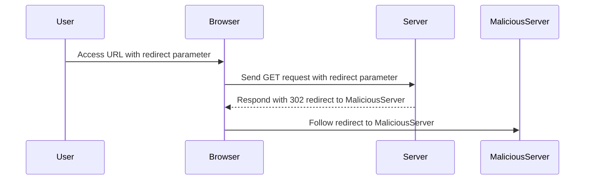

## Exploiting DOM-Based Open Redirection

Now that we have identified the potential vulnerability, let's proceed to exploit it.

### Identifying the Vulnerable Parameter

In this lab, the application reads a `redirect` parameter from the URL and uses it to set the location of the page. We need to identify this parameter and test if it can be manipulated to cause a redirect.

#### Example URL

```plaintext
http://example.com/?redirect=http://malicious.com/
```

### Crafting the Exploit

To exploit the vulnerability, we need to craft a URL that includes the `redirect` parameter with a malicious URL.

1. **Modify the URL**: Change the `redirect` parameter to point to a malicious URL.
2. **Intercept the Request**: Use Burp Suite to intercept the modified request and send it to the application.

#### Example Exploit URL

```plaintext
http://example.com/?redirect=http://exploit-server.com/
```

### Observing the Redirect

Once the modified request is sent, observe the behavior of the application. If the application redirects to the malicious URL, the vulnerability has been successfully exploited.

#### Expected Behavior

- The browser should redirect to the specified malicious URL.
- The application should not validate or sanitize the `redirect` parameter.

### Full HTTP Request and Response

Let's look at the full HTTP request and response to understand the interaction between the client and the server.

#### HTTP Request

```http
GET /?redirect=http://exploit-server.com/ HTTP/1.1
Host: example.com
User-Agent: Mozilla/5.0 (Windows NT 10.0; Win64; x64) AppleWebKit/537.36 (KHTML, like Gecko) Chrome/91.0.4472.124 Safari/537.36
Accept: text/html,application/xhtml+xml,application/xml;q=0.9,image/avif,image/webp,image/apng,*/*;q=0.8,application/signed-exchange;v=b3;q=0.9
Accept-Encoding: gzip, deflate
Accept-Language: en-US,en;q=0.9
Connection: close
```

#### HTTP Response

```http
HTTP/1.1 302 Found
Date: Tue, 01 Mar 2022 12:00:00 GMT
Server: Apache/2.4.41 (Ubuntu)
Location: http://exploit-server.com/
Content-Type: text/html; charset=UTF-8
Content-Length: 0
Connection: close
```

### Mermaid Diagram: Attack Chain

A mermaid diagram can help visualize the attack chain.



---
<!-- nav -->
[[02-DOM-Based Vulnerabilities Understanding and Mitigating DOM-Based Open Redirection|DOM-Based Vulnerabilities Understanding and Mitigating DOM-Based Open Redirection]] | [[Web Security (PortSwigger)/06-DOM-based Vulnerabilities/04-Lab 4 DOM based open redirection/00-Overview|Overview]] | [[04-How to Prevent  Defend Against DOM-Based Open Redirection|How to Prevent  Defend Against DOM-Based Open Redirection]]
