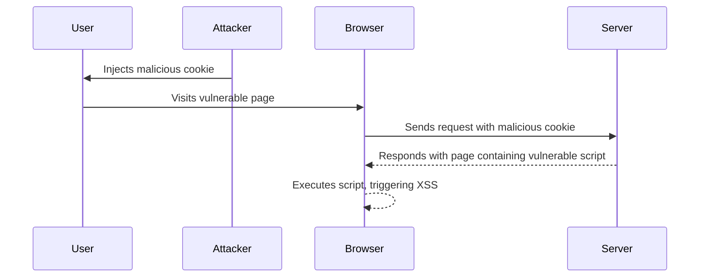

## Understanding DOM-Based Vulnerabilities

### What Are DOM-Based Vulnerabilities?

DOM-based vulnerabilities occur when a web application's client-side JavaScript manipulates the Document Object Model (DOM) in a way that can be influenced by untrusted input. This untrusted input could come from various sources such as URL parameters, cookies, local storage, or user input. When an attacker can control this input, they can inject malicious scripts or manipulate the DOM in ways that can lead to security issues like Cross-Site Scripting (XSS).

### Why Do DOM-Based Vulnerabilities Matter?

DOM-based vulnerabilities are significant because they can bypass traditional server-side protections. Unlike reflected or stored XSS attacks, which rely on the server to reflect or store the malicious script, DOM-based vulnerabilities operate entirely on the client side. This makes them harder to detect and mitigate using standard server-side security measures.

### How Do DOM-Based Vulnerabilities Work?

To understand how DOM-based vulnerabilities work, let's break down the process:

1. **Untrusted Input**: An attacker finds a way to inject untrusted input into the application. This could be through URL parameters, cookies, or other sources.
2. **JavaScript Execution**: The client-side JavaScript reads this untrusted input and uses it to manipulate the DOM.
3. **Malicious Script Injection**: If the untrusted input is not properly sanitized, it can contain malicious scripts that execute when the page loads or interacts with the user.

### Example: DOM-Based Cookie Manipulation

Let's consider the example provided in the lecture transcript. The script in question is manipulating the DOM to introduce a cross-site scripting vulnerability that triggers the `print` function when the user visits the application.

#### Background Theory

In this scenario, the attacker might inject a payload into a cookie that the JavaScript reads and uses to modify the DOM. Here’s a simplified example of how this might look:

```javascript
// Vulnerable JavaScript Code
var cookieValue = document.cookie;
document.getElementById("content").innerHTML = cookieValue;
```

If an attacker sets a cookie value to something like `"<script>alert('XSS')</script>"`, the JavaScript will read this value and insert it into the DOM, leading to an XSS attack.

### Real-World Examples

#### Recent CVEs and Breaches

One notable real-world example of a DOM-based vulnerability is the CVE-2019-11358, which affected the popular jQuery library. This vulnerability allowed attackers to inject malicious scripts via URL parameters, leading to potential XSS attacks.

Another example is the CVE-2020-14182, which affected the AngularJS framework. This vulnerability allowed attackers to inject malicious scripts via URL parameters, leading to potential XSS attacks.

### Complete Code Example

Let's walk through a complete example of how this might look in practice:

#### Vulnerable Code

```javascript
// Vulnerable JavaScript Code
var cookieValue = document.cookie;
document.getElementById("content").innerHTML = cookieValue;
```

#### Exploit Payload

An attacker might set a cookie value to something like:

```http
Set-Cookie: xss=<script>alert('XSS')</script>
```

#### Full HTTP Request and Response

Here’s what the full HTTP request and response might look like:

```http
GET /vulnerable-page HTTP/1.1
Host: example.com
Cookie: xss=<script>alert('XSS')</script>

HTTP/1.1 200 OK
Content-Type: text/html
Set-Cookie: xss=<script>alert('XSS')</script>

<!DOCTYPE html>
<html>
<head>
    <title>Vulnerable Page</title>
</head>
<body>
    <div id="content"></div>
    <script>
        var cookieValue = document.cookie;
        document.getElementById("content").innerHTML = cookieValue;
    </script>
</body>
</html>
```

### Mermaid Diagrams

Let's visualize the attack chain using a mermaid diagram:



### Pitfalls and Common Mistakes

#### Unsanitized Input

One of the most common mistakes is failing to sanitize input before using it to manipulate the DOM. This allows attackers to inject malicious scripts.

#### Lack of Content Security Policy (CSP)

Another common mistake is not implementing a Content Security Policy (CSP) that can help mitigate the impact of XSS attacks.

### How to Prevent / Defend

#### Detection

To detect DOM-based vulnerabilities, you can use automated tools like static analysis tools (e.g., ESLint with plugins) and dynamic analysis tools (e.g., Burp Suite, OWASP ZAP).

#### Prevention

1. **Sanitize Input**: Always sanitize untrusted input before using it to manipulate the DOM. Use libraries like DOMPurify to sanitize HTML content.
   
   ```javascript
   // Secure JavaScript Code
   var cookieValue = document.cookie;
   document.getElementById("content").innerHTML = DOMPurify.sanitize(cookieValue);
   ```

2. **Use Content Security Policy (CSP)**: Implement a strict CSP to limit the sources from which scripts can be loaded.

   ```http
   Content-Security-Policy: default-src 'self'; script-src 'self'
   ```

3. **Avoid Direct DOM Manipulation**: Avoid directly manipulating the DOM with untrusted data. Instead, use frameworks and libraries that handle sanitization for you.

### Secure Coding Fixes

#### Vulnerable vs. Fixed Code

Here’s a comparison of the vulnerable and fixed code:

**Vulnerable Code:**

```javascript
var cookieValue = document.cookie;
document.getElementById("content").innerHTML = cookieValue;
```

**Fixed Code:**

```javascript
var cookieValue = document.cookie;
document.getElementById("content").innerHTML = DOMPurify.sanitize(cookieValue);
```

### Hands-On Practice Labs

For hands-on practice with DOM-based vulnerabilities, consider the following labs:

- **PortSwigger Web Security Academy**: Offers a variety of labs that cover different types of XSS vulnerabilities, including DOM-based ones.
- **OWASP Juice Shop**: A deliberately insecure web application that includes several DOM-based vulnerabilities.
- **DVWA (Damn Vulnerable Web Application)**: Another intentionally vulnerable web application that includes DOM-based XSS challenges.

These labs provide practical experience in identifying and exploiting DOM-based vulnerabilities, as well as learning how to defend against them.

### Conclusion

DOM-based vulnerabilities are a critical aspect of web security that can lead to serious security issues if not properly addressed. By understanding the underlying mechanisms, recognizing common pitfalls, and implementing robust defenses, developers can significantly reduce the risk of these vulnerabilities affecting their applications.

---
<!-- nav -->
[[05-Injecting Malicious Cookies|Injecting Malicious Cookies]] | [[Web Security (PortSwigger)/06-DOM-based Vulnerabilities/05-Lab 5 DOM based cookie manipulation/00-Overview|Overview]] | [[Web Security (PortSwigger)/06-DOM-based Vulnerabilities/05-Lab 5 DOM based cookie manipulation/07-Understanding the Lab Environment|Understanding the Lab Environment]]
