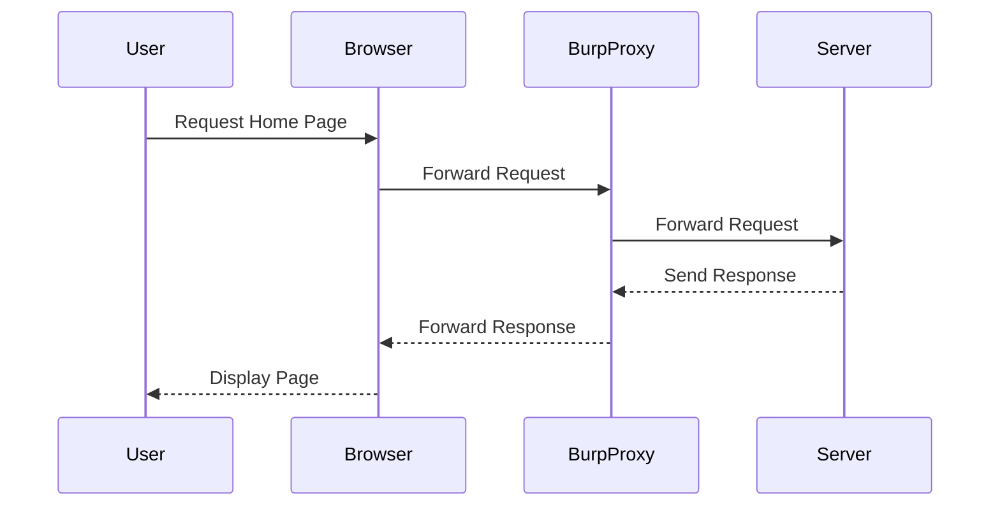

## Understanding the Lab Environment

To understand and solve the DOM-based cookie manipulation lab, we need to familiarize ourselves with the environment and tools used.

### Accessing the Lab

The lab is hosted on the PortSwigger Web Security Academy. To access it:

1. Visit `https://portswigger.net/web-security`.
2. Click on the "Sign up" button to create an account if you don't already have one.
3. Log in to your account.
4. Navigate to the "Academy" section.
5. Search for "DOM-based vulnerabilities labs".
6. Select lab number five, titled "Dom-Based Cookie Manipulation".

### Tools Used

- **Burp Suite**: A comprehensive toolkit for web application security testing.
- **Exploit Server**: A server provided by the lab environment to assist in directing the victim to the correct pages.

### Viewing the Page Source

When dealing with DOM-based vulnerabilities, it's crucial to inspect the page source to identify any insecure JavaScript that might introduce vulnerabilities. Let's start by viewing the page source of the home page.

---
<!-- nav -->
[[06-Understanding DOM-Based Vulnerabilities|Understanding DOM-Based Vulnerabilities]] | [[Web Security (PortSwigger)/06-DOM-based Vulnerabilities/05-Lab 5 DOM based cookie manipulation/00-Overview|Overview]] | [[Web Security (PortSwigger)/06-DOM-based Vulnerabilities/05-Lab 5 DOM based cookie manipulation/08-Conclusion|Conclusion]]
