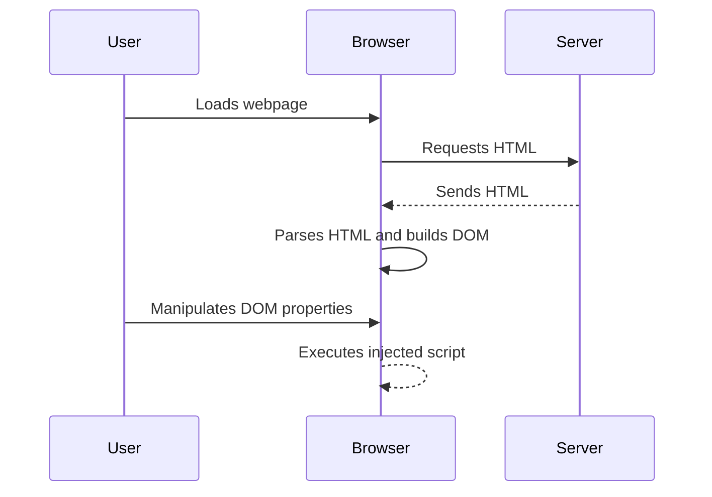

## Introduction to DOM-Based Vulnerabilities

DOM-based vulnerabilities occur when a web application processes user input within the browser's Document Object Model (DOM) without proper sanitization or validation. These vulnerabilities can lead to various attacks, including Cross-Site Scripting (XSS), which can compromise user data and privacy. One specific type of DOM-based vulnerability is DOM clobbering, which we will explore in detail in this chapter.

### What is DOM Clobbering?

DOM clobbering occurs when an attacker manipulates the DOM properties in such a way that they override or "clobber" legitimate properties. This can lead to unexpected behavior and can be exploited to inject malicious scripts into the page.

#### Why Does DOM Clobbering Matter?

DOM clobbering is significant because it can bypass traditional server-side input validation mechanisms. Since the manipulation happens client-side, the server may not even be aware of the malicious activity. This makes it particularly dangerous and difficult to detect.

#### How Does DOM Clobbering Work Under the Hood?

When a web page loads, the browser parses the HTML and constructs the DOM tree. Each node in the DOM tree represents an element in the HTML document. Properties of these nodes can be manipulated using JavaScript. If an attacker can manipulate these properties, they can potentially execute arbitrary JavaScript code.

### Real-World Examples of DOM Clobbering

One notable real-world example of DOM clobbering is the CVE-2019-11358, which affected several popular websites. Attackers were able to exploit DOM clobbering to inject malicious scripts into the page, leading to potential data theft and other malicious activities.



### Lab Setup: Exploiting DOM Clobbering to Enable XSS

To understand and practice exploiting DOM clobbering, we will use the Web Security Academy provided by PortSwigger. This lab is designed to simulate a real-world scenario where an attacker can exploit DOM clobbering to enable XSS.

#### Accessing the Lab

1. **Sign Up**: Visit `https://portswigger.net/web-security` and sign up for an account.
2. **Navigate to the Lab**:
    - Click on "Academy".
    - Select "All Content".
    - Navigate to "All Labs".
    - Search for "DOM-based Vulnerabilities".
    - Locate and open "Lab Number Six: Exploiting DOM Clobbering to Enable XSS".

### Understanding the Lab Environment

The lab environment contains a web application with a comment functionality. The goal is to exploit a DOM clobbering vulnerability to perform an XSS attack and call the `alert` function.

#### Comment Functionality

The comment functionality allows users to submit comments. However, the application filters out any JavaScript or malicious HTML to ensure that only "safe" HTML is processed. This filtering mechanism is intended to prevent XSS attacks.

### Identifying the Vulnerability

The first step in exploiting the DOM clobbering vulnerability is to identify how the application processes user input. In this case, the application allows safe HTML but filters out any JavaScript or malicious HTML.

#### Analyzing the Filtering Mechanism

The filtering mechanism likely uses a library or custom code to sanitize the input. This means that simply injecting JavaScript directly will not work. Instead, we need to find a way to bypass this filtering mechanism.

### Exploiting DOM Clobbering

To exploit DOM clobbering, we need to manipulate the DOM properties in such a way that they override legitimate properties and allow us to inject malicious scripts.

#### Step-by-Step Exploitation

1. **Identify the DOM Property to Clobber**:
    - Look for properties in the DOM that can be manipulated to override legitimate properties.
    - Common properties to target include `window`, `document`, and `location`.

2. **Craft the Payload**:
    - Create a payload that manipulates the DOM property to inject malicious scripts.
    - Ensure the payload bypasses the filtering mechanism.

3. **Inject the Payload**:
    - Submit the crafted payload through the comment functionality.
    - Observe the behavior of the application to confirm successful exploitation.

#### Example Payload

Here is an example payload that exploits DOM clobbering:

```html
<script>
    window.location = "javascript:alert('XSS')";
</script>
```

This payload attempts to manipulate the `window.location` property to inject a JavaScript alert.

### Full HTTP Request and Response

Let's look at the full HTTP request and response for submitting the payload:

#### HTTP Request

```http
POST /submit-comment HTTP/1.1
Host: vulnerable-website.com
Content-Type: application/x-www-form-urlencoded
Content-Length: 49

comment=<script>window.location=%22javascript:alert(%27XSS%27)%22;</script>
```

#### HTTP Response

```http
HTTP/1.1 200 OK
Date: Mon, 20 Mar 2023 12:00:00 GMT
Content-Type: text/html; charset=UTF-8
Content-Length: 1234

<!DOCTYPE html>
<html>
<head>
    <title>Vulnerable Website</title>
</head>
<body>
    <div id="comments">
        <script>window.location="javascript:alert('XSS')";</script>
    </div>
</body>
</html>
```

### Expected Result

Upon submitting the payload, the `alert` function should be called, indicating successful exploitation of the DOM clobbering vulnerability.

### Common Pitfalls and Detection

#### Common Pitfalls

1. **Incorrect Payload Construction**: Ensure the payload correctly manipulates the DOM property and bypasses the filtering mechanism.
2. **Filter Evasion**: Some applications may have more sophisticated filtering mechanisms. Test different payloads to find one that works.

#### Detection

Detection of DOM clobbering vulnerabilities can be challenging since the manipulation happens client-side. However, tools like Burp Suite and browser developer tools can help identify suspicious DOM manipulations.

### How to Prevent / Defend

#### Secure Coding Fixes

1. **Sanitize Input**: Ensure all user input is properly sanitized and validated.
2. **Use Content Security Policy (CSP)**: Implement CSP to restrict the sources of executable scripts.

#### Configuration Hardening

1. **Disable Unnecessary DOM Properties**: Disable or remove unnecessary DOM properties that can be manipulated.
2. **Enable Strict Contextual Escaping (SCE)**: Use frameworks that support SCE to automatically escape user input.

#### Secure Code Example

Here is an example of secure code that prevents DOM clobbering:

```javascript
// Vulnerable Code
document.getElementById("comments").innerHTML = "<script>alert('XSS');</script>";

// Secure Code
document.getElementById("comments").textContent = "User Comment";
```

### Conclusion

Exploiting DOM clobbering to enable XSS is a complex but critical skill in web security. By understanding the underlying principles and practicing with real-world examples, you can effectively identify and mitigate these vulnerabilities.

### Practice Labs

For hands-on practice, consider the following labs:

- **PortSwigger Web Security Academy**: Offers a variety of labs, including those focused on DOM-based vulnerabilities.
- **OWASP Juice Shop**: Provides a comprehensive set of web security challenges, including DOM clobbering.

By engaging with these labs, you can deepen your understanding and proficiency in handling DOM-based vulnerabilities.

---
<!-- nav -->
[[Web Security (PortSwigger)/06-DOM-based Vulnerabilities/06-Lab 6 Exploiting DOM clobbering to enable XSS/00-Overview|Overview]] | [[02-DOM-Based Vulnerabilities Exploiting DOM Clobbering to Enable XSS|DOM-Based Vulnerabilities Exploiting DOM Clobbering to Enable XSS]]
