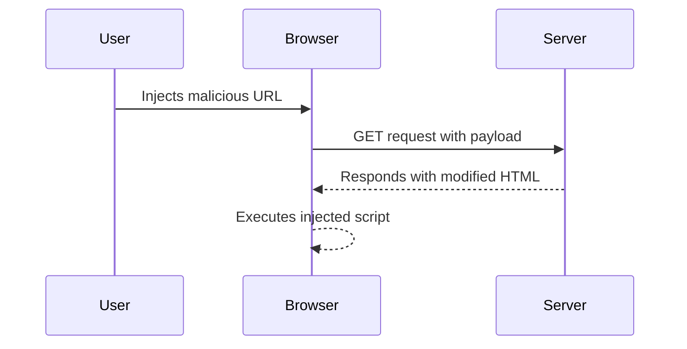

## DOM-Based Vulnerabilities: Exploiting DOM Clobbering to Enable XSS

### Background Theory

DOM-based vulnerabilities occur when a web application processes user input within the browser's Document Object Model (DOM) without proper validation or sanitization. This can lead to various security issues, including Cross-Site Scripting (XSS). One such vulnerability is DOM clobbering, where an attacker manipulates the DOM to override or "clobber" certain properties or variables, leading to unintended behavior.

#### What is DOM Clobbering?

DOM clobbering involves exploiting the way JavaScript handles property access and assignment. In JavaScript, properties can be accessed and modified dynamically. If a script attempts to read or write a property that doesn't exist, JavaScript will create it. An attacker can exploit this behavior to inject malicious data into the DOM.

#### Why Does DOM Clobbering Matter?

DOM clobbering is significant because it allows attackers to bypass traditional server-side input validation. Since the manipulation occurs client-side, the server may never see the malicious input. This makes it particularly dangerous and often harder to detect than other forms of XSS.

### Understanding the Scenario

Let's delve into the specific scenario described in the lecture:

1. **Global Configuration vs Default Configuration**:
    - The application checks for a global configuration setting for the user's avatar.
    - If the global configuration is not set, it defaults to a predefined avatar.
    - The default avatar URL is `/resources/image/avatar_default`.

2. **Inspecting the Avatar URL**:
    - By inspecting the page, we can see that the avatar URL is indeed `/resources/image/avatar_default`.
    - This indicates that the global configuration is not set for the user.

3. **Controlling the Variable**:
    - If we can control the variable that sets the avatar URL, we can potentially manipulate it to inject malicious content.
    - The goal is to clobber the variable and inject a payload that breaks out of the `src` attribute and executes arbitrary JavaScript.

### Detailed Example

Consider the following JavaScript code snippet that initializes the avatar URL:

```javascript
var avatarUrl = window.globalConfig.avatar || "/resources/image/avatar_default";
document.getElementById("avatar").src = avatarUrl;
```

Here, `window.globalConfig.avatar` is checked, and if it is not set, the default URL is used.

#### Exploitation Steps

1. **Identify the Target Variable**:
    - The target variable is `window.globalConfig.avatar`.

2. **Inject Malicious Data**:
    - An attacker can inject a payload that overrides this variable.

3. **Break Out of the `src` Attribute**:
    - The payload should be crafted to break out of the `src` attribute and execute JavaScript.

For example, an attacker might inject the following URL:

```
http://example.com/?globalConfig[avatar]=%22%3E%3Cscript%3Ealert(%22XSS%22)%3C/script%3E
```

This URL sets the `globalConfig.avatar` to a string that includes a closing quote (`"`), a script tag, and an alert function.

#### Full HTTP Request and Response

The full HTTP request might look like this:

```http
GET /?globalConfig[avatar]="">><script>alert("XSS")</script> HTTP/1.1
Host: example.com
User-Agent: Mozilla/5.0 (Windows NT 10.0; Win64; x64) AppleWebKit/537.36 (KHTML, like Gecko) Chrome/91.0.4472.124 Safari/537.36
Accept: text/html,application/xhtml+xml,application/xml;q=0.9,image/webp,*/*;q=0.8
Accept-Language: en-US,en;q=0.5
Connection: keep-alive
```

The corresponding response might be:

```http
HTTP/1.1 200 OK
Date: Mon, 12 Jul 2021 12:00:00 GMT
Server: Apache/2.4.41 (Ubuntu)
Content-Type: text/html; charset=UTF-8
Content-Length: 1234
Connection: close

<!DOCTYPE html>
<html>
<head>
    <title>Example Page</title>
</head>
<body>
    ><script>alert("XSS")</script>>
</body>
</html>
```

### Mermaid Diagrams

#### Attack Flow Diagram



### Real-World Examples

#### Recent CVEs and Breaches

- **CVE-2021-3427**: A DOM-based XSS vulnerability was found in a popular web application framework. The issue allowed attackers to inject malicious scripts through URL parameters.
- **Breaches**: Several high-profile websites have been affected by DOM-based XSS attacks, leading to unauthorized access and data theft.

### How to Prevent / Defend

#### Detection

- **Static Analysis Tools**: Use tools like ESLint, SonarQube, or commercial static analysis solutions to identify potential DOM clobbering vulnerabilities.
- **Dynamic Analysis Tools**: Employ tools like Burp Suite, ZAP, or commercial dynamic analysis solutions to test for runtime vulnerabilities.

#### Prevention

1. **Input Validation and Sanitization**:
    - Validate and sanitize all user inputs, especially those that are used to construct URLs or other sensitive data.
    - Use libraries like DOMPurify to sanitize HTML content.

2. **Secure Coding Practices**:
    - Avoid using eval() or similar functions that can execute arbitrary code.
    - Use strict mode in JavaScript to catch common errors and enforce better coding practices.

3. **Configuration Hardening**:
    - Ensure that default configurations are secure and cannot be easily overridden.
    - Use Content Security Policy (CSP) to restrict the sources of executable scripts.

#### Secure Code Fix

##### Vulnerable Code

```javascript
var avatarUrl = window.globalConfig.avatar || "/resources/image/avatar_default";
document.getElementById("avatar").src = avatarUrl;
```

##### Fixed Code

```javascript
var avatarUrl = window.globalConfig.avatar || "/resources/image/avatar_default";
document.getElementById("avatar").src = encodeURI(avatarUrl);
```

By encoding the URL, we ensure that any special characters are properly escaped, preventing the injection of malicious scripts.

### Practice Labs

- **PortSwigger Web Security Academy**: Offers detailed labs on DOM-based XSS and other web security topics.
- **OWASP Juice Shop**: Provides a vulnerable web application for practicing various web security techniques.
- **DVWA (Damn Vulnerable Web Application)**: Another popular platform for learning and testing web security vulnerabilities.

### Conclusion

DOM-based vulnerabilities, particularly DOM clobbering, pose significant risks to web applications. By understanding the underlying mechanisms and implementing robust security measures, developers can mitigate these risks and protect their applications from exploitation.

---
<!-- nav -->
[[Web Security (PortSwigger)/06-DOM-based Vulnerabilities/06-Lab 6 Exploiting DOM clobbering to enable XSS/01-Introduction to DOM-Based Vulnerabilities|Introduction to DOM-Based Vulnerabilities]] | [[Web Security (PortSwigger)/06-DOM-based Vulnerabilities/06-Lab 6 Exploiting DOM clobbering to enable XSS/00-Overview|Overview]] | [[03-DOM-Based Vulnerabilities and DOM Clobbering|DOM-Based Vulnerabilities and DOM Clobbering]]
