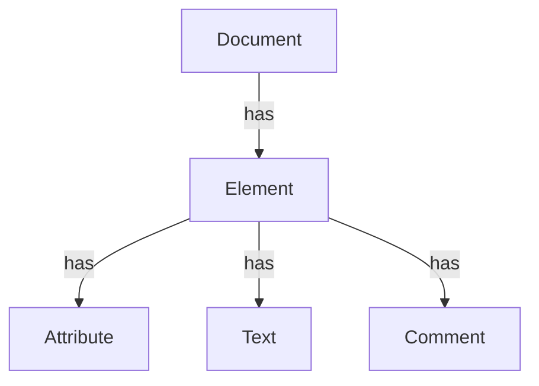
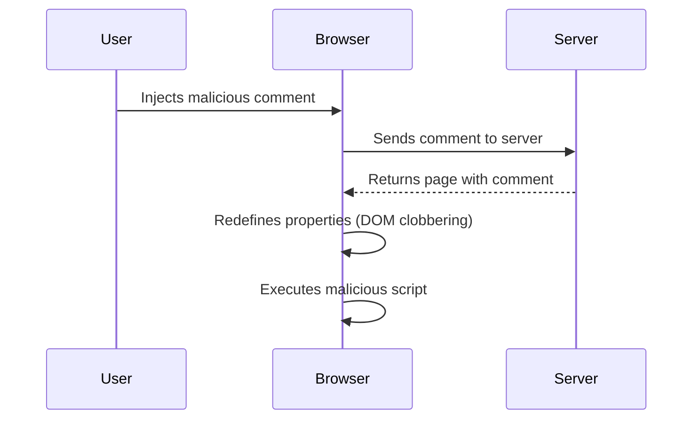

## DOM-Based Vulnerabilities and Exploiting DOM Clobbering to Enable XSS

### Introduction to DOM-Based Vulnerabilities

DOM-based vulnerabilities occur when a web application processes user input within the browser's Document Object Model (DOM) without proper validation or sanitization. This can lead to various security issues, including Cross-Site Scripting (XSS). In this context, we will explore how DOM clobbering can be exploited to enable XSS attacks.

### Understanding the DOM

The Document Object Model (DOM) is an API for HTML and XML documents. It represents the document as a tree structure, where each node is an object representing parts of the document such as elements, attributes, and text content. JavaScript interacts with the DOM to manipulate the document dynamically.

#### Example of DOM Manipulation

Consider a simple HTML document:

```html
<!DOCTYPE html>
<html>
<head>
    <title>DOM Example</title>
</head>
<body>
    <div id="content">Hello, World!</div>
    <script>
        var contentDiv = document.getElementById('content');
        contentDiv.innerHTML = 'Hello, User!';
    </script>
</body>
</html>
```

In this example, the `innerHTML` property of the `div` element is modified using JavaScript, changing the content from "Hello, World!" to "Hello, User!".

### What is DOM Clobbering?

DOM clobbering occurs when an attacker manipulates the global object (usually `window`) to redefine properties or methods. This can interfere with the normal behavior of the DOM and potentially lead to security vulnerabilities.

#### Example of DOM Clobbering

Consider the following scenario where an attacker can inject a script tag into the page:

```html
<script>
    window.location = 'http://example.com';
</script>
```

If the attacker can redefine the `location` property, they can control the navigation of the page. For instance:

```javascript
window.location = function() {
    alert('DOM Clobbering!');
};
```

This redefinition can cause unexpected behavior and potentially allow the execution of arbitrary scripts.

### Exploiting DOM Clobbering to Enable XSS

DOM-based XSS occurs when an attacker can inject malicious scripts into a page through the manipulation of the DOM. DOM clobbering can be used to bypass certain security measures and enable XSS.

#### Example Scenario

Let's consider a web application that allows users to post comments. The application dynamically updates the page with user comments using JavaScript. Suppose the application uses the following code to display comments:

```javascript
function displayComments(comments) {
    var commentList = document.getElementById('comment-list');
    comments.forEach(function(comment) {
        var commentElement = document.createElement('div');
        commentElement.innerHTML = comment;
        commentList.appendChild(commentElement);
    });
}
```

An attacker can inject a script tag into their comment, which will be executed when the comment is displayed:

```html
<script>alert('XSS');</script>
```

However, modern browsers often have protections against this type of injection. To bypass these protections, an attacker might use DOM clobbering to redefine properties or methods that are used to process the comment.

#### Step-by-Step Exploit

1. **Inject Malicious Comment**: The attacker posts a comment containing a script tag.
   
   ```html
   <script>alert('XSS');</script>
   ```

2. **Redefine Properties**: The attacker redefines properties or methods to bypass security checks.

   ```javascript
   window.document = {
       createElement: function(tagName) {
           return { innerHTML: '' };
       },
       getElementById: function(id) {
           return { appendChild: function(node) {} };
       }
   };
   ```

3. **Trigger Execution**: The attacker ensures that the malicious script is executed when the comment is processed.

   ```javascript
   window.displayComments(['<script>alert("XSS");</script>']);
   ```

### Real-World Examples

Recent real-world examples of DOM-based vulnerabilities include:

- **CVE-2021-21972**: A DOM-based XSS vulnerability in Microsoft Edge allowed attackers to execute arbitrary scripts by manipulating the `document.domain` property.
- **CVE-2020-10151**: A DOM-based XSS vulnerability in Google Chrome allowed attackers to bypass Content Security Policy (CSP) by manipulating the `location` property.

### How to Prevent / Defend Against DOM-Based Vulnerabilities

#### Detection

To detect DOM-based vulnerabilities, you can use tools like:

- **DOM Sniffer**: A Firefox extension that helps identify potential DOM-based XSS vulnerabilities.
- **Burp Suite**: A web application security testing tool that includes features for detecting and exploiting DOM-based vulnerabilities.

#### Prevention

1. **Input Validation and Sanitization**: Ensure that all user inputs are validated and sanitized before being used in the DOM. Use libraries like DOMPurify to sanitize user inputs.

   ```javascript
   // Vulnerable code
   var commentElement = document.createElement('div');
   commentElement.innerHTML = userComment;

   // Secure code
   var commentElement = document.createElement('div');
   commentElement.textContent = DOMPurify.sanitize(userComment);
   ```

2. **Content Security Policy (CSP)**: Implement CSP to restrict the sources from which scripts can be loaded. This can help mitigate the impact of XSS attacks.

   ```http
   Content-Security-Policy: default-src 'self'; script-src 'self' https://trustedscripts.example.com;
   ```

3. **Subresource Integrity (SRI)**: Use SRI to ensure that external scripts are not tampered with.

   ```html
   <script src="https://example.com/script.js" integrity="sha384-oqVuafJ..."></script>
   ```

4. **Avoid Direct DOM Manipulation**: Minimize direct manipulation of the DOM and use frameworks or libraries that handle security concerns.

### Practice Labs

For hands-on practice with DOM-based vulnerabilities, consider the following labs:

- **PortSwigger Web Security Academy**: Offers interactive labs to learn about and exploit various types of XSS, including DOM-based XSS.
- **OWASP Juice Shop**: A deliberately insecure web application for practicing web security skills, including DOM-based vulnerabilities.
- **DVWA (Damn Vulnerable Web Application)**: A PHP/MySQL web application that demonstrates web application vulnerabilities.

### Conclusion

Understanding and preventing DOM-based vulnerabilities is crucial for securing web applications. By validating and sanitizing user inputs, implementing security policies, and using secure coding practices, developers can significantly reduce the risk of XSS attacks. Regularly testing and auditing applications can help identify and mitigate these vulnerabilities effectively.

### Diagrams

#### DOM Structure



#### DOM Clobbering Attack Flow



By thoroughly understanding the concepts and techniques involved in DOM-based vulnerabilities, developers can build more secure and resilient web applications.

---
<!-- nav -->
[[03-DOM-Based Vulnerabilities and DOM Clobbering|DOM-Based Vulnerabilities and DOM Clobbering]] | [[Web Security (PortSwigger)/06-DOM-based Vulnerabilities/06-Lab 6 Exploiting DOM clobbering to enable XSS/00-Overview|Overview]] | [[Web Security (PortSwigger)/06-DOM-based Vulnerabilities/06-Lab 6 Exploiting DOM clobbering to enable XSS/05-How to Prevent  Defend Against DOM-Based Vulnerabilities|How to Prevent  Defend Against DOM-Based Vulnerabilities]]
