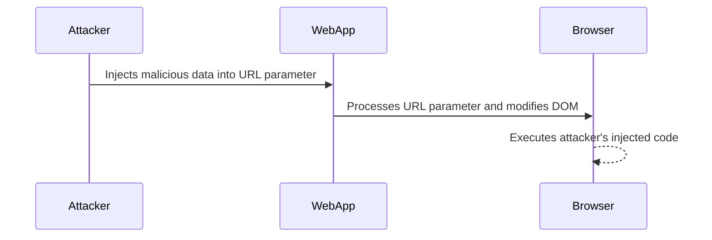

## Testing for DOM-Based Vulnerabilities

When testing for DOM-based vulnerabilities, especially DOM clobbering, it is essential to identify areas where user input is reflected back into the application. This includes form fields, URL parameters, and any other input mechanisms.

### Identifying Potential Vulnerabilities

Consider the following example of a blogging application where users can comment on posts. The application reflects user input in the comment field, name field, email field, and website field.

```html
<form>
    <input type="text" id="name" placeholder="Name">
    <input type="email" id="email" placeholder="Email">
    <input type="url" id="website" placeholder="Website">
    <textarea id="comment" placeholder="Comment"></textarea>
    <button type="submit">Submit</button>
</form>
```

### Testing for XSS Vulnerabilities

The first step is to test each input field for XSS vulnerabilities. Since the comment field allows HTML, it is particularly important to test for JavaScript injection.

#### Testing the Comment Field

1. **Input Injection**: Enter the following into the comment field:
   ```html
   <script>alert('XSS')</script>
   ```
2. **Observation**: If the script executes, it indicates a potential XSS vulnerability.

#### Testing for DOM Clobbering

If the application allows HTML but not JavaScript, the next step is to test for DOM clobbering. Consider the following example:

1. **Input Injection**: Enter the following into the comment field:
   ```html
   
   ```
2. **Observation**: If the `onerror` event handler executes, it indicates a potential DOM clobbering vulnerability.

### Real-World Example: CVE-2-2021-21972

In the case of CVE-2021-21972, the attacker could inject malicious data into the URL parameter, which would then be used to overwrite properties in the AngularJS `$location` service. This allowed the attacker to execute arbitrary JavaScript code in the context of the victim's browser.



---
<!-- nav -->
[[Web Security (PortSwigger)/06-DOM-based Vulnerabilities/06-Lab 6 Exploiting DOM clobbering to enable XSS/05-How to Prevent  Defend Against DOM-Based Vulnerabilities|How to Prevent  Defend Against DOM-Based Vulnerabilities]] | [[Web Security (PortSwigger)/06-DOM-based Vulnerabilities/06-Lab 6 Exploiting DOM clobbering to enable XSS/00-Overview|Overview]] | [[07-Understanding DOM Clobbering|Understanding DOM Clobbering]]
