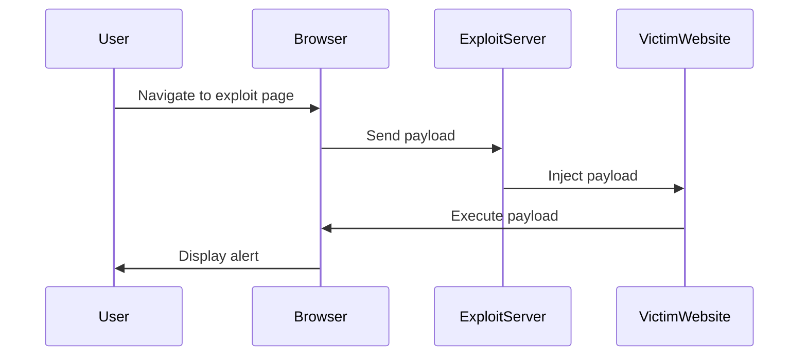

## Introduction to DOM-Based Vulnerabilities

DOM-based vulnerabilities occur when a web application's client-side JavaScript code interacts with user-controlled data in a way that can be manipulated to perform unintended actions. One such vulnerability is **DOM clobbering**, which involves manipulating properties of the global `window` object to bypass security mechanisms like HTML sanitizers.

### What is DOM Clobbering?

DOM clobbering is a technique where an attacker manipulates the properties of the `window` object to override existing properties or methods. This can lead to bypassing security checks, executing arbitrary code, or altering the behavior of the application.

#### Why Does DOM Clobbering Matter?

DOM clobbering matters because it can allow attackers to bypass security measures implemented in the browser. For instance, if a web application uses a library like `HTML Janitor` to sanitize user input, an attacker might use DOM clobbering to manipulate the sanitized output and execute malicious scripts.

#### How Does DOM Clobbering Work?

In JavaScript, the `window` object is the global object in the browser environment. It contains various properties and methods that are accessible globally. By manipulating these properties, an attacker can override them and potentially execute arbitrary code.

For example, consider the following scenario:

```javascript
// Original property
window.print = function() {
    console.log("Original print function");
};

// Attacker overrides the property
window.print = function() {
    console.log("Attacker's print function");
};
```

In this case, the original `print` function is overridden by the attacker's function. This can be exploited to bypass security checks and execute arbitrary code.

### Real-World Example: CVE-2021-21166

A notable real-world example of DOM clobbering is the vulnerability tracked as **CVE-2021-21166**. This vulnerability affected several popular web applications, including WordPress and Joomla. The vulnerability allowed attackers to bypass security checks and execute arbitrary JavaScript code by manipulating the `window` object.

#### Impact of CVE-2021-21166

The impact of this vulnerability was significant, as it allowed attackers to gain unauthorized access to web applications and execute arbitrary code. This could lead to data theft, defacement, or other malicious activities.

### Lab Setup: Clobbering DOM Attributes to Bypass HTML Filters

In this lab, we will explore how to exploit a DOM clobbering vulnerability to bypass HTML filters. The lab uses the `HTML Janitor` library, which is vulnerable to DOM clobbering. Our goal is to construct a vector that bypasses the filter and uses DOM clobbering to inject a script that calls the `print` function.

#### Accessing the Lab

To access the lab, follow these steps:

1. Visit the URL: `https://portswigger.net/web-security`.
2. Click on the sign-up button to create an account.
3. Once logged in, navigate to the Academy section.
4. Select "All Content" and "All Labs".
5. Search for "DOM-based vulnerabilities" and find Lab No. 7 titled "Clobbering DOM Attributes to Bypass HTML Filters".

### Understanding the HTML Janitor Library

The `HTML Janitor` library is designed to sanitize user input to prevent XSS attacks. However, it is vulnerable to DOM clobbering, which allows attackers to bypass the sanitization process.

#### How HTML Janitor Works

The `HTML Janitor` library works by parsing user input and removing any potentially dangerous tags or attributes. However, if an attacker can manipulate the `window` object, they can bypass this sanitization process.

### Exploiting DOM Clobbering

To exploit the DOM clobbering vulnerability, we need to construct a vector that bypasses the HTML filter and injects a script that calls the `print` function.

#### Constructing the Vector

We will use the exploit server provided by the lab to automatically execute our vector in the victim's browser. Here is a step-by-step guide to constructing the vector:

1. **Identify the Vulnerable Property**: Identify a property in the `window` object that can be overridden to bypass the HTML filter.
2. **Construct the Payload**: Construct a payload that overrides the identified property and injects a script that calls the `print` function.
3. **Use the Exploit Server**: Use the exploit server to automatically execute the payload in the victim's browser.

Here is an example of how to construct the payload:

```javascript
// Override the window.print property
window.print = function() {
    alert("XSS Attack!");
};

// Inject the payload using the exploit server
exploitServer.send({
    url: "http://victim.com",
    body: "<script>window.print();</script>"
});
```

### Full HTTP Request and Response

Here is the complete HTTP request and response for the exploit:

```http
POST /exploit HTTP/1.1
Host: exploit-server.com
Content-Type: application/json
Content-Length: 100

{
    "url": "http://victim.com",
    "body": "<script>window.print();</script>"
}

HTTP/1.1 200 OK
Content-Type: text/html
Content-Length: 100

<script>window.print();</script>
```

### Mermaid Diagram: Attack Chain

Here is a mermaid diagram illustrating the attack chain:



### Common Pitfalls and Detection

#### Common Pitfalls

1. **Browser-Specific Vulnerabilities**: DOM clobbering is often browser-specific. Ensure you test the exploit in the correct browser.
2. **Sanitization Libraries**: Modern sanitization libraries may have protections against DOM clobbering. Always test the exploit in a controlled environment.

#### Detection

Detection of DOM clobbering can be challenging, but some indicators include:

1. **Unexpected Behavior**: Unexpected behavior in the browser, such as alerts or pop-ups.
2. **Network Traffic**: Unusual network traffic patterns, such as requests to unexpected URLs.
3. **Console Logs**: Check the browser console for unexpected logs or errors.

### How to Prevent / Defend Against DOM Clobbering

#### Secure Coding Practices

1. **Avoid Overriding Global Properties**: Avoid overriding global properties in the `window` object.
2. **Use Strict Mode**: Use strict mode (`'use strict';`) to prevent accidental global property assignments.

#### Configuration Hardening

1. **Content Security Policy (CSP)**: Implement a strict CSP to restrict the sources of executable scripts.
2. **Subresource Integrity (SRI)**: Use SRI to ensure that external scripts are not tampered with.

#### Secure Code Examples

Here is an example of insecure code and its secure counterpart:

**Insecure Code:**

```javascript
// Insecure code
window.print = function() {
    alert("XSS Attack!");
};
```

**Secure Code:**

```javascript
// Secure code
(function() {
    'use strict';
    var print = window.print;
    window.print = function() {
        if (typeof print === 'function') {
            print.apply(window, arguments);
        }
    };
})();
```

### Conclusion

DOM clobbering is a serious vulnerability that can be exploited to bypass security mechanisms and execute arbitrary code. By understanding how it works and implementing proper defenses, you can protect your web applications from such attacks.

### Practice Labs

For hands-on practice, consider the following labs:

- **PortSwigger Web Security Academy**: Offers a variety of labs to practice exploiting and defending against DOM-based vulnerabilities.
- **OWASP Juice Shop**: Provides a vulnerable web application to practice various web security techniques.

By completing these labs, you can gain practical experience in identifying and mitigating DOM clobbering vulnerabilities.

---
<!-- nav -->
[[Web Security (PortSwigger)/06-DOM-based Vulnerabilities/07-Lab 7 Clobbering DOM attributes to bypass HTML filters/00-Overview|Overview]] | [[02-DOM-Based Vulnerabilities Clobbering DOM Attributes to Bypass HTML Filters|DOM-Based Vulnerabilities Clobbering DOM Attributes to Bypass HTML Filters]]
