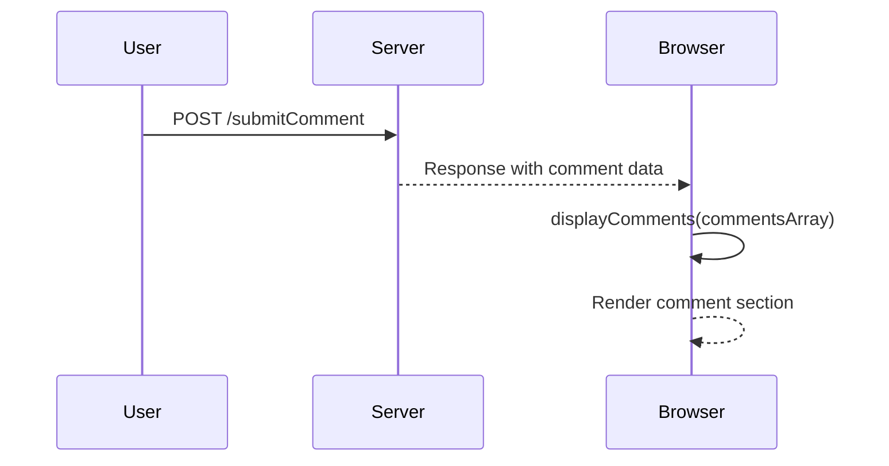
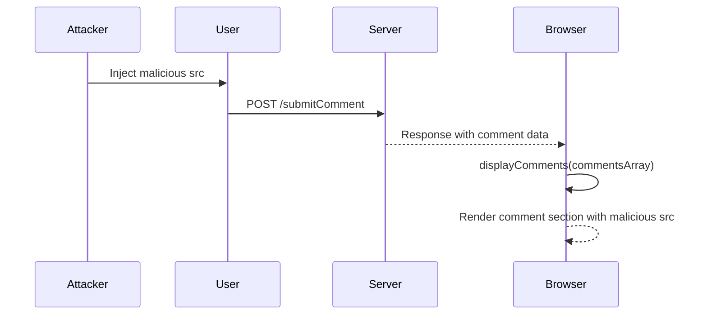

## DOM-Based Vulnerabilities: Clobbering DOM Attributes to Bypass HTML Filters

### Background Theory

DOM-based vulnerabilities occur when client-side JavaScript interacts with the Document Object Model (DOM) in a way that can be manipulated by an attacker. These vulnerabilities often arise due to improper handling of user input, leading to potential security issues such as Cross-Site Scripting (XSS).

In the context of the given lecture, the `displayComments` function is responsible for rendering user-generated comments on a webpage. This function constructs elements dynamically based on user input, which can introduce vulnerabilities if not handled carefully.

### Understanding the Display Comments Function

The `displayComments` function processes user input and constructs HTML elements accordingly. Here’s a detailed breakdown:

1. **Comments Array**: The function likely starts with an array of comments.
2. **Section Element**: A `<section>` element is created to contain the comment.
3. **Attributes**: Various attributes are added to the `<section>` element, including the comment itself.
4. **Paragraph Element**: A `<p>` element is created to hold the comment body.
5. **Image Element**: An `` element is created to display an avatar. The `class` attribute is set to `avatar`, and the `src` attribute is determined based on whether a specific value is already set.

Here is a simplified version of the `displayComments` function:

```javascript
function displayComments(commentsArray) {
    const sectionElement = document.createElement('section');
    
    // Add comment attribute
    sectionElement.setAttribute('data-comment', commentsArray[0].comment);
    
    // Create paragraph element
    const paragraphElement = document.createElement('p');
    paragraphElement.textContent = commentsArray[0].body;
    sectionElement.appendChild(paragraphElement);
    
    // Create image element
    const imageElement = document.createElement('img');
    imageElement.className = 'avatar';
    if (commentsArray[0].avatarSrc) {
        imageElement.src = commentsArray[0].avatarSrc;
    } else {
        imageElement.src = 'default-avatar.png';
    }
    sectionElement.appendChild(imageElement);
    
    // Append section to the document
    document.body.appendChild(sectionElement);
}
```

### Vulnerability Analysis: Dumb Clobbering

Dumb clobbering refers to a situation where an attacker can overwrite or manipulate attributes in the DOM, potentially bypassing HTML filters. In the previous lab, the vulnerability existed because the `src` attribute of the `` element was not properly sanitized.

#### Example of Vulnerable Code

Consider the following vulnerable code snippet:

```javascript
function displayComments(commentsArray) {
    const sectionElement = document.createElement('section');
    sectionElement.setAttribute('data-comment', commentsArray[0].comment);
    
    const paragraphElement = document.createElement('p');
    paragraphElement.textContent = commentsArray[0].body;
    sectionElement.appendChild(paragraphElement);
    
    const imageElement = document.createElement('img');
    imageElement.className = 'avatar';
    imageElement.src = commentsArray[0].avatarSrc; // Vulnerable line
    sectionElement.appendChild(imageElement);
    
    document.body.appendChild(sectionElement);
}
```

If an attacker can control the `avatarSrc` input, they could inject malicious content, leading to XSS attacks.

### Proper Handling: Using the Clean Function

To mitigate this vulnerability, the `clean` function from the HTML Janitor library is used to sanitize user input. This ensures that any potentially harmful content is removed or escaped.

#### Example of Secure Code

Here is the secure version of the code:

```javascript
function displayComments(commentsArray) {
    const sectionElement = document.createElement('section');
    sectionElement.setAttribute('data-comment', commentsArray[0].comment);
    
    const paragraphElement = document.createElement('p');
    paragraphElement.textContent = commentsArray[0].body;
    sectionElement.appendChild(paragraphElement);
    
    const imageElement = document.createElement('img');
    imageElement.className = 'avatar';
    if (commentsArray[0].avatarSrc) {
        imageElement.src = clean(commentsArray[0].avatarSrc); // Secure line
    } else {
        imageElement.src = 'default-avatar.png';
    }
    sectionElement.appendChild(imageElement);
    
    document.body.appendChild(sectionElement);
}

// Mock implementation of clean function
function clean(input) {
    return input.replace(/[^a-zA-Z0-9\.\-\_\/]/g, '');
}
```

### Real-World Examples

Recent real-world examples of DOM-based vulnerabilities include:

- **CVE-2021-21972**: A vulnerability in the WordPress plugin "WP GDPR Compliance" allowed attackers to inject arbitrary JavaScript via the `src` attribute of an `` tag.
- **CVE-2020-14882**: A vulnerability in the Joomla CMS allowed attackers to inject malicious scripts through the `src` attribute of an `<iframe>` tag.

These examples highlight the importance of proper sanitization and validation of user inputs.

### How to Prevent / Defend

#### Detection

To detect DOM-based vulnerabilities, you can use tools like:

- **DOMinator**: A browser extension that helps identify potential DOM-based XSS vulnerabilities.
- **Burp Suite**: A web application security testing tool that includes features for detecting and exploiting DOM-based vulnerabilities.

#### Prevention

1. **Sanitize User Input**: Always sanitize user input before inserting it into the DOM. Use libraries like HTML Janitor or similar tools to ensure input is safe.
2. **Content Security Policy (CSP)**: Implement a strict CSP to limit the sources from which scripts can be loaded.
3. **Input Validation**: Validate user input on both the client and server sides to ensure it meets expected formats and constraints.
4. **Use Trusted Libraries**: Utilize well-maintained and trusted libraries for handling user input and DOM manipulation.

#### Secure Coding Practices

Compare the vulnerable and secure versions of the code:

**Vulnerable Version:**

```javascript
function displayComments(commentsArray) {
    const sectionElement = document.createElement('section');
    sectionElement.setAttribute('data-comment', commentsArray[0].comment);
    
    const paragraphElement = document.createElement('p');
    paragraphElement.textContent = commentsArray[0].body;
    sectionElement.appendChild(paragraphElement);
    
    const imageElement = document.createElement('img');
    imageElement.className = 'avatar';
    imageElement.src = commentsArray[0].avatarSrc; // Vulnerable line
    sectionElement.appendChild(imageElement);
    
    document.body.appendChild(sectionElement);
}
```

**Secure Version:**

```javascript
function displayComments(commentsArray) {
    const sectionElement = document.createElement('section');
    sectionElement.setAttribute('data-comment', commentsArray[0].comment);
    
    const paragraphElement = document.createElement('p');
    paragraphElement.textContent = commentsArray[0].body;
    sectionElement.appendChild(paragraphElement);
    
    const imageElement = document.createElement('img');
    imageElement.className = 'avatar';
    if (commentsArray[0].avatarSrc) {
        imageElement.src = clean(commentsArray[.avatarSrc]); // Secure line
    } else {
        imageElement.src = 'default-avatar.png';
    }
    sectionElement.appendChild(imageElement);
    
    document.body.appendChild(sectionElement);
}

// Mock implementation of clean function
function clean(input) {
    return input.replace(/[^a-zA-Z0-9\.\-\_\/]/g, '');
}
```

### Mermaid Diagrams

#### Request/Response Flow



#### Attack Chain



### Hands-On Labs

For hands-on practice, consider the following labs:

- **PortSwigger Web Security Academy**: Offers interactive labs to practice identifying and exploiting DOM-based vulnerabilities.
- **OWASP Juice Shop**: Provides a vulnerable web application for practicing various web security techniques, including DOM-based XSS.
- **DVWA (Damn Vulnerable Web Application)**: Another vulnerable web application for learning and testing web security concepts.

By thoroughly understanding and implementing these practices, you can significantly reduce the risk of DOM-based vulnerabilities in your web applications.

---
<!-- nav -->
[[Web Security (PortSwigger)/06-DOM-based Vulnerabilities/07-Lab 7 Clobbering DOM attributes to bypass HTML filters/01-Introduction to DOM-Based Vulnerabilities|Introduction to DOM-Based Vulnerabilities]] | [[Web Security (PortSwigger)/06-DOM-based Vulnerabilities/07-Lab 7 Clobbering DOM attributes to bypass HTML filters/00-Overview|Overview]] | [[03-DOM-Based Vulnerabilities|DOM-Based Vulnerabilities]]
