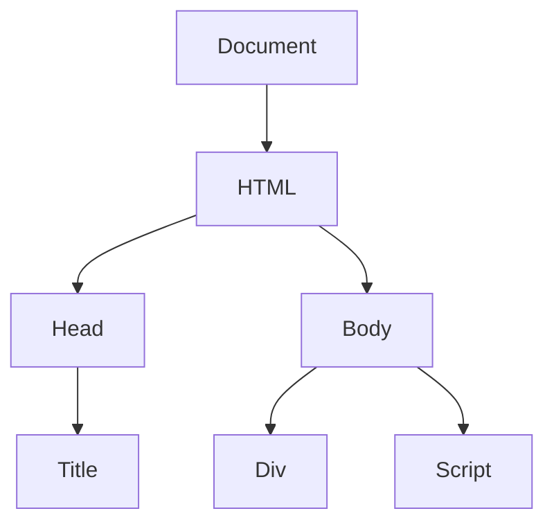

## DOM-Based Vulnerabilities

### Introduction to DOM-Based Vulnerabilities

DOM-based vulnerabilities occur when a web application's client-side JavaScript manipulates the Document Object Model (DOM) in a way that can be influenced by untrusted input. This can lead to various types of attacks, including Cross-Site Scripting (XSS), which allows attackers to inject malicious scripts into web pages viewed by other users.

### Understanding the Document Object Model (DOM)

The Document Object Model (DOM) is a programming interface for web documents. It represents the page so that programs can change the document structure, style, and content. The DOM represents the document as a tree structure, with each node representing a part of the document.

#### How the DOM Works

- **Nodes**: Each element in the DOM is represented as a node. Nodes can be elements, text, comments, etc.
- **Element Nodes**: These represent HTML tags. For example, `<div>`, `<span>`, `<script>`, etc.
- **Text Nodes**: These contain the text inside the elements.
- **Attributes**: These are properties of elements, such as `id`, `class`, `src`, etc.



### DOM Clobbering

DOM clobbering is a technique where an attacker can overwrite or "clobber" the properties of the DOM object. This can lead to unexpected behavior and potential security vulnerabilities.

#### Mechanism of DOM Clobbering

When a script attempts to access a property of the DOM object, it first checks if the property exists. If the property does not exist, it can be created dynamically. An attacker can exploit this by setting properties that the script expects to be present, leading to unintended behavior.

### Example of DOM Clobbering

Consider a web application that uses a library called "HTML Janitor" to sanitize user input. The library might have a method to clean up the input and ensure it doesn't contain malicious scripts. However, if the library relies on certain properties of the DOM object, an attacker can manipulate these properties to bypass the sanitization.

#### Vulnerable Code Example

Let's assume the HTML Janitor library checks the `attributes` property of an element to ensure it doesn't contain any malicious attributes. An attacker can manipulate this property to bypass the check.

```javascript
// Vulnerable code
function sanitizeInput(input) {
    var element = document.createElement('div');
    element.innerHTML = input;
    if (element.attributes.length > 0) {
        console.log("Malicious attributes detected!");
        return false;
    }
    return true;
}

// Attacker's input
var maliciousInput = '';
sanitizeInput(maliciousInput);
```

In this example, the attacker sets the `attributes` property to an empty object, which bypasses the check in the `sanitizeInput` function.

### Real-World Examples

#### Recent Breaches Involving DOM Clobbering

One notable example of a breach involving DOM clobbering is the CVE-2021-21972, which affected several popular web applications. The vulnerability allowed attackers to bypass input sanitization mechanisms by manipulating DOM properties.

### How to Exploit DOM Clobbering

To exploit DOM clobbering, an attacker needs to understand the specific properties and methods used by the target application. The attacker can then craft input that manipulates these properties to bypass security checks.

#### Step-by-Step Exploitation

1. **Identify the Vulnerability**: Analyze the target application to identify where it relies on DOM properties.
2. **Craft the Input**: Create input that manipulates the identified properties.
3. **Inject the Input**: Inject the crafted input into the application through a vulnerable parameter.
4. **Trigger the Exploit**: Ensure the manipulated properties are accessed by the application, leading to the desired outcome.

### Complete Example of Exploiting DOM Clobbering

Let's consider a more detailed example where an attacker exploits DOM clobbering to bypass an HTML filter.

#### Vulnerable Application Code

```javascript
// Vulnerable application code
function processUserInput(userInput) {
    var div = document.createElement('div');
    div.innerHTML = userInput;
    if (div.attributes.length > 0) {
        console.log("Malicious attributes detected!");
        return false;
    }
    return true;
}
```

#### Attacker's Exploit

The attacker crafts an input that sets the `attributes` property to an empty object, bypassing the check.

```javascript
// Attacker's input
var maliciousInput = '';
processUserInput(maliciousInput);
```

### How to Prevent / Defend Against DOM Clobbering

#### Detection

To detect DOM clobbering, security teams can use static analysis tools and dynamic analysis techniques to identify suspicious patterns in the code.

##### Static Analysis Tools

- **ESLint**: Can be configured to detect potential DOM clobbering issues.
- **SonarQube**: Provides rules to detect insecure coding practices.

##### Dynamic Analysis Techniques

- **Web Application Firewalls (WAF)**: Can monitor incoming requests for suspicious patterns.
- **Browser Extensions**: Tools like Burp Suite can help in identifying and testing for DOM clobbering.

#### Prevention

To prevent DOM clobbering, developers should follow secure coding practices and implement proper input validation and sanitization.

##### Secure Coding Practices

- **Avoid Direct DOM Manipulation**: Use libraries and frameworks that abstract away direct DOM manipulation.
- **Use Content Security Policy (CSP)**: Implement CSP to restrict the sources of executable scripts.

##### Input Validation and Sanitization

- **Validate User Input**: Ensure all user inputs are validated against a whitelist of allowed characters and patterns.
- **Sanitize Inputs**: Use libraries like DOMPurify to sanitize user inputs before inserting them into the DOM.

#### Secure Code Example

Here is an example of secure code that prevents DOM clobbering:

```javascript
// Secure code
function sanitizeAndProcessInput(userInput) {
    var div = document.createElement('div');
    div.innerHTML = DOMPurify.sanitize(userInput);
    if (div.attributes.length > 0) {
        console.log("Malicious attributes detected!");
        return false;
    }
    return true;
}

// Attacker's input
var maliciousInput = '';
sanitizeAndProcessInput(maliciousInput);
```

### Configuration Hardening

To further harden the application against DOM clobbering, configure the environment to restrict unnecessary permissions and enable security features.

#### Example Configuration

```nginx
# Nginx configuration
server {
    listen 80;
    server_name example.com;

    location / {
        add_header Content-Security-Policy "default-src 'self'";
        add_header X-Content-Type-Options nosniff;
        add_header X-XSS-Protection "1; mode=block";
    }
}
```

### Hands-On Labs

For practical experience with DOM-based vulnerabilities, consider the following labs:

- **PortSwigger Web Security Academy**: Offers interactive labs on various web security topics, including DOM-based XSS.
- **OWASP Juice Shop**: A deliberately insecure web application for practicing web security skills.
- **DVWA (Damn Vulnerable Web Application)**: A PHP/MySQL web application that is riddled with vulnerabilities for educational purposes.

### Conclusion

DOM-based vulnerabilities, particularly DOM clobbering, pose significant risks to web applications. By understanding the underlying mechanisms and implementing robust security measures, developers can mitigate these risks and protect their applications from exploitation.

---
<!-- nav -->
[[02-DOM-Based Vulnerabilities Clobbering DOM Attributes to Bypass HTML Filters|DOM-Based Vulnerabilities Clobbering DOM Attributes to Bypass HTML Filters]] | [[Web Security (PortSwigger)/06-DOM-based Vulnerabilities/07-Lab 7 Clobbering DOM attributes to bypass HTML filters/00-Overview|Overview]] | [[04-Finding DOM Clobbering Vulnerabilities|Finding DOM Clobbering Vulnerabilities]]
