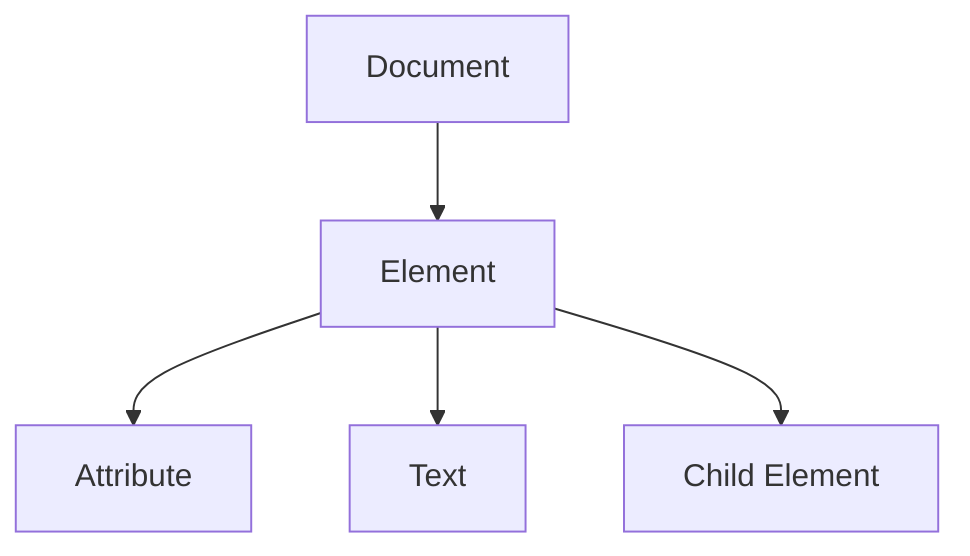
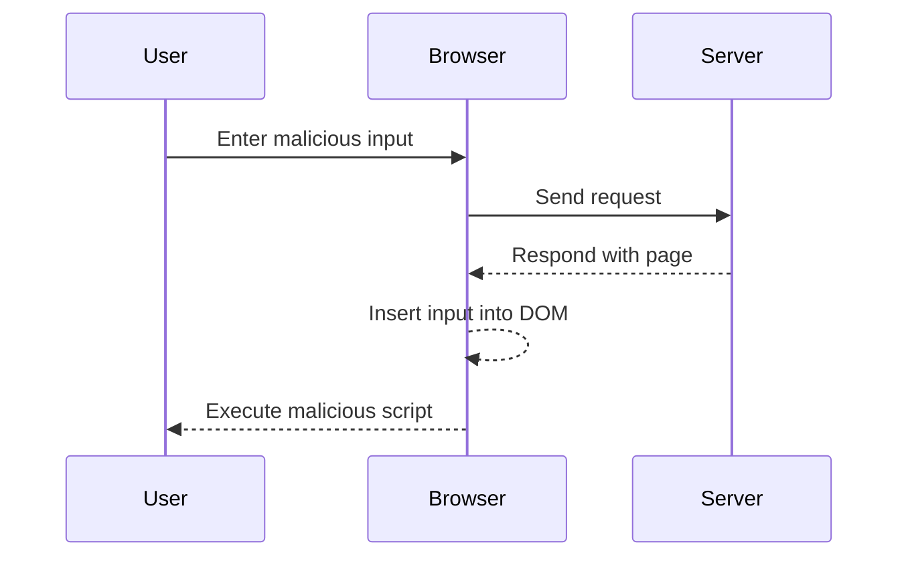

## Understanding DOM-Based Vulnerabilities

### What Are DOM-Based Vulnerabilities?

DOM-based vulnerabilities occur when an attacker can manipulate the Document Object Model (DOM) of a webpage to execute arbitrary scripts or modify the page's behavior. These vulnerabilities often arise due to insufficient input validation or sanitization, allowing attackers to inject malicious content into the DOM.

### Why Are They Important?

DOM-based vulnerabilities are significant because they can lead to various types of attacks, including Cross-Site Scripting (XSS), which can result in data theft, session hijacking, and more. These vulnerabilities are particularly dangerous because they can bypass traditional server-side input validation mechanisms.

### How Do They Work Under the Hood?

When a user interacts with a webpage, the browser parses the HTML and constructs the DOM. Any user input that is reflected back into the DOM without proper sanitization can be exploited. For instance, if a user inputs a script tag (`<script>`), and this input is directly inserted into the DOM, the script will execute.

#### Example of a Simple DOM-Based XSS Attack

Consider a simple webpage that reflects user input into the DOM:

```html
<!DOCTYPE html>
<html>
<head>
    <title>DOM-Based XSS Example</title>
</head>
<body>
    <input type="text" id="userInput">
    <button onclick="display()">Display Input</button>
    <div id="output"></div>

    <script>
        function display() {
            var userInput = document.getElementById('userInput').value;
            document.getElementById('output').innerHTML = userInput;
        }
    </script>
</body>
</html>
```

If an attacker inputs `<script>alert('XSS')</script>` into the `userInput` field, the script will execute, displaying an alert box. This is a classic example of a DOM-based XSS attack.

### Real-World Examples

#### Recent CVEs and Breaches

One notable example is the CVE-2021-21972, which affected the popular web framework AngularJS. The vulnerability allowed attackers to inject malicious scripts into the DOM, leading to potential data theft and other malicious activities.

Another example is the CVE-2020-14182, which affected the jQuery library. This vulnerability allowed attackers to inject malicious scripts into the DOM through event handlers, leading to potential XSS attacks.

### Background Theory

To understand DOM-based vulnerabilities, it's essential to grasp the basics of the Document Object Model (DOM). The DOM is a programming interface for web documents, representing the structure of a document as a tree of nodes. Each node represents a part of the document, such as elements, attributes, and text.

### Step-by-Step Mechanics

Let's break down the process of a DOM-based XSS attack:

1. **User Input**: An attacker inputs malicious content into a form field or URL parameter.
2. **DOM Manipulation**: The input is reflected back into the DOM without proper sanitization.
3. **Script Execution**: The malicious script executes within the context of the victim's browser.

### Complete Code Example

Here's a more detailed example of a DOM-based XSS attack:

```html
<!DOCTYPE html>
<html>
<head>
    <title>DOM-Based XSS Example</title>
</head>
<body>
    <input type="text" id="userInput">
    <button onclick="display()">Display Input</button>
    <div id="output"></div>

    <script>
        function display() {
            var userInput = document.getElementById('userInput').value;
            document.getElementById('output').innerHTML = userInput;
        }
    </script>
</body>
</html>
```

In this example, if an attacker inputs `<script>alert('XSS')</script>`, the script will execute, displaying an alert box.

### Mermaid Diagrams

#### DOM Structure



This diagram shows the basic structure of the DOM, where each element can have attributes, text, and child elements.

#### Attack Flow



This sequence diagram illustrates the flow of a DOM-based XSS attack.

### Common Mistakes

#### Not Sanitizing User Input

One of the most common mistakes is not sanitizing user input before reflecting it into the DOM. This allows attackers to inject malicious scripts.

#### Using InnerHTML Directly

Using `innerHTML` directly to insert user input into the DOM is risky because it can execute any script tags included in the input.

### Detection and Prevention

#### How to Detect

To detect DOM-based vulnerabilities, you can use automated tools like Burp Suite, OWASP ZAP, and static analysis tools like ESLint. These tools can help identify areas where user input is reflected into the DOM without proper sanitization.

#### How to Prevent

##### Secure Coding Fixes

To prevent DOM-based vulnerabilities, follow these best practices:

1. **Sanitize User Input**: Always sanitize user input before reflecting it into the DOM. Use libraries like DOMPurify to sanitize input.
2. **Use Content Security Policy (CSP)**: Implement a strict CSP to mitigate the impact of XSS attacks.
3. **Avoid Using InnerHTML**: Avoid using `innerHTML` directly. Instead, use methods like `textContent` to insert plain text.

##### Secure Code Example

Here's an example of secure code that uses `textContent` instead of `innerHTML`:

```html
<!DOCTYPE html>
<html>
<head>
    <title>Secure DOM-Based Example</title>
</head>
<body>
    <input type="text" id="userInput">
    <button onclick="display()">Display Input</button>
    <div id="output"></div>

    <script>
        function display() {
            var userInput = document.getElementById('userInput').value;
            document.getElementById('output').textContent = userInput;
        }
    </script>
</body>
</html>
```

In this example, `textContent` is used to insert user input into the DOM, preventing script execution.

##### Configuration Hardening

Implement a strict Content Security Policy (CSP) to mitigate the impact of XSS attacks. Here's an example of a CSP header:

```http
Content-Security-Policy: default-src 'self'; script-src 'self' https://trustedscripts.example.com; object-src 'none'
```

This CSP restricts the sources from which scripts can be loaded, reducing the risk of XSS attacks.

### Real-World Example: CVE-2021-21972

#### Vulnerability Description

CVE-2021-21972 affected the AngularJS framework, allowing attackers to inject malicious scripts into the DOM through event handlers.

#### Exploit Details

Attackers could inject malicious scripts into the DOM by manipulating event handlers, leading to potential XSS attacks.

#### Detection

Automated tools like Burp Suite and OWASP ZAP can detect this vulnerability by analyzing the DOM structure and identifying areas where user input is reflected without proper sanitization.

#### Prevention

To prevent this vulnerability, follow these steps:

1. **Update AngularJS**: Ensure that AngularJS is updated to the latest version, which includes security patches.
2. **Sanitize User Input**: Always sanitize user input before reflecting it into the DOM.
3. **Implement CSP**: Implement a strict CSP to mitigate the impact of XSS attacks.

### Real-World Example: CVE-2-2020-14182

#### Vulnerability Description

CVE-2020-14182 affected the jQuery library, allowing attackers to inject malicious scripts into the DOM through event handlers.

#### Exploit Details

Attackers could inject malicious scripts into the DOM by manipulating event handlers, leading to potential XSS attacks.

#### Detection

Automated tools like Burp Suite and OWASP ZAP can detect this vulnerability by analyzing the DOM structure and identifying areas where user input is reflected without proper sanitization.

#### Prevention

To prevent this vulnerability, follow these steps:

1. **Update jQuery**: Ensure that jQuery is updated to the latest version, which includes security patches.
2. **Sanitize User Input**: Always sanitize user input before reflecting it into the DOM.
3. **Implement CSP**: Implement a strict CSP to mitigate the impact of XSS attacks.

### Hands-On Labs

For hands-on practice with DOM-based vulnerabilities, consider the following labs:

- **PortSwigger Web Security Academy**: Offers interactive labs to practice detecting and preventing DOM-based XSS attacks.
- **OWASP Juice Shop**: Provides a vulnerable web application to practice finding and exploiting DOM-based vulnerabilities.
- **DVWA (Damn Vulnerable Web Application)**: Includes several DOM-based vulnerabilities for practice.

These labs provide real-world scenarios to help you master the detection and prevention of DOM-based vulnerabilities.

### Conclusion

Understanding and preventing DOM-based vulnerabilities is crucial for securing web applications. By following best practices, using secure coding techniques, and implementing strict security policies, you can significantly reduce the risk of these vulnerabilities. Regularly updating your frameworks and libraries, and using automated tools for detection, can help keep your applications secure.

---
<!-- nav -->
[[06-Testing for Cross-Site Scripting (XSS)|Testing for Cross-Site Scripting (XSS)]] | [[Web Security (PortSwigger)/06-DOM-based Vulnerabilities/07-Lab 7 Clobbering DOM attributes to bypass HTML filters/00-Overview|Overview]] | [[Web Security (PortSwigger)/06-DOM-based Vulnerabilities/07-Lab 7 Clobbering DOM attributes to bypass HTML filters/08-Understanding the Lab Environment|Understanding the Lab Environment]]
