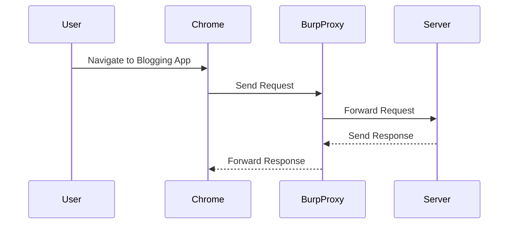

## Understanding the Lab Environment

To understand the lab environment, we will use the Burp Suite, a comprehensive toolkit for web application security testing. The lab involves a blogging application where users can view posts and leave comments. The goal is to find a DOM clobbering vulnerability to perform an XSS attack.

### Setting Up the Lab

Ensure you are using the Chrome browser and the built-in browser in Burp Suite. This setup ensures that all your requests are intercepted by Burp Proxy, allowing you to inspect and modify traffic.

### Identifying Input Vectors

In the lab, the input vectors that need to be tested for XSS include the comment field, the name field, and the website field. These fields are likely to be reflected in the DOM and can be manipulated to inject malicious scripts.

---
<!-- nav -->
[[Web Security (PortSwigger)/06-DOM-based Vulnerabilities/07-Lab 7 Clobbering DOM attributes to bypass HTML filters/07-Understanding DOM-Based Vulnerabilities|Understanding DOM-Based Vulnerabilities]] | [[Web Security (PortSwigger)/06-DOM-based Vulnerabilities/07-Lab 7 Clobbering DOM attributes to bypass HTML filters/00-Overview|Overview]] | [[Web Security (PortSwigger)/06-DOM-based Vulnerabilities/07-Lab 7 Clobbering DOM attributes to bypass HTML filters/09-Conclusion|Conclusion]]
