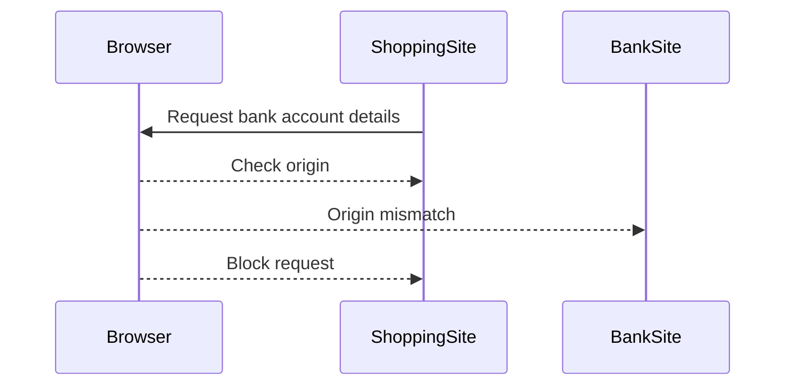
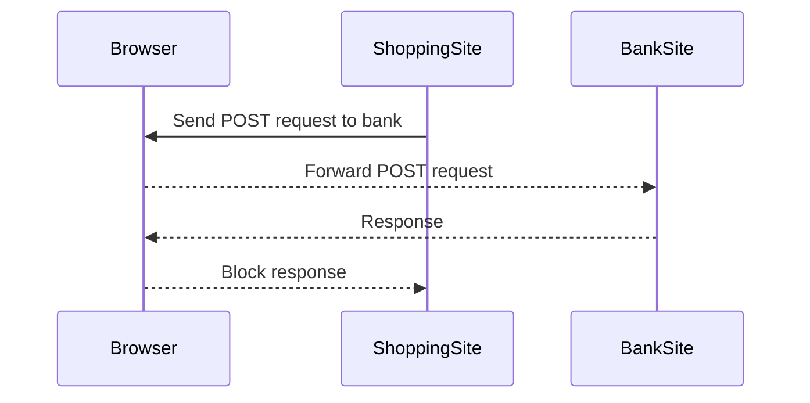
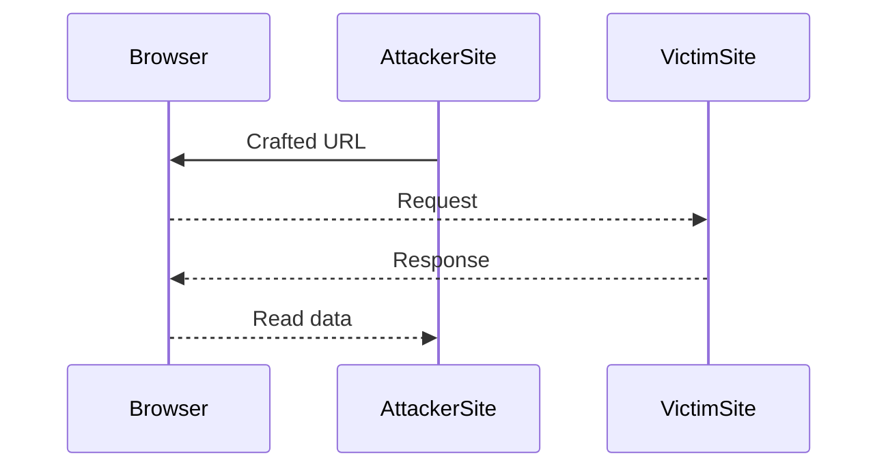

## Same Origin Policy Overview

The **Same Origin Policy** (SOP) is a critical security measure implemented in web browsers to ensure that scripts running on a webpage cannot access data from a different origin. An origin is defined by a combination of scheme (protocol), hostname, and port number. For instance, `https://www.example.com` and `http://www.example.com` are considered different origins due to the difference in the scheme (HTTPS vs HTTP).

### Why is the Same Origin Policy Important?

Without the SOP, a malicious script on a webpage could easily read sensitive data from another website. For example, imagine a scenario where a user is logged into their bank account (`https://bank.com`) and then visits a malicious shopping site (`https://shoppingmalicious.com`). Without the SOP, the malicious site could potentially read the user's bank account details, leading to severe financial losses.

### How Does the Same Origin Policy Work?

The SOP ensures that a web page can only access resources from the same origin. This means that if a script tries to access a resource from a different origin, the browser will block the request. The policy applies to various types of requests, including:

- **XMLHttpRequest**
- **Fetch API**
- **WebSocket**

#### Example of SOP in Action

Consider a scenario where a user is logged into their bank account at `https://bank.com`. A malicious script on a shopping site at `https://shoppingmalicious.com` attempts to read the user's bank account details. Here’s how the SOP would prevent this:



In this sequence, the browser checks the origin of the request and finds that it originates from `https://shoppingmalicious.com`, which is different from `https://bank.com`. As a result, the browser blocks the request.

### Writing Between Applications

It's important to note that the SOP does not prevent writing between applications. This means that a script on a malicious site can still send data to another site, but it cannot read the response. For example, a malicious script could send a POST request to a bank's API, but it would not be able to read the response.

#### Example of Writing Between Applications

Here’s an example of a POST request from a malicious site to a bank's API:



In this sequence, the browser allows the POST request to be sent to the bank's API, but it blocks the response, preventing the malicious script from reading the data.

### Real-World Examples and Breaches

Several real-world examples illustrate the importance of the SOP. One notable breach occurred in 2018 when a vulnerability in Facebook allowed attackers to steal users' private information. The attackers exploited a flaw in the SOP implementation, allowing them to read data from other origins.

#### CVE-2018-16224: Facebook Same Origin Policy Bypass

In CVE-2018-16224, attackers were able to bypass the SOP by using a crafted URL that included a subdomain of the target origin. This allowed the attackers to read sensitive data from the victim's account.



In this sequence, the attacker used a crafted URL to bypass the SOP, allowing them to read data from the victim's account.

### How to Prevent / Defend Against SOP Bypasses

To prevent SOP bypasses, it's crucial to implement proper security measures:

1. **Strict Content Security Policy (CSP)**: Ensure that your website uses a strict CSP to limit the sources of content that can be loaded.
2. **Subresource Integrity (SRI)**: Use SRI to ensure that external scripts are not tampered with.
3. **Secure Cookies**: Set the `HttpOnly` and `Secure` flags on cookies to prevent them from being accessed by scripts.
4. **Regular Audits**: Regularly audit your website for potential vulnerabilities and ensure that all security patches are applied.

#### Secure Coding Practices

Here’s an example of how to set secure cookies:

```javascript
document.cookie = "username=John Doe; HttpOnly; Secure";
```

And here’s an example of a strict CSP:

```html
<meta http-equiv="Content-Security-Policy" content="default-src 'self'; script-src 'self' https://trustedscripts.example.com;">
```

### Conclusion

The Same Origin Policy is a fundamental security measure that helps prevent cross-site scripting attacks and other types of security vulnerabilities. By understanding how the SOP works and implementing proper security measures, you can protect your website and its users from potential threats.

### Practice Labs

For hands-on practice with the Same Origin Policy, consider the following labs:

- **PortSwigger Web Security Academy**: Offers detailed labs on SOP and related security topics.
- **OWASP Juice Shop**: Provides a vulnerable web application for testing and learning about various security vulnerabilities, including SOP bypasses.

These labs will help you gain practical experience in identifying and defending against SOP-related vulnerabilities.

---
<!-- nav -->
[[Web Security (PortSwigger)/07-Cross-origin Resource Sharing (CORS)/01-Cross Origin Resource Sharing CORS Complete Guide/01-Introduction to Cross-Origin Resource Sharing (CORS)|Introduction to Cross-Origin Resource Sharing (CORS)]] | [[Web Security (PortSwigger)/07-Cross-origin Resource Sharing (CORS)/01-Cross Origin Resource Sharing CORS Complete Guide/00-Overview|Overview]] | [[03-Access-Control-Allow-Credentials Header|Access-Control-Allow-Credentials Header]]
