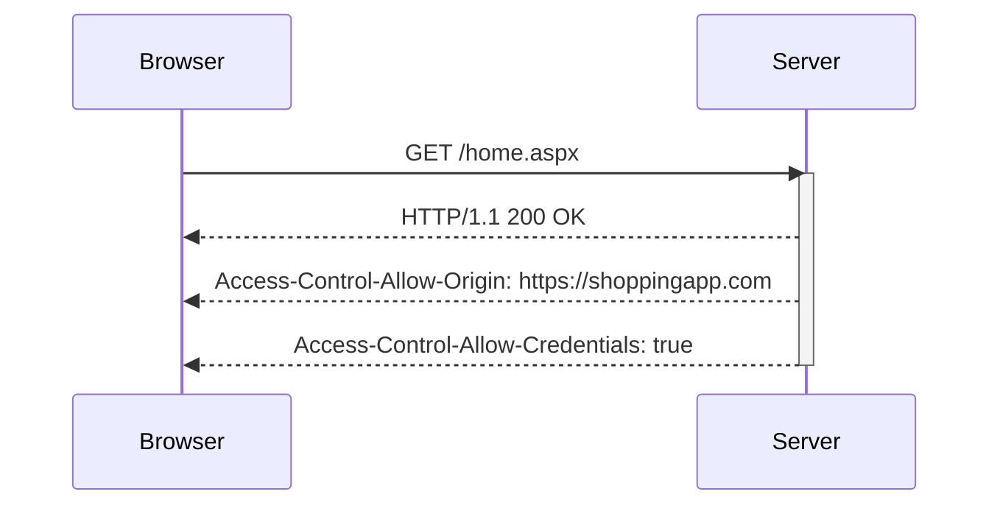

## Access-Control-Allow-Credentials Header

The `Access-Control-Allow-Credentials` header is used to indicate whether or not the response to the request can be exposed when the credentials flag is true. This header is typically used in conjunction with cookies or HTTP authentication.

### Example Scenario

Continuing with the previous example, if the shopping app needs to send cookies or other credentials with the request, the `Access-Control-Allow-Credentials` header must be set to `true`.

#### Request

```http
GET /home.aspx HTTP/1.1
Host: analyticsapp.com
Origin: https://shoppingapp.com
Cookie: session_id=abc123
```

#### Response

```http
HTTP/1.1 200 OK
Content-Type: application/json
Access-Control-Allow-Origin: https://shoppingapp.com
Access-Control-Allow-Credentials: true
Content-Length: 1024
```

### Pitfalls and Security Implications

Setting `Access-Control-Allow-Credentials` to `true` can expose sensitive data if the origin is not properly validated. This can lead to CSRF (Cross-Site Request Forgery) attacks.

#### Real-World Example: CVE-2020-14774

In 2020, a vulnerability was discovered in the WordPress REST API where the API was configured to allow CORS requests with credentials from any origin. This allowed attackers to perform CSRF attacks.

### How to Prevent / Defend

To securely configure the `Access-Control-Allow-Credentials` header:

1. **Validate Origins**: Ensure that only trusted origins are allowed to send credentials.
2. **Use HTTPS**: Always use HTTPS to encrypt data in transit.
3. **Secure Coding Practices**: Ensure that sensitive data is not exposed via CORS.

#### Secure Configuration Example

```http
HTTP/1.1 200 OK
Content-Type: application/json
Access-Control-Allow-Origin: https://shoppingapp.com
Access-Control-Allow-Credentials: true
Content-Length: 1234
```

### Mermaid Diagram: CORS with Credentials Flow



---
<!-- nav -->
[[02-Same Origin Policy Overview|Same Origin Policy Overview]] | [[Web Security (PortSwigger)/07-Cross-origin Resource Sharing (CORS)/01-Cross Origin Resource Sharing CORS Complete Guide/00-Overview|Overview]] | [[04-Access-Control-Allow-Origin Header|Access-Control-Allow-Origin Header]]
