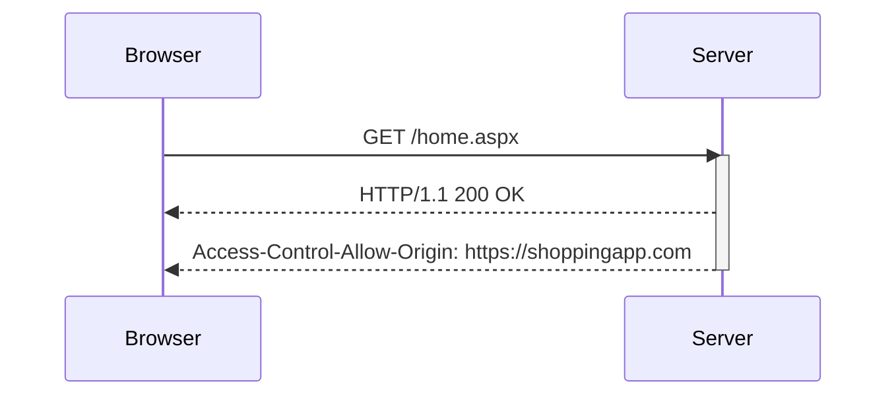

## Access-Control-Allow-Origin Header

The `Access-Control-Allow-Origin` header specifies which origins are allowed to access the resource. This header can have one of two types of values:

- A single origin (e.g., `https://www.example.com`)
- The wildcard value `*`, which allows any origin to access the resource

### Example Scenario

Consider two domains: `https://shoppingapp.com` (Domain A) and `https://analyticsapp.com` (Domain B). The shopping app needs to read data from the analytics app.

#### Request

```http
GET /home.aspx HTTP/1.1
Host: analyticsapp.com
Origin: https://shoppingapp.com
```

#### Response

If `analyticsapp.com` is configured to allow requests from `shoppingapp.com`, the response might look like this:

```http
HTTP/1.1 200 OK
Content-Type: application/json
Access-Control-Allow-Origin: https://shoppingapp.com
Content-Length: 1024
```

### Pitfalls and Security Implications

Using the wildcard `*` can be dangerous because it allows any origin to access the resource. This can lead to security vulnerabilities if sensitive data is exposed.

#### Real-World Example: CVE-2021-21972

In 2021, a vulnerability was discovered in the Microsoft Exchange Server where the server was configured to allow CORS requests from any origin. This allowed attackers to bypass the same-origin policy and access sensitive data.

### How to Prevent / Defend

To securely configure the `Access-Control-Allow-Origin` header:

1. **Whitelist Specific Origins**: Only allow specific trusted origins.
2. **Avoid Wildcard Usage**: Avoid using the wildcard `*` unless absolutely necessary.
3. **Secure Coding Practices**: Ensure that sensitive data is not exposed via CORS.

#### Secure Configuration Example

```http
HTTP/1.1 200 OK
Content-Type: application/json
Access-Control-Allow-Origin: https://shoppingapp.com
Content-Length: 1024
```

### Mermaid Diagram: CORS Flow



---
<!-- nav -->
[[03-Access-Control-Allow-Credentials Header|Access-Control-Allow-Credentials Header]] | [[Web Security (PortSwigger)/07-Cross-origin Resource Sharing (CORS)/01-Cross Origin Resource Sharing CORS Complete Guide/00-Overview|Overview]] | [[05-Cross-Origin Resource Sharing (CORS)|Cross-Origin Resource Sharing (CORS)]]
