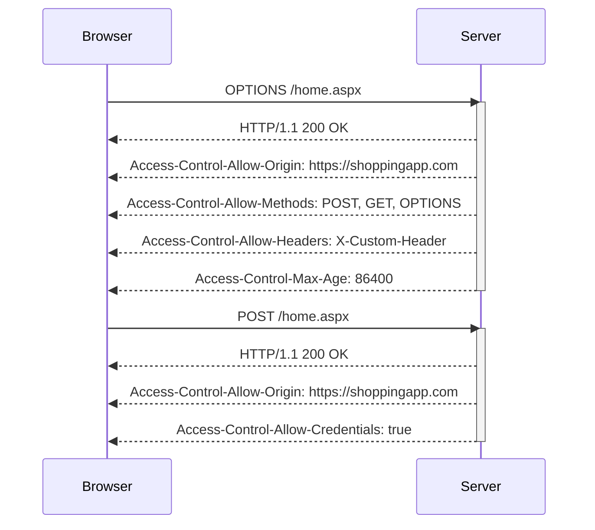

## Pre-flight Requests

For certain types of requests, the browser performs a pre-flight request using the OPTIONS method to check if the actual request is safe to send. This is done to ensure that the server supports the requested method and headers.

### Example Scenario

If the shopping app needs to send a POST request with custom headers, the browser will first send an OPTIONS request to check if the server supports this.

#### Pre-flight Request

```http
OPTIONS /home.aspx HTTP/1.1
Host: analyticsapp.com
Origin: https://shoppingapp.com
Access-Control-Request-Method: POST
Access-Control-Request-Headers: X-Custom-Header
```

#### Pre-flight Response

```http
HTTP/1.1 200 OK
Content-Type: text/plain
Access-Control-Allow-Origin: https://shoppingapp.com
Access-Control-Allow-Methods: POST, GET, OPTIONS
Access-Control-Allow-Headers: X-Custom-Header
Access-Control-Max-Age: 86400
```

### Actual Request

After receiving the pre-flight response, the browser will send the actual request.

#### Actual Request

```http
POST /home.aspx HTTP/1.1
Host: analyticsapp.com
Origin: https://shoppingapp.com
X-Custom-Header: custom-value
```

#### Actual Response

```http
HTTP/1.1 200 OK
Content-Type: application/json
Access-Control-Allow-Origin: https://shoppingapp.com
Access-Control-Allow-Credentials: true
Content-Length: 1234
```

### Pitfalls and Security Implications

Pre-flight requests can be used to probe the server for supported methods and headers. This can be exploited to discover sensitive information.

#### Real-World Example: CVE-2021-33209

In 2021, a vulnerability was discovered in the Apache Struts framework where the framework did not properly validate pre-flight requests, allowing attackers to discover supported methods and headers.

### How to Prevent / Defend

To securely handle pre-flight requests:

1. **Validate Methods and Headers**: Ensure that only supported methods and headers are allowed.
2. **Use HTTPS**: Always use HTTPS to encrypt data in transit.
3. **Secure Coding Practices**: Ensure that sensitive data is not exposed via CORS.

#### Secure Configuration Example

```http
HTTP/1.1 200 OK
Content-Type: text/plain
Access-Control-Allow-Origin: https://shoppingapp.com
Access-Control-Allow-Methods: POST, GET, OPTIONS
Access-Control-Allow-Headers: X-Custom-Header
Access-Control-Max-Age: 86400
```

### Mermaid Diagram: Pre-flight Request Flow



---
<!-- nav -->
[[10-How to Prevent  Defend Against CORS Vulnerabilities|How to Prevent  Defend Against CORS Vulnerabilities]] | [[Web Security (PortSwigger)/07-Cross-origin Resource Sharing (CORS)/01-Cross Origin Resource Sharing CORS Complete Guide/00-Overview|Overview]] | [[12-Preventing and Mitigating CORS Attacks|Preventing and Mitigating CORS Attacks]]
