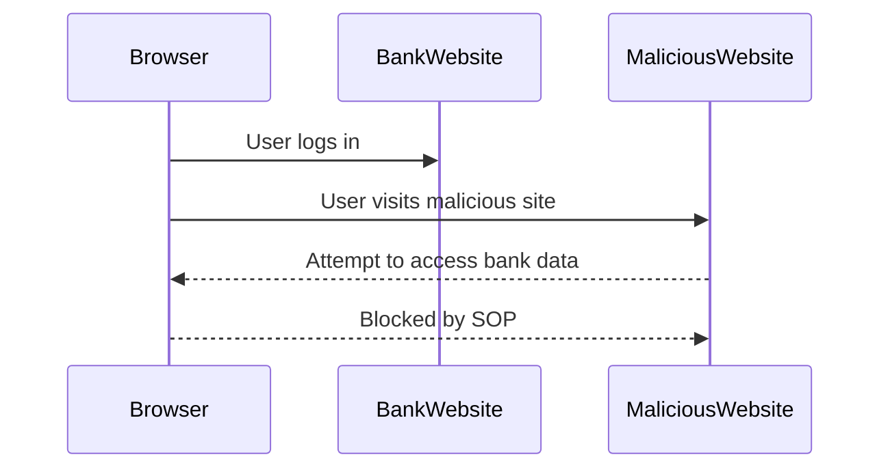

## Same Origin Policy (SOP)

### Introduction to Same Origin Policy

The **Same Origin Policy (SOP)** is a critical security mechanism enforced by web browsers to restrict how documents or scripts loaded from one origin can interact with resources from another origin. An origin is defined by a combination of scheme (protocol), hostname (domain), and port number. For example, `https://example.com` and `http://example.com` are considered different origins due to the difference in scheme (HTTPS vs HTTP).

#### Why SOP Matters

The primary goal of the Same Origin Policy is to prevent malicious scripts from accessing sensitive data across different domains. Without SOP, a malicious website could potentially access and manipulate data from other websites, leading to severe security vulnerabilities such as:

- **Cross-Site Scripting (XSS)**: Malicious scripts could inject themselves into trusted websites.
- **Cross-Site Request Forgery (CSRF)**: Attackers could trick users into performing unintended actions on a website they are authenticated to.

### How SOP Works

When a web page attempts to access resources from another origin, the browser checks whether the origins match. If they do not match, the browser enforces restrictions based on the SOP rules. This includes:

- **Reading Data**: Scripts cannot read data from another origin unless explicitly allowed.
- **Writing Data**: Scripts can send data to another origin but cannot read the response unless the server allows it via CORS (Cross-Origin Resource Sharing).

#### Example of SOP in Action

Consider a scenario where a user is logged into their bank account (`https://bank.example.com`) and visits a malicious website (`https://malicious.example.com`). The malicious site tries to access the user's bank account details. Due to SOP, the browser will block this attempt because the origins do not match.



### Real-World Examples and Breaches

#### Recent CVEs and Breaches

One notable example of an SOP-related breach is the **CVE-2018-11776** vulnerability in Google Chrome. This vulnerability allowed attackers to bypass SOP through a crafted HTML document, enabling them to steal cookies and other sensitive data from other origins.

Another example is the **CVE-2020-6517** vulnerability in Microsoft Edge, which allowed attackers to bypass SOP and execute arbitrary JavaScript in the context of another origin.

### How to Prevent / Defend Against SOP Bypasses

#### Detection

To detect potential SOP bypasses, organizations should implement robust logging and monitoring mechanisms. Tools like **Web Application Firewalls (WAFs)** can help identify suspicious activities that may indicate an SOP bypass attempt.

#### Prevention

1. **Secure Coding Practices**: Ensure that all web applications adhere to secure coding practices. Avoid using eval() and other dangerous functions that can introduce vulnerabilities.
2. **Content Security Policy (CSP)**: Implement CSP to further restrict what resources can be loaded and executed within a web page.
3. **HTTP Headers**: Use appropriate HTTP headers to enforce security policies. For example, the `Content-Security-Policy` header can be used to specify allowed sources of content.

#### Secure Code Fix

Here is an example of how to implement a Content Security Policy (CSP) to prevent SOP bypasses:

**Vulnerable Code:**
```html
<!DOCTYPE html>
<html>
<head>
    <title>Vulnerable Site</title>
</head>
<body>
    <script src="https://malicious.example.com/script.js"></script>
</body>
</html>
```

**Fixed Code:**
```html
<!DOCTYPE html>
<html>
<head>
    <title>Secure Site</title>
    <meta http-equiv="Content-Security-Policy" content="default-src 'self'; script-src 'self' https://trusted.example.com;">
</head>
<body>
    <script src="https://trusted.example.com/script.js"></script>
</body>
</html>
```

In the fixed code, the `Content-Security-Policy` header restricts the sources from which scripts can be loaded, preventing malicious scripts from being executed.

### Cross-Origin Resource Sharing (CORS)

#### Introduction to CORS

While the Same Origin Policy provides strong security, it can sometimes be too restrictive for legitimate use cases where different origins need to interact. **Cross-Origin Resource Sharing (CORS)** is a mechanism that allows controlled relaxation of the SOP. With CORS, servers can specify which origins are allowed to access their resources.

#### How CORS Works

CORS operates through a series of HTTP headers that allow servers to specify which origins are permitted to access their resources. There are two types of CORS requests: **simple requests** and **preflighted requests**.

##### Simple Requests

Simple requests are those that meet the following criteria:
- The HTTP method is GET, HEAD, or POST.
- The only headers set are `Accept`, `Accept-Language`, `Content-Language`, `Content-Type`, `Last-Event-ID`, `DNT`, `Referer`, `User-Agent`, `Origin`.
- The `Content-Type` header is either `application/x-www-form-urlencoded`, `multipart/form-data`, or `text/plain`.

For simple requests, the browser sends an `Origin` header to the server. The server responds with an `Access-Control-Allow-Origin` header to indicate which origins are allowed to access the resource.

##### Preflighted Requests

Preflighted requests are those that do not meet the criteria for simple requests. Before sending the actual request, the browser sends a preflight request using the `OPTIONS` method to determine if the actual request is safe to send. The server responds with various `Access-Control-*` headers to indicate the allowed methods, headers, and origins.

#### Example of CORS in Action

Consider a scenario where a web application at `https://app.example.com` needs to access resources from `https://api.example.com`. The server at `https://api.example.com` needs to include the appropriate CORS headers to allow this interaction.

**Preflight Request:**
```http
OPTIONS /resource HTTP/1.1
Host: api.example.com
Origin: https://app.example.com
Access-Control-Request-Method: GET
Access-Control-Request-Headers: Authorization
```

**Preflight Response:**
```http
HTTP/1.1 200 OK
Access-Control-Allow-Origin: https://app.example.com
Access-Control-Allow-Methods: GET, POST, OPTIONS
Access-Control-Allow-Headers: Authorization
Access-Control-Max-Age: 86400
```

**Actual Request:**
```http
GET /resource HTTP/1.1
Host: api.example.com
Origin: https://app.example.com
Authorization: Bearer <token>
```

**Actual Response:**
```http
HTTP/1.1 200 OK
Access-Control-Allow-Origin: https://app.example.com
Content-Type: application/json
{
    "data": "some data"
}
```

### Real-World Examples and Breaches

#### Recent CVEs and Breaches

One notable example of a CORS misconfiguration is the **CVE-2019-11510** vulnerability in WordPress. This vulnerability allowed attackers to bypass CORS restrictions and access sensitive data from other origins.

Another example is the **CVE-2020-14182** vulnerability in Apache Struts, which allowed attackers to bypass CORS restrictions and execute arbitrary commands.

### How to Prevent / Defend Against CORS Misconfigurations

#### Detection

To detect potential CORS misconfigurations, organizations should implement robust logging and monitoring mechanisms. Tools like **Web Application Firewalls (WAFs)** can help identify suspicious activities that may indicate a CORS misconfiguration.

#### Prevention

1. **Secure Coding Practices**: Ensure that all web applications adhere to secure coding practices. Avoid using eval() and other dangerous functions that can introduce vulnerabilities.
2. **Content Security Policy (CSP)**: Implement CSP to further restrict what resources can be loaded and executed within a web page.
3. **HTTP Headers**: Use appropriate HTTP headers to enforce security policies. For example, the `Access-Control-Allow-Origin` header should be set to specific origins rather than `*` to avoid broad exposure.

#### Secure Code Fix

Here is an example of how to implement proper CORS headers to prevent misconfigurations:

**Vulnerable Code:**
```javascript
app.use(cors());
```

**Fixed Code:**
```javascript
const corsOptions = {
    origin: 'https://trusted.example.com',
    methods: ['GET', 'POST'],
    allowedHeaders: ['Content-Type', 'Authorization']
};

app.use(cors(corsOptions));
```

In the fixed code, the `corsOptions` object specifies the allowed origin, methods, and headers, ensuring that only trusted origins can access the resources.

### Conclusion

Understanding and implementing the Same Origin Policy and Cross-Origin Resource Sharing correctly is crucial for maintaining the security of web applications. By adhering to secure coding practices and using appropriate HTTP headers, developers can prevent common vulnerabilities and ensure that their applications are protected against unauthorized access.

### Practice Labs

For hands-on practice with CORS and SOP, consider the following labs:

- **PortSwigger Web Security Academy**: Offers interactive labs on CORS and SOP.
- **OWASP Juice Shop**: Provides a vulnerable web application for practicing web security concepts.
- **DVWA (Damn Vulnerable Web Application)**: A deliberately insecure web application for practicing web security techniques.

By completing these labs, you can gain practical experience in identifying and mitigating CORS and SOP vulnerabilities.

---
<!-- nav -->
[[12-Preventing and Mitigating CORS Attacks|Preventing and Mitigating CORS Attacks]] | [[Web Security (PortSwigger)/07-Cross-origin Resource Sharing (CORS)/01-Cross Origin Resource Sharing CORS Complete Guide/00-Overview|Overview]] | [[14-Same Origin Policy and Cross-Origin Resource Sharing (CORS)|Same Origin Policy and Cross-Origin Resource Sharing (CORS)]]
