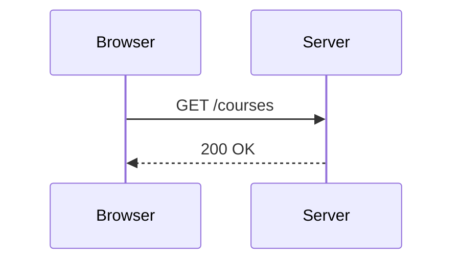
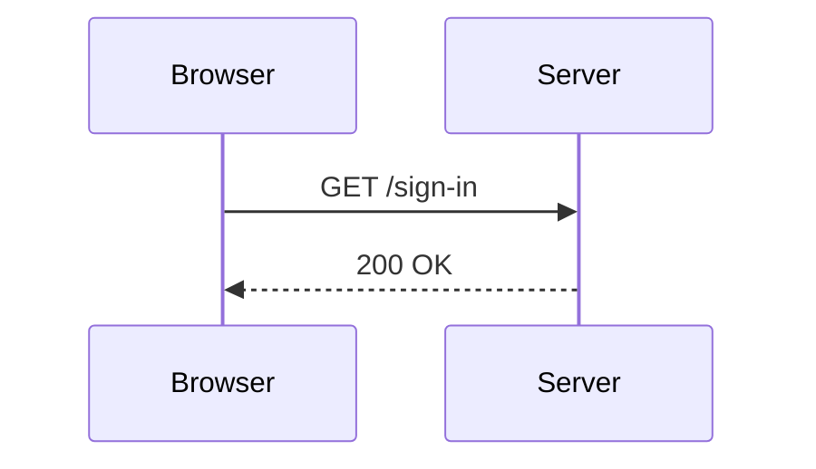
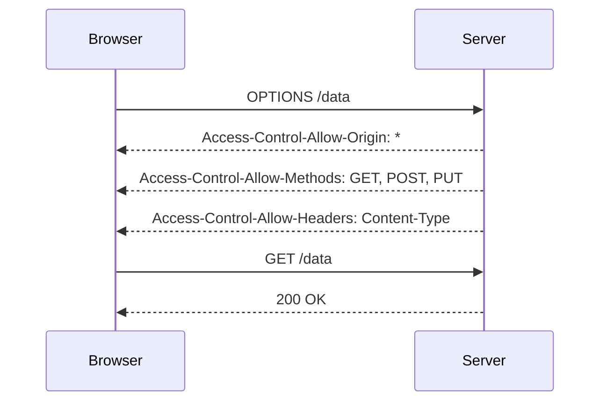

## Same Origin Policy and Cross-Origin Resource Sharing (CORS)

### Introduction to Same Origin Policy

The **Same Origin Policy** is a critical security measure implemented by web browsers to restrict how documents or scripts loaded from one origin can interact with resources from another origin. An origin is defined by a combination of three elements: the scheme (protocol), the domain, and the port number. For example, `http://runacalil.com` and `https://runacalil.com` are considered different origins due to the difference in the scheme.

#### Why the Same Origin Policy Matters

The Same Origin Policy prevents malicious scripts from accessing sensitive data across different domains. Without this policy, an attacker could potentially inject a script into a webpage that reads cookies or other sensitive information from another domain, leading to significant security risks such as session hijacking and data theft.

#### How the Same Origin Policy Works

When a browser loads a document (like an HTML page), it checks the origin of the document against the origin of any resources (like images, scripts, or AJAX requests) that the document tries to access. If the origins match, the resource is allowed to be accessed; otherwise, the request is blocked.

Let's break down the components of an origin:

- **Scheme**: The protocol used, such as `http`, `https`, or `ftp`.
- **Domain**: The hostname, such as `runacalil.com`.
- **Port**: The port number, such as `80` for HTTP or `443` for HTTPS. If the port is not specified, the default port for the scheme is used.

For example, consider the following origins:

- `http://runacalil.com`
- `https://runacalil.com`
- `http://runacalil.com:8080`

These are all different origins because they differ in at least one component (scheme or port).

### Evaluating Same Origin Requests

To understand how the Same Origin Policy works, let's evaluate some scenarios based on the provided transcript chunk.

#### Scenario 1: Request to the Same Domain

Consider the following scenario:

- **Requesting Site**: `http://runacalil.com/courses`
- **Requested Resource**: `http://runacalil.com`



In this scenario, the requesting site and the requested resource share the same origin (`http://runacalil.com`). Since the scheme, domain, and port are identical, the request is allowed by the Same Origin Policy.

#### Scenario 2: Request to a Different Page on the Same Domain

Now, consider a slightly different scenario:

- **Requesting Site**: `http://runacalil.com/courses`
- **Requested Resource**: `http://runacalil.com/sign-in`



Here, the requesting site and the requested resource still share the same origin (`http://runacalil.com`). Although the paths (`/courses` and `/sign-in`) are different, the scheme, domain, and port remain the same. Therefore, the request is allowed by the Same Origin Policy.

### Cross-Origin Resource Sharing (CORS)

While the Same Origin Policy provides strong security, it can sometimes be too restrictive for legitimate use cases where resources need to be shared between different origins. This is where **Cross-Origin Resource Sharing (CORS)** comes into play.

#### What is CORS?

CORS is a mechanism that uses additional HTTP headers to tell browsers to give a web application running at one origin, permission to access selected resources from a different origin. Essentially, it allows controlled access to resources across different origins.

#### How CORS Works

When a browser makes a cross-origin request, it first sends a **preflight request** to the server. A preflight request is an `OPTIONS` request that includes the `Access-Control-Request-Method` and `Access-Control-Request-Headers` headers. The server responds with appropriate `Access-Control-Allow-Origin`, `Access-Control-Allow-Methods`, and `Access-Control-Allow-Headers` headers to indicate whether the actual request is allowed.

If the preflight request is successful, the browser then sends the actual request.

#### Example of CORS Headers

Consider a scenario where a web application at `http://example.com` wants to make a request to `http://api.runacalil.com`.



In this example, the server responds to the preflight request with the necessary CORS headers, indicating that the actual request is allowed.

### Real-World Examples and Recent Breaches

#### Real-World Example: CVE-2021-23277

One notable example of a CORS misconfiguration leading to a security breach is CVE-2021-23277. In this case, a misconfigured CORS policy allowed an attacker to bypass the Same Origin Policy and access sensitive data from a different origin.

#### How to Prevent / Defend Against CORS Misconfigurations

To prevent CORS misconfigurations, follow these best practices:

1. **Restrict Allowed Origins**: Only allow specific origins that are trusted. Avoid using `*` unless absolutely necessary.
2. **Use Secure Headers**: Ensure that the `Access-Control-Allow-Origin` header is set correctly and does not expose your application to unnecessary risks.
3. **Validate User Input**: Always validate user input to prevent injection attacks.
4. **Monitor and Audit**: Regularly monitor and audit your CORS configurations to ensure they remain secure.

#### Secure Coding Practices

Here’s an example of a vulnerable CORS configuration and its secure counterpart:

**Vulnerable Configuration:**

```json
{
  "Access-Control-Allow-Origin": "*",
  "Access-Control-Allow-Methods": "GET, POST, PUT"
}
```

**Secure Configuration:**

```json
{
  "Access-Control-Allow-Origin": "http://trusted-origin.com",
  "Access-Control-Allow-Methods": "GET, POST, PUT"
}
```

### Hands-On Labs

To practice and gain a deeper understanding of CORS and Same Origin Policy, consider the following labs:

- **PortSwigger Web Security Academy**: Offers interactive labs on CORS and Same Origin Policy.
- **OWASP Juice Shop**: Provides a vulnerable web application where you can explore and exploit CORS misconfigurations.
- **DVWA (Damn Vulnerable Web Application)**: Another excellent resource for practicing web security concepts, including CORS.

By thoroughly understanding the Same Origin Policy and CORS, you can effectively secure your web applications and prevent unauthorized access to sensitive resources.

---
<!-- nav -->
[[13-Same Origin Policy (SOP)|Same Origin Policy (SOP)]] | [[Web Security (PortSwigger)/07-Cross-origin Resource Sharing (CORS)/01-Cross Origin Resource Sharing CORS Complete Guide/00-Overview|Overview]] | [[15-Same Origin Policy and Origins|Same Origin Policy and Origins]]
