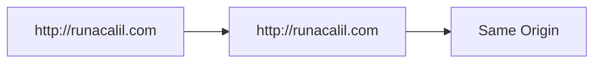
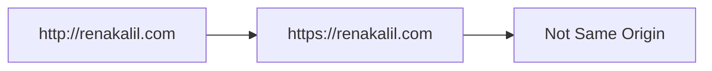
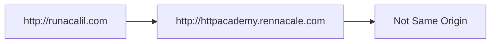

## Same Origin Policy and Origins

### What is the Same Origin Policy?

The Same Origin Policy (SOP) is a critical security measure implemented by web browsers to ensure that scripts running on one website cannot access data from another website unless both websites share the same origin. An origin is defined by three components: the scheme (protocol), the domain, and the port number. This policy helps prevent malicious scripts from accessing sensitive data such as cookies, local storage, or other resources that could be used to compromise user privacy and security.

### How Does the Same Origin Policy Work?

To determine whether two URLs share the same origin, the browser compares their scheme, domain, and port. If all three components match, the URLs are considered to be from the same origin. Here’s a breakdown of each component:

- **Scheme**: The protocol used, such as `http`, `https`, or `ftp`.
- **Domain**: The domain name, such as `example.com` or `subdomain.example.com`.
- **Port**: The port number, such as `80` for HTTP or `443` for HTTPS.

For example, consider the following URLs:

- `http://www.example.com`
- `https://www.example.com`
- `http://www.example.com:80`
- `http://subdomain.example.com`

These URLs can be compared to see if they share the same origin:

- `http://www.example.com` and `http://www.example.com:80` share the same origin because they have the same scheme (`http`), domain (`www.example.com`), and port (`80`).
- `http://www.example.com` and `https://www.example.com` do not share the same origin because they have different schemes (`http` vs `https`).
- `http://www.example.com` and `http://subdomain.example.com` do not share the same origin because they have different domains (`www.example.com` vs `subdomain.example.com`).

### Example Analysis

Let's analyze the examples provided in the transcript:

#### Example 1: Same Origin

- **URL 1**: `http://runacalil.com`
- **URL 2**: `http://runacalil.com`

Both URLs have the same scheme (`http`), domain (`runacalil.com`), and port (`80`). Therefore, they share the same origin and the request is allowed by the same origin policy.



#### Example 2: Different Scheme and Port

- **URL 1**: `http://renakalil.com`
- **URL 2**: `https://renakalil.com`

Here, the scheme (`http` vs `https`) and the port (`80` vs `443`) differ. Therefore, these URLs do not share the same origin and the request is not allowed by the same origin policy.



#### Example 3: Different Domain

- **URL 1**: `http://runacalil.com`
- **URL 2**: `http://httpacademy.rennacale.com`

In this case, the domain differs (`runacalil.com` vs `httpacademy.rennacale.com`). Therefore, these URLs do not share the same origin and the request is not allowed by the same origin policy.



### Real-World Examples and Breaches

One notable real-world example of a breach due to improper handling of the same origin policy is the **Cross-Site Request Forgery (CSRF)** attack. CSRF attacks occur when an attacker tricks a victim into executing unwanted actions on a web application in which they are authenticated. This can happen if the web application does not properly enforce the same origin policy.

For instance, consider a banking website that allows users to transfer funds. If the website does not enforce the same origin policy correctly, an attacker could create a malicious webpage that sends a request to the banking website to transfer funds. If the victim is logged into the banking website, the request would be executed with the victim's credentials.

**CVE Example**: CVE-2019-11510 was a vulnerability in the WordPress REST API that allowed attackers to bypass the same origin policy and execute arbitrary code. This vulnerability was exploited to perform CSRF attacks, leading to unauthorized actions on behalf of authenticated users.

### How to Prevent / Defend Against Same Origin Policy Violations

#### Detection

To detect violations of the same origin policy, web applications should implement proper logging and monitoring mechanisms. Logs should capture all cross-origin requests and flag those that violate the same origin policy. Additionally, security tools like Web Application Firewalls (WAFs) can help detect and block suspicious cross-origin requests.

#### Prevention

1. **Enforce Strict Same Origin Policy**: Ensure that your web application enforces the same origin policy strictly. This means that any cross-origin requests should be blocked unless explicitly allowed.
   
2. **Use Content Security Policy (CSP)**: Implement a Content Security Policy (CSP) to restrict the sources from which content can be loaded. CSP can help prevent cross-site scripting (XSS) and other types of attacks by specifying trusted sources.

3. **Implement CORS Headers Correctly**: If your application needs to allow cross-origin requests, ensure that you implement CORS headers correctly. This includes setting the `Access-Control-Allow-Origin` header to specify which origins are allowed to make requests.

4. **Secure Cookies**: Set the `HttpOnly` and `Secure` flags on cookies to prevent them from being accessed by JavaScript and ensure they are only sent over HTTPS.

#### Secure Coding Fixes

Here’s an example of how to implement CORS headers correctly:

```http
HTTP/1.1 200 OK
Content-Type: application/json
Access-Control-Allow-Origin: https://example.com
Access-Control-Allow-Methods: GET, POST, OPTIONS
Access-Control-Allow-Headers: Content-Type, Authorization
```

In this example, the `Access-Control-Allow-Origin` header specifies that only requests from `https://example.com` are allowed. The `Access-Control-Allow-Methods` and `Access-Control-Allow-Headers` headers specify which methods and headers are allowed in cross-origin requests.

#### Vulnerable vs. Fixed Code

Here’s an example of a vulnerable CORS implementation and its fixed version:

**Vulnerable Code**:
```javascript
app.use((req, res, next) => {
    res.header("Access-Control-Allow-Origin", "*");
    res.header("Access-Control-Allow-Headers", "Origin, X-Requested-With, Content-Type, Accept");
    next();
});
```

**Fixed Code**:
```javascript
app.use((req, res, next) => {
    const allowedOrigins = ['https://example.com', 'https://secure.example.com'];
    const origin = req.headers.origin;
    
    if (allowedOrigins.includes(origin)) {
        res.header("Access-Control-Allow-Origin", origin);
    }
    res.header("Access-Control-Allow-Headers", "Origin, X-Requested-With, Content-Type, Accept");
    next();
});
```

In the fixed code, the `Access-Control-Allow-Origin` header is set based on a list of allowed origins, rather than allowing all origins.

### Practice Labs

For hands-on practice with CORS and the same origin policy, consider the following labs:

- **PortSwigger Web Security Academy**: Offers interactive labs on CORS misconfigurations and same origin policy bypasses.
- **OWASP Juice Shop**: Provides a vulnerable web application that can be used to practice identifying and exploiting CORS vulnerabilities.
- **DVWA (Damn Vulnerable Web Application)**: Contains various web application vulnerabilities, including those related to CORS and the same origin policy.

By thoroughly understanding and implementing the principles of the same origin policy and CORS, you can significantly enhance the security of your web applications and protect against common web vulnerabilities.

---
<!-- nav -->
[[14-Same Origin Policy and Cross-Origin Resource Sharing (CORS)|Same Origin Policy and Cross-Origin Resource Sharing (CORS)]] | [[Web Security (PortSwigger)/07-Cross-origin Resource Sharing (CORS)/01-Cross Origin Resource Sharing CORS Complete Guide/00-Overview|Overview]] | [[16-Same Origin Policy|Same Origin Policy]]
