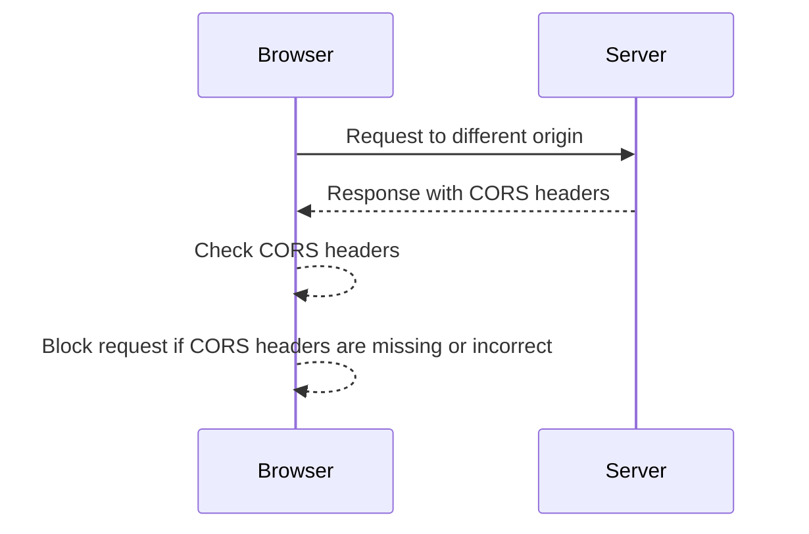
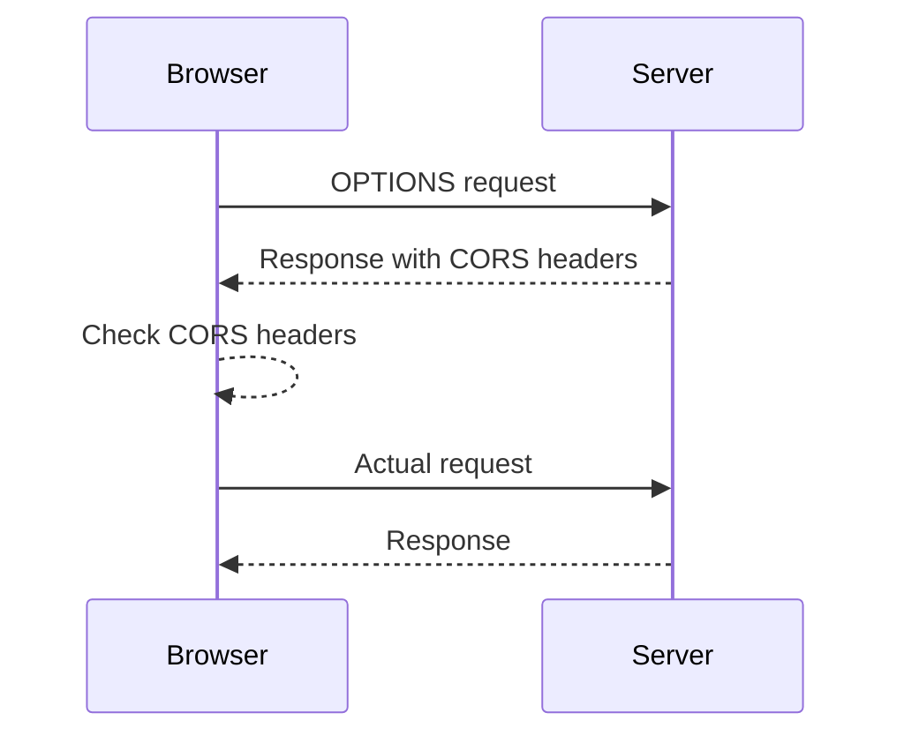

## Same Origin Policy

### What is the Same Origin Policy?

The Same Origin Policy (SOP) is a critical security measure implemented by web browsers to ensure that scripts running on a webpage cannot access data from other domains unless explicitly allowed. The policy defines the origin of a resource based on three components: the protocol (HTTP, HTTPS), the domain name (example.com), and the port number (80, 443, etc.). Two resources have the same origin if and only if all these components match exactly.

#### Why is the Same Origin Policy Important?

The SOP is essential for preventing cross-site scripting (XSS) attacks and other types of malicious activities. Without it, a script on one website could potentially access sensitive data from another website, leading to serious security vulnerabilities. For instance, an attacker could inject a script into a victim's page that reads cookies or other sensitive information from a bank's website, which could then be sent to the attacker.

#### How Does the Same Origin Policy Work?

When a script attempts to access a resource from a different origin, the browser checks whether the origins match. If they do not, the request is blocked. This mechanism ensures that a script on `runacalil.com` cannot access data from `google.com`, even if both sites are accessed by the same user.

### Examples of Same Origin Policy Enforcement

Let's explore some examples to understand how the Same Origin Policy is enforced:

1. **Different Domains**:
    - **Example**: A script on `renachal.com` tries to access data from `academy.runacaliel.com`.
    - **Result**: The request is blocked because the domains are different (`renachal.com` vs. `academy.runacaliel.com`).

2. **Subdomains**:
    - **Example**: A script on `subdomain.example.com` tries to access data from `example.com`.
    - **Result**: The request is blocked because subdomains are considered different origins (`subdomain.example.com` vs. `example.com`).

3. **Different Ports**:
    - **Example**: A script on `http://runacalil.com:80` tries to access data from `http://runacalil.com:8080`.
    - **Result**: The request is blocked because the ports are different (`80` vs. `8080`).

### Violating the Same Origin Policy

When a script attempts to violate the Same Origin Policy, the browser blocks the request and typically returns an error message. Let's look at a specific example:

#### Example: Access Denied Due to Same Origin Policy

Consider a scenario where a script on `runacalil.com` tries to make a request to `google.com`.

```http
GET https://google.com/
```

The browser will block this request and return an error message similar to the following:

```plaintext
Access to google.com from the origin renacalal.com has been blocked by something called a CORS policy.
```

This error indicates that the request was blocked due to the Same Origin Policy.

### Cross-Origin Resource Sharing (CORS)

Cross-Origin Resource Sharing (CORS) is a mechanism that allows a server to relax the Same Origin Policy restrictions. It enables a server to specify which origins are allowed to access its resources. This is achieved through the use of HTTP headers in the server's response.

#### CORS Headers

The key headers used in CORS are:

- **Access-Control-Allow-Origin**: Specifies which origins are allowed to access the resource.
- **Access-Control-Allow-Methods**: Specifies which HTTP methods are allowed.
- **Access-Control-Allow-Headers**: Specifies which headers are allowed in the request.
- **Access-Control-Max-Age**: Specifies how long the results of a preflight request can be cached.

#### Example: CORS Headers in Action

Consider a server that wants to allow requests from `runacalil.com`. The server would include the following headers in its response:

```http
HTTP/1.1 200 OK
Content-Type: application/json
Access-Control-Allow-Origin: http://runacalil.com
Access-Control-Allow-Methods: GET, POST, OPTIONS
Access-Control-Allow-Headers: Content-Type, Authorization
Access-Control-Max-Age: 86400
```

### Preflight Requests

For certain types of requests, such as those involving custom headers or non-simple methods (e.g., PUT, DELETE), the browser sends a preflight request to the server. The preflight request is an OPTIONS request that checks whether the actual request is safe to send.

#### Example: Preflight Request

A client might send a preflight request like this:

```http
OPTIONS /api/resource HTTP/1.1
Host: example.com
Origin: http://runacalil.com
Access-Control-Request-Method: PUT
Access-Control-Request-Headers: X-Custom-Header
```

The server would respond with the appropriate CORS headers:

```http
HTTP/1.1 200 OK
Access-Control-Allow-Origin: http://runacalil.com
Access-Control-Allow-Methods: PUT, GET, POST
Access-Control-Allow-Headers: X-Custom-Header
Access-Control-Max-Age: 86400
```

### Real-World Examples and Breaches

#### Recent CVEs and Breaches

One notable example of a CORS misconfiguration leading to a security breach is the case of a popular social media platform that allowed unauthorized access to user data due to improper CORS settings. The platform had set `Access-Control-Allow-Origin: *`, allowing any origin to access its API. An attacker exploited this misconfiguration to steal user data.

#### Secure Configuration

To avoid such vulnerabilities, it is crucial to configure CORS settings securely. Here are some best practices:

1. **Restrict Origins**: Only allow specific trusted origins rather than using `*`.
2. **Limit Methods and Headers**: Specify only the necessary methods and headers.
3. **Use Pre-flight Requests**: Ensure that pre-flight requests are properly handled.

### How to Prevent / Defend Against CORS Misconfigurations

#### Detection

To detect potential CORS misconfigurations, you can use tools like Burp Suite or OWASP ZAP to test your API endpoints for CORS-related issues. These tools can help identify if your server is responding with overly permissive CORS headers.

#### Prevention

1. **Configure CORS Properly**: Use a whitelist approach to specify trusted origins.
2. **Limit Access**: Restrict the allowed methods and headers to only what is necessary.
3. **Regular Audits**: Perform regular security audits to check for misconfigurations.

#### Secure Coding Fixes

Here is an example of a vulnerable CORS configuration and its secure counterpart:

**Vulnerable Configuration:**

```python
from flask import Flask, Response

app = Flask(__name__)

@app.after_request
def after_request(response):
    response.headers.add('Access-Control-Allow-Origin', '*')
    response.headers.add('Access-Control-Allow-Methods', 'GET, POST, OPTIONS')
    response.headers.add('Access-Control-Allow-Headers', 'Content-Type, Authorization')
    return response

if __name__ == '__main__':
    app.run()
```

**Secure Configuration:**

```python
from flask import Flask, Response

app = Flask(__name__)

@app.after_request
def after_request(response):
    response.headers.add('Access-Control-Allow-Origin', 'http://runacalil.com')
    response.headers.add('Access-Control-Allow-Methods', 'GET, POST, OPTIONS')
    response.headers.add('Access-Control-Allow-Headers', 'Content-Type, Authorization')
    return response

if __name__ == '__main__':
    app.run()
```

### Mermaid Diagrams

#### Same Origin Policy Flow



#### Preflight Request Flow



### Practice Labs

For hands-on practice with CORS and Same Origin Policy, consider the following labs:

- **PortSwigger Web Security Academy**: Offers interactive labs on CORS misconfigurations and Same Origin Policy.
- **OWASP Juice Shop**: Provides a vulnerable web application where you can test and exploit CORS misconfigurations.
- **DVWA (Damn Vulnerable Web Application)**: Includes scenarios where CORS is improperly configured, allowing you to practice securing it.

By thoroughly understanding and implementing these concepts, you can significantly enhance the security of web applications against cross-origin attacks.

---
<!-- nav -->
[[15-Same Origin Policy and Origins|Same Origin Policy and Origins]] | [[Web Security (PortSwigger)/07-Cross-origin Resource Sharing (CORS)/01-Cross Origin Resource Sharing CORS Complete Guide/00-Overview|Overview]] | [[Web Security (PortSwigger)/07-Cross-origin Resource Sharing (CORS)/01-Cross Origin Resource Sharing CORS Complete Guide/17-Conclusion|Conclusion]]
