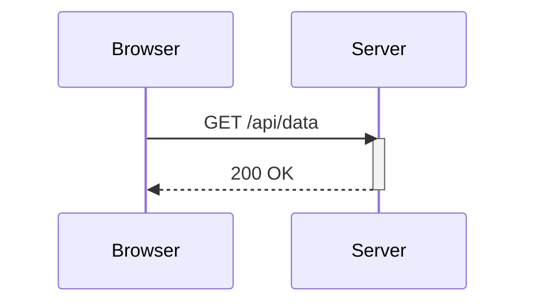
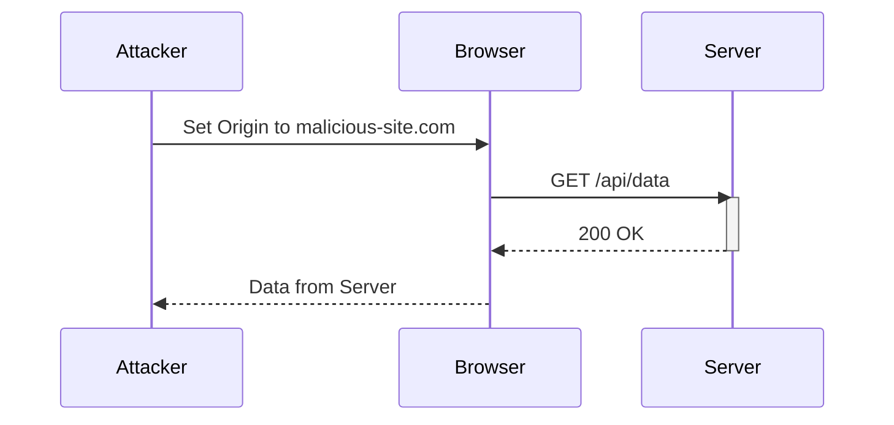

## Cross-Origin Resource Sharing (CORS)

Cross-Origin Resource Sharing (CORS) is a mechanism that uses additional HTTP headers to tell browsers to give a web application running at one origin, access to selected resources from a different origin. A web application makes a cross-origin HTTP request when it requests a resource from a different domain than the one that served the web page. For example, an HTML page served from `http://domain-a.com` might try to fetch data from `http://domain-b.com`.

### What is CORS?

CORS is designed to ensure that web applications can securely interact with resources hosted on different domains. This is necessary because of the Same Origin Policy (SOP), which restricts how a document or script loaded from one origin can interact with a resource from another origin. The SOP helps mitigate risks like Cross-Site Scripting (XSS) and Cross-Site Request Forgery (CSRF).

### How CORS Works

When a browser makes a cross-origin request, it adds an `Origin` header to the request. The server then responds with specific CORS headers that indicate whether the request is allowed. The most important CORS headers are:

- **Access-Control-Allow-Origin**: Specifies which origins are permitted to access the resource.
- **Access-Control-Allow-Methods**: Lists the HTTP methods that are allowed for the resource.
- **Access-Control-Allow-Headers**: Lists the headers that are allowed in the request.
- **Access-Control-Allow-Credentials**: Indicates whether the request can include credentials such as cookies, authorization headers, or client-side SSL certificates.

#### Example of a CORS Request and Response

```http
GET /api/data HTTP/1.1
Host: domain-b.com
Origin: http://domain-a.com
```

```http
HTTP/1.1 200 OK
Access-Control-Allow-Origin: http://domain-a.com
Content-Type: application/json
{
  "data": "some data"
}
```

### CORS Vulnerabilities

A common CORS vulnerability occurs when the server reflects the `Origin` header without proper validation. This can lead to a situation where any origin is allowed to access the resource, which can be exploited by attackers.

#### Example of a Vulnerable CORS Configuration

Consider a web application that reflects the `Origin` header without validation:

```http
GET /api/data HTTP/1.1
Host: website.com
Origin: http://malicious-site.com
```

```http
HTTP/1.1 200 OK
Access-Control-Allow-Origin: http://malicious-site.com
Content-Type: application/json
{
  "data": "some data"
}
```

In this scenario, the attacker can set the `Origin` header to their malicious site, and the server will reflect it back, allowing the attacker to access the resource.

### Real-World Examples of CORS Vulnerabilities

One notable example of a CORS vulnerability is CVE-2021-21972, which affected several versions of the WordPress REST API. The vulnerability allowed attackers to bypass CORS restrictions and access sensitive data.

Another example is the CORS vulnerability found in the Tesla API, which allowed attackers to access sensitive information about Tesla vehicles. This vulnerability was exploited in a proof-of-concept attack that demonstrated how an attacker could access vehicle data from a malicious website.

### How to Prevent / Defend Against CORS Vulnerabilities

To prevent CORS vulnerabilities, it is essential to properly configure the CORS headers and validate the `Origin` header.

#### Secure Configuration of CORS Headers

The following steps outline how to securely configure CORS headers:

1. **Validate the Origin Header**: Ensure that the `Origin` header is validated against a whitelist of trusted origins.
2. **Use Specific Origins**: Instead of using `*` for `Access-Control-Allow-Origin`, specify the exact origins that are allowed.
3. **Set Access-Control-Allow-Credentials**: Only set `Access-Control-Allow-Credentials` to `true` if the origin is explicitly trusted.
4. **Limit Allowed Methods and Headers**: Specify the exact methods and headers that are allowed.

#### Example of Secure CORS Configuration

```http
GET /api/data HTTP/1.1
Host: website.com
Origin: http://trusted-site.com
```

```http
HTTP/1.1 200 OK
Access-Control-Allow-Origin: http://trusted-site.com
Access-Control-Allow-Methods: GET, POST
Access-Control-Allow-Headers: Content-Type, Authorization
Access-Control-Allow-Credentials: true
Content-Type: application/json
{
  "data": "some data"
}
```

#### Detection of CORS Vulnerabilities

To detect CORS vulnerabilities, you can use tools like Burp Suite, which includes features for testing CORS configurations. Additionally, you can manually test the application by setting different `Origin` headers and observing the responses.

#### Secure Coding Practices

When implementing CORS, ensure that the following secure coding practices are followed:

1. **Do Not Reflect the Origin Header Without Validation**: Always validate the `Origin` header against a whitelist of trusted origins.
2. **Use Specific Origins**: Avoid using `*` for `Access-Control-Allow-Origin`.
3. **Limit Access Control Allow Credentials**: Only set `Access-Control-Allow-Credentials` to `true` for trusted origins.

#### Example of Vulnerable vs. Secure Code

**Vulnerable Code**

```python
from flask import Flask, request

app = Flask(__name__)

@app.after_request
def after_request(response):
    response.headers.add('Access-Control-Allow-Origin', request.headers.get('Origin'))
    return response

if __name__ == '__main__':
    app.run()
```

**Secure Code**

```python
from flask import Flask, request

app = Flask(__name__)
TRUSTED_ORIGINS = ['http://trusted-site.com']

@app.after_request
def after_request(response):
    origin = request.headers.get('Origin')
    if origin in TRUSTED_ORIGINS:
        response.headers.add('Access-Control-Allow-Origin', origin)
        response.headers.add('Access-Control-Allow-Credentials', 'true')
    return response

if __name__ == '__main__':
    app.run()
```

### Hands-On Labs

For hands-on practice with CORS vulnerabilities, consider the following labs:

- **PortSwigger Web Security Academy**: Offers interactive labs on CORS vulnerabilities.
- **OWASP Juice Shop**: Contains various web security challenges, including CORS-related issues.
- **DVWA (Damn Vulnerable Web Application)**: Provides a vulnerable web application for testing and learning.

### Conclusion

Understanding and properly configuring CORS is crucial for securing web applications. By validating the `Origin` header and limiting access to trusted origins, you can prevent attackers from exploiting CORS vulnerabilities. Regularly testing your application for CORS misconfigurations and implementing secure coding practices can help ensure the security of your web application.

### Diagrams

#### CORS Request and Response Flow



#### CORS Attack Chain



By thoroughly understanding and implementing these principles, you can effectively prevent CORS vulnerabilities and ensure the security of your web applications.

---
<!-- nav -->
[[02-CORS Exploitation via Origin Reflection|CORS Exploitation via Origin Reflection]] | [[Web Security (PortSwigger)/07-Cross-origin Resource Sharing (CORS)/02-Lab 1 CORS vulnerability with basic origin reflection/00-Overview|Overview]] | [[04-Detailed Explanation of CORS Vulnerability with Basic Origin Reflection|Detailed Explanation of CORS Vulnerability with Basic Origin Reflection]]
