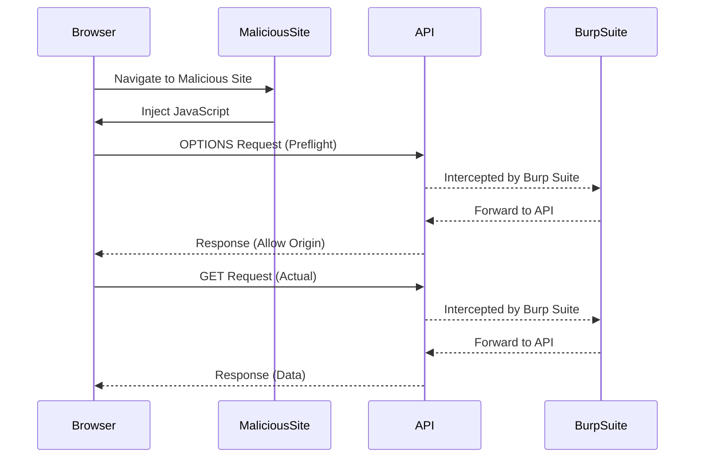

## Expert Lab Setup

In the given scenario, we are working on an expert lab that requires knowledge of scripting in JavaScript and the use of Burp Suite Professional. The lab involves using the provided exploit server and/or Burp Collaborator's default public server.

### Setting Up the Lab Environment

1. **Access the Lab**:
   - Click on "Access the Lab" to start the lab environment.
   - Open Burp Suite Professional in another tab to avoid timeouts.

2. **Configure Burp Suite**:
   - Set FoxyProxy to send requests to Burp Suite.
   - Verify that requests are intercepted in the proxy tab.

### Scripting in JavaScript

To solve the lab, you need to write four different scripts in JavaScript. These scripts will help you interact with the web application and exploit the CORS vulnerability.

#### Example Script 1: Preflight Request

```javascript
const xhr = new XMLHttpRequest();
xhr.open('OPTIONS', 'https://api.example.org/data');
xhr.setRequestHeader('Origin', 'https://malicious-site.com');
xhr.setRequestHeader('Access-Control-Request-Method', 'GET');
xhr.setRequestHeader('Access-Control-Request-Headers', 'Authorization');
xhr.onreadystatechange = function() {
    if (xhr.readyState === 4 && xhr.status === 200) {
        console.log(xhr.getAllResponseHeaders());
    }
};
xhr.send();
```

#### Example Script 2: Actual Request

```javascript
const xhr = new XMLHttpRequest();
xhr.open('GET', 'https://api.example.org/data');
xhr.setRequestHeader('Authorization', 'Bearer token');
xhr.onreadystatechange = function() {
    if (xhr.readyState === 4 && xhr.status === 200) {
        console.log(xhr.responseText);
    }
};
xhr.send();
```

### Sequence Diagram: Attack Flow



### Conclusion

Understanding and mitigating CORS vulnerabilities is crucial for securing web applications. By properly configuring CORS headers and validating origins, you can prevent unauthorized access and protect sensitive data. Regularly testing your applications for CORS misconfigurations and using tools like Burp Suite can help identify and fix these vulnerabilities.

### Further Reading

- **MDN Web Docs**: Detailed documentation on CORS and how to configure it.
- **OWASP Top Ten Project**: Information on common web application security risks, including CORS misconfigurations.
- **CORS Anywhere**: A Node.js server that acts as a CORS proxy, useful for testing and development purposes.

By mastering CORS and its security implications, you can significantly enhance the security posture of your web applications.

---
<!-- nav -->
[[04-Cross-Origin Resource Sharing (CORS)|Cross-Origin Resource Sharing (CORS)]] | [[Web Security (PortSwigger)/07-Cross-origin Resource Sharing (CORS)/05-Lab 4 CORS vulnerability with internal network pivot attack/00-Overview|Overview]] | [[06-How to Prevent  Defend Against CORS Vulnerabilities|How to Prevent  Defend Against CORS Vulnerabilities]]
