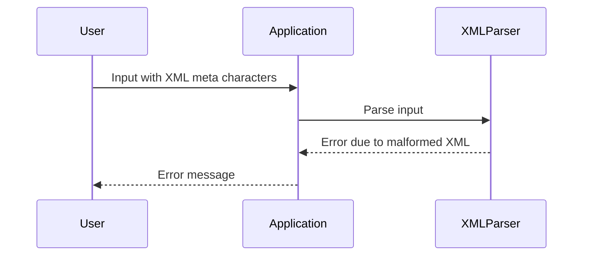

## Identifying Potential XXE Vulnerabilities

### Obvious Cases

The most straightforward way to identify potential XXE vulnerabilities is by observing the application's behavior when it processes XML input. If you intercept a request using a tool like Burp Suite and notice that the application is directly sending XML input or formatting your input in XML format in the response, this is a strong indicator of a potential XXE vulnerability.

### Less Obvious Cases

In less obvious scenarios, the application may process your input as XML code in the backend, but there might be no indication of this on the client side. To detect these cases, you can inject XML meta characters such as single quotes (`'`), double quotes (`"`), and angle brackets (`<`, `>`). These characters can break the XML code in the backend, causing the application to throw an error that indicates it is processing the input as XML code.

### Automating Testing

Given the complexity and the number of input vectors, it is highly recommended to automate the testing process using web application vulnerability scanners. Tools like Burp Suite, OWASP ZAP, and Nessus can help identify potential XXE vulnerabilities by systematically testing various input vectors.

---
<!-- nav -->
[[17-How to Prevent  Defend Against XXE Injection|How to Prevent  Defend Against XXE Injection]] | [[Web Security (PortSwigger)/08-XXE Injection/01-XXE Injection Complete Guide/00-Overview|Overview]] | [[19-Internal vs External XML Entities|Internal vs External XML Entities]]
