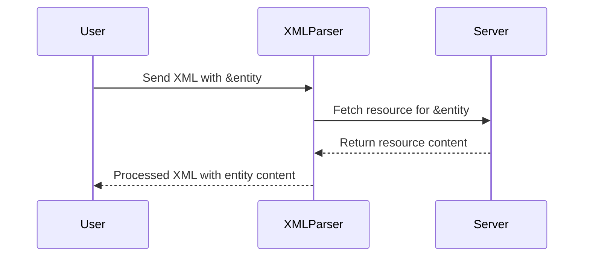

## Internal vs External XML Entities

### Background Theory

XML (Extensible Markup Language) is a markup language designed to store and transport data. XML documents can contain both data and metadata, making them versatile for various applications. One key feature of XML is the ability to define entities, which are placeholders that can be replaced with specific content during parsing.

#### Internal XML Entities

An **internal XML entity** is defined within the Document Type Definition (DTD) of the XML document itself. This means the entity's value is specified locally within the same document. Here’s an example of an internal entity:

```xml
<!DOCTYPE root [
    <!ENTITY name "John Doe">
]>
<root>
    <name>&name;</name>
</root>
```

In this example, `&name;` is an internal entity that is defined as `"John Doe"` within the DTD. When the XML parser encounters `&name;`, it replaces it with `"John Doe"`.

#### External XML Entities

An **external XML entity**, on the other hand, is defined outside of the DTD. The entity's value is fetched from an external resource, such as a file or a URL. This is indicated by the `SYSTEM` keyword followed by the URI of the external resource.

Here’s an example of an external entity:

```xml
<!DOCTYPE root [
    <!ENTITY product SYSTEM "file:///etc/passwd">
]>
<root>
    <product>&product;</product>
</root>
```

In this example, `&product;` is an external entity that points to the `/etc/passwd` file on the local filesystem. When the XML parser encounters `&product;`, it reads the contents of `/etc/passwd` and inserts them into the XML document.

### Why External Entities Matter

External entities are particularly important in the context of web security because they can be exploited to perform **XXE (XML External Entity) attacks**. These attacks leverage the ability of XML parsers to fetch and process external resources, potentially leading to unauthorized access to sensitive files, denial of service, or even remote code execution.

### How External Entities Work

When an XML parser encounters an external entity, it follows the URI provided and retrieves the content. This content is then inserted into the XML document at the location of the entity reference. The URI can point to a variety of resources, including local files, network resources, or even network services.

#### Example: Fetching Local File Content

Consider the following XML document with an external entity:

```xml
<!DOCTYPE root [
    <!ENTITY product SYSTEM "file:///etc/passwd">
]>
<root>
    <product>&product;</product>
</root>
```

When parsed, the XML document will replace `&product;` with the contents of `/etc/passwd`. This can be dangerous if the attacker can control the URI and point it to sensitive files.

#### Example: Fetching Network Resource

External entities can also point to network resources. For instance:

```xml
<!DOCTYPE root [
    <!ENTITY product SYSTEM "http://example.com/data.txt">
]>
<root>
    <product>&product;</product>
</root>
```

In this case, the XML parser will fetch the content of `data.txt` from `example.com` and insert it into the XML document.

### Real-World Examples

#### CVE-2019-1010156

A notable example of an XXE vulnerability is CVE-2019-1010156, which affected the Atlassian Confluence application. An attacker could exploit this vulnerability to read arbitrary files on the server by injecting malicious XML content into the application.

#### CVE-2020-13952

Another example is CVE-2020-13952, which affected the Jenkins Continuous Integration server. This vulnerability allowed attackers to read arbitrary files on the server through an XXE attack.

### Pitfalls and Common Mistakes

One common mistake is allowing XML input without proper validation or sanitization. This can lead to XXE attacks if the input contains external entity references. Another pitfall is using outdated or vulnerable XML parsers that do not properly handle external entities.

### How to Prevent / Defend

#### Detection

To detect potential XXE vulnerabilities, you can use static analysis tools that scan your codebase for XML input handling. Dynamic analysis tools can also help by simulating XXE attacks against your application.

#### Prevention

1. **Disable External Entity Processing**: Configure your XML parser to disable processing of external entities. This can often be done via configuration settings or flags.

2. **Input Validation**: Validate all XML input to ensure it does not contain external entity references. Use libraries that provide robust XML validation capabilities.

3. **Secure Coding Practices**: Ensure that your code handles XML input securely. Avoid using untrusted input directly in XML documents.

#### Secure Code Fix

Here’s an example of how to prevent XXE attacks by disabling external entity processing in Python using the `defusedxml` library:

```python
from defusedxml import ElementTree

# Vulnerable code
def parse_vulnerable(xml_data):
    tree = ElementTree.fromstring(xml_data)
    return tree

# Secure code
def parse_secure(xml_data):
    tree = ElementTree.fromstring(xml_data, forbid_dtd=True)
    return tree

vulnerable_xml = """
<!DOCTYPE root [
    <!ENTITY product SYSTEM "file:///etc/passwd">
]>
<root>
    <product>&product;</product>
</root>
"""

secure_xml = """
<root>
    <product>Safe Product</product>
</root>
"""

print(parse_vulnerable(vulnerable_xml))
print(parse_secure(secure_xml))
```

In the secure code, `forbid_dtd=True` ensures that the XML parser does not process external entities.

### Mermaid Diagrams

#### XML Parsing Flow



#### XXE Attack Flow

```mermaid
sequenceDiagram
    participant Attacker
    participant XMLParser
    participant Server
    Attacker->>XMLParser: Send XML with &entity; pointing to /etc/passwd
    XMLParser->>Server: Fetch /etc/passwd
    Server-->>XMLParser: Return /etc/passwd content
    XMLParser-->>Attacker: Processed XML with passwd content
```

### Practice Labs

For hands-on practice with XXE injection, consider the following labs:

- **PortSwigger Web Security Academy**: Offers detailed XXE injection challenges.
- **OWASP Juice Shop**: Contains several XXE-related vulnerabilities for exploitation.
- **DVWA (Damn Vulnerable Web Application)**: Provides a variety of web application vulnerabilities, including XXE.

These labs will help you understand and defend against XXE attacks in real-world scenarios.

---
<!-- nav -->
[[18-Identifying Potential XXE Vulnerabilities|Identifying Potential XXE Vulnerabilities]] | [[Web Security (PortSwigger)/08-XXE Injection/01-XXE Injection Complete Guide/00-Overview|Overview]] | [[20-Pitfalls and Common Mistakes|Pitfalls and Common Mistakes]]
