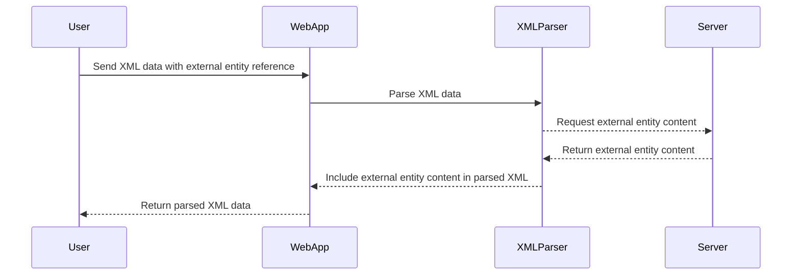

## XML External Entity (XXE) Injection

XML External Entity (XXE) injection is a type of attack where an attacker exploits the XML parser's ability to resolve external entities. This can lead to unauthorized access to sensitive information, denial of service, or even remote code execution.

### How XXE Injection Works

When an XML parser encounters a reference to an external entity, it attempts to retrieve the content of that entity. If the parser is configured to allow such references, an attacker can inject malicious content into the XML document, leading to various security issues.

#### Example of XXE Injection

Consider the following XML document:

```xml
<?xml version="1.0"?>
<!DOCTYPE foo [
<!ELEMENT foo ANY >
<!ENTITY xxe SYSTEM "file:///etc/passwd" >]>
<foo>&xxe;</foo>
```

In this example:
- `<!DOCTYPE foo [ ... ]>` defines a custom DTD (Document Type Definition).
- `<!ELEMENT foo ANY >` specifies that the `foo` element can contain any content.
- `<!ENTITY xxe SYSTEM "file:///etc/passwd" >` defines an external entity named `xxe` that points to the `/etc/passwd` file on the server.
- `<foo>&xxe;</foo>` uses the `xxe` entity within the `foo` element.

If the XML parser is configured to allow external entities, it will attempt to read the contents of `/etc/passwd` and include it in the parsed XML document. This can lead to unauthorized disclosure of sensitive information.

### Real-World Examples of XXE Attacks

Several high-profile breaches have been attributed to XXE injection attacks. One notable example is the Equifax breach in 2017, where attackers exploited an XXE vulnerability in the Apache Struts framework to gain unauthorized access to sensitive data.

Another example is the CVE-2018-11776, which affected the Atlassian Confluence application. This vulnerability allowed attackers to execute arbitrary commands on the server through an XXE attack.

### Detection and Prevention of XXE Injection

To prevent XXE injection attacks, it is crucial to configure the XML parser correctly and implement proper security measures.

#### Secure Configuration of XML Parser

Most modern XML parsers provide options to disable the processing of external entities. For example, in Python's `lxml` library, you can disable external entity resolution as follows:

```python
from lxml import etree

def parse_xml(xml_data):
    parser = etree.XMLParser(resolve_entities=False)
    tree = etree.fromstring(xml_data, parser=parser)
    return tree
```

In Java, you can configure the `DocumentBuilderFactory` to disable external entity resolution:

```java
import javax.xml.parsers.DocumentBuilderFactory;
import javax.xml.parsers.ParserConfigurationException;

public class XmlParser {
    public static void parseXml(String xmlData) throws Exception {
        DocumentBuilderFactory factory = DocumentBuilderFactory.newInstance();
        factory.setFeature("http://apache.org/xml/features/disallow-doctype-decl", true);
        factory.setFeature("http://xml.org/sax/features/external-general-entities", false);
        factory.setFeature("http://xml.org/sax/features/external-parameter-entities", false);
        factory.setFeature("http://apache.org/xml/features/nonvalidating/load-external-dtd", false);

        DocumentBuilder builder = factory.newDocumentBuilder();
        builder.parse(new InputSource(new StringReader(xmlData)));
    }
}
```

#### Secure Coding Practices

In addition to configuring the XML parser correctly, it is essential to follow secure coding practices to prevent XXE injection attacks. This includes validating and sanitizing user input, using parameterized queries, and implementing proper error handling.

#### Example of Vulnerable Code

Here is an example of vulnerable code that processes an XML document without proper validation:

```python
import xml.etree.ElementTree as ET

def parse_xml_vulnerable(xml_data):
    tree = ET.fromstring(xml_data)
    return tree
```

#### Example of Secure Code

Here is an example of secure code that validates and sanitizes user input before processing the XML document:

```python
import xml.etree.ElementTree as ET
import re

def parse_xml_secure(xml_data):
    # Validate and sanitize user input
    if not re.match(r'^<.*>$', xml_data):
        raise ValueError("Invalid XML data")

    # Parse the XML data
    tree = ET.fromstring(xml_data)
    return tree
```

### Conclusion

XML External Entity (XXE) injection is a serious security vulnerability that can lead to unauthorized access to sensitive information and other security issues. To prevent XXE injection attacks, it is crucial to configure the XML parser correctly, validate and sanitize user input, and follow secure coding practices.

### Practice Labs

For hands-on practice with XXE injection, consider the following labs:
- **PortSwigger Web Security Academy**: Offers interactive challenges and labs to learn about XXE injection and other web security topics.
- **OWASP Juice Shop**: A deliberately insecure web application that includes XXE injection vulnerabilities for educational purposes.
- **DVWA (Damn Vulnerable Web Application)**: A PHP/MySQL web application that contains numerous security vulnerabilities, including XXE injection.

By practicing these labs, you can gain a deeper understanding of XXE injection and how to defend against it.

### Diagrams

Here is a mermaid diagram illustrating the flow of an XXE injection attack:



This diagram shows the steps involved in an XXE injection attack, from the initial request sent by the user to the final response returned by the web application.

### Summary

In summary, XML External Entity (XXE) injection is a critical security vulnerability that can lead to unauthorized access to sensitive information. By understanding the principles of XML parsing, detecting and preventing XXE injection attacks, and following secure coding practices, you can protect your applications from these types of attacks.

---
<!-- nav -->
[[22-Understanding XML and Its Role in Web Security|Understanding XML and Its Role in Web Security]] | [[Web Security (PortSwigger)/08-XXE Injection/01-XXE Injection Complete Guide/00-Overview|Overview]] | [[24-XXE Injection Vulnerabilities|XXE Injection Vulnerabilities]]
