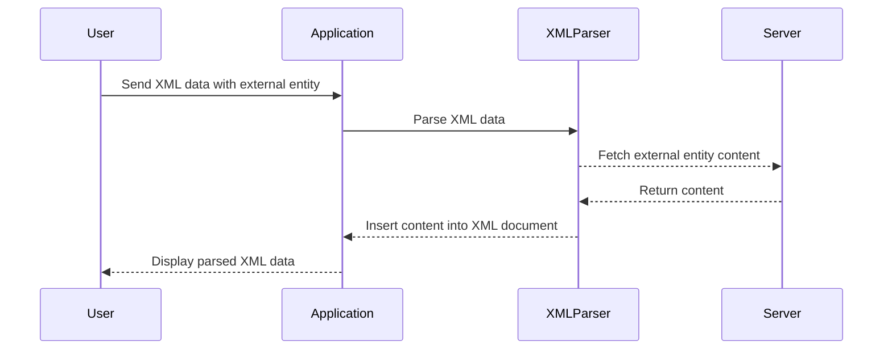

## XXE Injection Vulnerabilities

XXE injection vulnerabilities occur when an application allows the resolution of client-supplied XML external entities. This means that an attacker can inject malicious content into the XML document, which can then be processed by the XML parser.

### How XXE Injection Works

When an application parses an XML document that includes external entities, it will attempt to resolve those entities by fetching the referenced resources. If an attacker can control the content of those resources, they can inject arbitrary data into the XML document.

For example, consider the following XML document:

```xml
<?xml version="1.0"?>
<!DOCTYPE foo [
    <!ELEMENT foo ANY>
    <!ENTITY xxe SYSTEM "file:///etc/passwd">
]>
<foo>&xxe;</foo>
```

In this example, the external entity `xxe` references the `/etc/passwd` file on the server. When the XML document is parsed, the content of the `/etc/passwd` file will be inserted into the document.

### Real-World Examples of XXE Injection

XXE injection vulnerabilities have been exploited in numerous real-world scenarios. Here are a few notable examples:

1. **CVE-2018-11776**: This vulnerability affected the Apache Struts framework. An attacker could exploit this vulnerability to read arbitrary files on the server by injecting malicious XML content.

2. **CVE-2019-11510**: This vulnerability affected the Atlassian Confluence application. An attacker could exploit this vulnerability to execute arbitrary commands on the server by injecting malicious XML content.

### Detailed Example of XXE Injection

Let's walk through a detailed example of how an XXE injection vulnerability can be exploited.

#### Vulnerable Code

Consider the following Python code that parses an XML document:

```python
import xml.etree.ElementTree as ET

def parse_xml(xml_data):
    tree = ET.fromstring(xml_data)
    print(tree.find('foo').text)

xml_data = """
<?xml version="1.0"?>
<!DOCTYPE foo [
    <!ELEMENT foo ANY>
    <!ENTITY xxe SYSTEM "file:///etc/passwd">
]>
<foo>&xxe;</foo>
"""

parse_xml(xml_data)
```

In this example, the `parse_xml` function takes an XML string as input and attempts to parse it using the `ElementTree` module. The XML string includes an external entity that references the `/etc/passwd` file.

#### Exploitation

When the `parse_xml` function is called with the provided XML string, the XML parser will attempt to resolve the external entity `xxe`. This will result in the content of the `/etc/passwd` file being inserted into the XML document.

The output of the `parse_xml` function will be the contents of the `/etc/passwd` file.

### How to Prevent / Defend Against XXE Injection

To prevent XXE injection vulnerabilities, it is essential to properly configure the XML parser to disallow the resolution of external entities. Here are some steps to take:

#### Secure Configuration

1. **Disable External Entity Resolution**: Ensure that the XML parser is configured to disable the resolution of external entities. This can typically be done by setting specific options in the parser configuration.

2. **Validate Input**: Validate the input XML data to ensure that it does not contain any external entity references. This can be done using regular expressions or other validation techniques.

#### Secure Code Example

Here is an example of how to securely parse an XML document in Python:

```python
import xml.etree.ElementTree as ET

def parse_xml_securely(xml_data):
    parser = ET.XMLParser(resolve_entities=False)
    tree = ET.fromstring(xml_data, parser=parser)
    print(tree.find('foo').text)

xml_data = """
<?xml version="1.0"?>
<!DOCTYPE foo [
    <!ELEMENT foo ANY>
    <!ENTITY xxe SYSTEM "file:///etc/passwd">
]>
<foo>&xxe;</foo>
"""

parse_xml_securely(xml_data)
```

In this example, the `resolve_entities` option is set to `False`, which disables the resolution of external entities. This ensures that the XML parser will not attempt to fetch the referenced resource.

#### Detection and Prevention

1. **Static Analysis Tools**: Use static analysis tools to detect potential XXE injection vulnerabilities in your codebase. Tools like SonarQube and Fortify can help identify insecure XML parsing patterns.

2. **Dynamic Analysis Tools**: Use dynamic analysis tools to test your application for XXE injection vulnerabilities. Tools like Burp Suite and OWASP ZAP can help you simulate attacks and identify vulnerable areas.

3. **Security Policies**: Implement security policies that require proper configuration of XML parsers and validation of input data. Ensure that developers are trained on secure coding practices and are aware of the risks associated with XXE injection.

### Conclusion

XXE injection vulnerabilities can have severe consequences if not properly mitigated. By understanding the underlying concepts of XML entities and DTDs, and by implementing secure configurations and validation techniques, you can protect your applications from these vulnerabilities.

### Practice Labs

To gain hands-on experience with XXE injection vulnerabilities, consider the following practice labs:

- **PortSwigger Web Security Academy**: Offers interactive labs on XXE injection and other web security topics.
- **OWASP Juice Shop**: A deliberately insecure web application that includes XXE injection vulnerabilities.
- **DVWA (Damn Vulnerable Web Application)**: A PHP/MySQL web application that includes various security vulnerabilities, including XXE injection.

By working through these labs, you can gain practical experience in identifying and mitigating XXE injection vulnerabilities.



This sequence diagram illustrates the flow of an XXE injection attack, showing how the user sends XML data with an external entity, the application parses the XML data, the XML parser fetches the external entity content, and the content is inserted into the XML document.

By thoroughly understanding the concepts and techniques discussed in this chapter, you can effectively defend against XXE injection vulnerabilities and ensure the security of your applications.

---
<!-- nav -->
[[23-XML External Entity (XXE) Injection|XML External Entity (XXE) Injection]] | [[Web Security (PortSwigger)/08-XXE Injection/01-XXE Injection Complete Guide/00-Overview|Overview]] | [[Web Security (PortSwigger)/08-XXE Injection/01-XXE Injection Complete Guide/25-Conclusion|Conclusion]]
